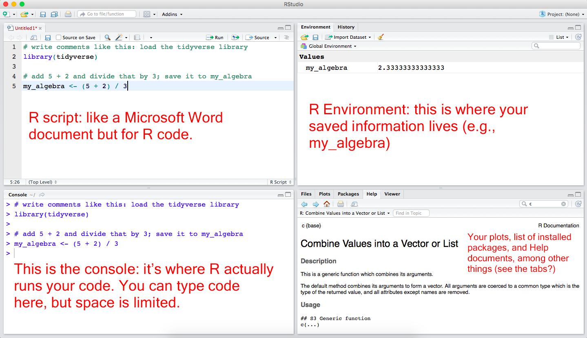
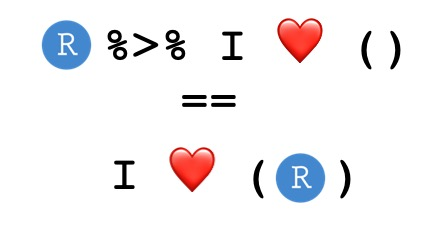

# How do I install R and RStudio (you need both in that order)
> - Installing R ([**Macintosh**](https://stats.idre.ucla.edu/r/icu/installing-r-for-macintosh/) / [**Windows**](https://stats.idre.ucla.edu/r/icu/installing-r-for-windows/))
> - Uninstalling R ([**Macintosh**](https://cran.r-project.org/doc/manuals/r-release/R-admin.html#Uninstalling-under-macOS) / [**Windows**](https://cran.r-project.org/doc/manuals/r-release/R-admin.html#Uninstallation))
> - Installing RStudio [[**.html**](https://www.rstudio.com/products/rstudio/download/)]
> - Uninstalling RStudio [[**.html**](https://support.rstudio.com/hc/en-us/articles/200554736-How-To-Uninstall-RStudio-Desktop)]

# What are all the panels in RStudio?


# How do I install and load new R packages?
> - Use `install.packages()` and `library()`  
> - "Packages are collections of R functions, data, and compiled code in a well-defined format. The directory where packages are stored is called the library. R comes with a standard set of packages. Others are available for download and installation. Once installed, they have to be loaded into the session to be used." [[.html](https://www.statmethods.net/interface/packages.html)]  
> - Similies: App Store, iBooks, Google Play store  
- **Best Practice Note.** `install.packages()` downloads files from the internet, so it's "polite" to "comment out" (# = comment) this code before you share it with people so they don't download files they don't really want by accident.  

**Sources.** `help("install.packages")` and `help("library")`

```{r, warning = FALSE, message = FALSE}

# install.packages("tidyverse")

library(tidyverse)

```

# How do I run R code?
> Start with simple examples

## Example: Save five numbers to an R object called `my_numbers`
> - `c()`: "Combine Values into a Vector or List"  
> - `<-`: "Assign a value to a name."  
> - **English:** combine 10, 6, 2, 8, and 3, and save this "combination" (i.e., vector of these numbers) to an object called `my_numbers`.

```{r}

my_numbers <- c(10, 6, 2, 8, 3)

```

> - **Note:** If you want to print and save at the same time, surround everything with `()`

```{r}

(my_numbers <- c(10, 6, 2, 8, 3))

```

## Where can I learn more basic R code?
> There's a cheat sheet for that: [Base R](http://github.com/rstudio/cheatsheets/raw/master/base-r.pdf). Download the cheat sheet and ake some time to look at the examples. Try some of them on your own.

## How to I learn more about the details of an R function or package or dataset?
> - Use a `?` before the name of an R function or package or dataset, or use `help("functionname")` or `help("packagename")` or `help("datasetname")` to see documentation about those things.

```{r}

help("c")
help("sum")
help("length")
help("mean")

```

## How long is `my_numbers` (i.e., how many numbers are in `my_numbers`)?
> - The first argument of the length() function asks for an R object. below, we use `my_numbers`, which is an R object.

```{r}

length(my_numbers)

```

## What is the sum of `my_numbers`?

```{r}

sum(my_numbers)

```

## What is the mean of `my_numbers`?
> - The sum of `my_numbers` divided by the length of `my_numbers`

```{r}

sum(my_numbers) / length(my_numbers)

```

## What is the mean of `my_numbers`?
> - We can also just use the `mean()` function

```{r}

mean(my_numbers)

```

# But what are functions and how do they work?
> - "A function is a piece of code written to carry out a specified task; it can or can not accept arguments or parameters and it can or can not return one or more values."" **Functions do things for you.** [[.html](https://www.datacamp.com/community/tutorials/functions-in-r-a-tutorial#what)]

## How would a simple mean function work?
> - Our custom `compute_mean()` function has one argument: values, which are numbers. our function takes the sum of the input (i.e., values) and divides by the length of that input. the function outputs the result of that computation.

```{r}

(compute_mean <- function(values) {
  
  sum(values) / length(values)
  
})

```

## Use the `compute_mean()` function to compute the mean of `my_numbers`.

```{r}

compute_mean(values = my_numbers)

```

## Functions are "stupid"; R is "stupid"
> - They only do exactly what you tell them to do and assume what they are programmed to assume. what if we add a missing value (a.k.a., NA, "Not available")

```{r}

(my_numbers <- c(10, 6, 2, 8, 3, NA))

```

## Use the `compute_mean()` function to compute the mean of of new `my_numbers` that includes a missing value.

```{r}

compute_mean(values = my_numbers)

```

## Is this what you expected?
> - turns out, this isn't a quirky feature of R. R was designed by statisticians and mathematicians. NA represents a value that is unknown. ask yourself, what is the sum of an unknown value and 17? if you don't know the value, then you don't know the value of adding it to 17 either. our `compute_mean()` function gives NA for this reason: the mean of 5 values and an unknwon value is NA; it's unknown; it's not available; it's missing.

# When you use functions throughout this course and in your own research ...
> - think about what the functions "assume" or "know"; ask, "What do I want the function to do? What do I expect it to do? Can the function do what I want with the information I gave it?"

```{r}

(compute_mean <- function(values, remove_missing = TRUE) {
  
  if (remove_missing == TRUE) {
    values <- na.omit(values)
  }
  
  sum(values) / length(values)
  })

```

## Remember this example every time you give data to a function

```{r}

compute_mean(values = my_numbers, remove_missing = TRUE)

# By the way, the mean() function also has this argument; so does sum() and many other trusty functions
mean(my_numbers, na.rm = TRUE)

```

# What is the tidyverse?
> - "The tidyverse is an opinionated collection of [**R packages**](https://www.tidyverse.org/packages/) designed for data science. All packages share an underlying design philosophy, grammar, and data structures."


# How do I use the pipe operator (`%>%`) from tidyverse?
> - The `%>%` operator allows you to "pipe"" a value forward into an expression or function; something along the lines of `x %>% f`, rather than `f(x)`.see the magrittr page [[.html](http://magrittr.tidyverse.org/articles/magrittr.html)] for more details, but check out these examples below.

## Example:



## How do I transform `my_numbers` into z-scores?
> - Use the `scale()` function: "`scale()` is generic function whose default method centers and/or scales the columns of a numeric matrix."

**Source.** `help("scale")`

```{r}

my_numbers %>% scale()

```

## How do I convert z-scores outputted from the `scale()` function into only numbers?
> - Use the `as.numeric()` function: "Creates or coerces objects of type 'numeric'"

**Source.** `help("as.numeric")`

```{r}

my_numbers %>% scale() %>% as.numeric()

```

## Compute the mean of our new z-scores
> - It should be zero.

```{r}

my_numbers %>% scale() %>% as.numeric() %>% mean()

```

## Oops!
> - We forgot to tell `mean()` to remove NA values before computing.

```{r}

my_numbers %>% scale() %>% as.numeric() %>% mean(na.rm = TRUE)

```

## The result rounds to zero.
> - `round()`: "round rounds the values in its first argument to the specified number of decimal places (default 0)."

**Source.** `help("round")`

```{r}

my_numbers %>% scale() %>% as.numeric() %>% mean(na.rm = TRUE) %>% round(digits = 1)

```

## This kind of coding with the `%>%` is especially useful when working with data frames

### Example: Start with a bigger data frame

```{r}

mpg

```

### Create a new, smaller data frame
> I want only cars that **get at least 30 miles per gallon on the highway** and that **have an authomatic transmission.** I also want to see their **average miles per gallon across city and highway driving.**  

**Sources.** `help("mpg")`, `help("filter")`, `help("select")`, `help("mutate")`, and `help("arrange")`

```{r}

# We will explain this kind of code in more detail on later days of the workshop
mpg %>% 
  # Filter rows based on the criteria above
  filter(hwy >= 30 & str_detect(trans, pattern = "auto")) %>% 
  # Select variables in the order we want
  select(manufacturer, model, year, class, trans, cty, hwy) %>% 
  # Average city and highway mileage
  mutate(mpg_mean = (cty + hwy) / 2) %>% 
  # Arrange rows by average mile per gallon in descending order
  arrange(desc(mpg_mean))

```

# Here are some other basic data types in R
> 1. Character type: categories, think words, letters, etc.  
> 2. Factor type: think categories but with numeric values assigned to them so they can be used in statistical models  
> 3. Data frame type: Think of an Excel spreadsheet

**Sources.** help("factor") and vignette("tibble")

```{r}

# Numeric type
(my_ids <- c(1, 2, 3, 4, 5, 6))

# Character type
(my_condtions <- c("Control", "Control", "Control", "Treatment", "Treatment", "Treatment"))

# Factor type
(my_condtions_fac <- factor(my_condtions))

# Data frame type but with more intutive assumptions and printing defaults
(my_dataframe <- tibble(my_ids, my_numbers, my_condtions, my_condtions_fac))

```

# Exercises
> 1. Install and load the `tidyverse` package.  
> 2. Create your own numeric object with the `c()` function.  
> 3. Create your own character object with the `c()` function.  
> 4. Store your new objects in a tibble data frame with the `tibble()` function.  
> 5. **Advanced:** create your own **simple** function with one argument.

# Resources
> * [**R for Data Science: Import, Tidy, Transform, Visualize, and Model Data.**](http://r4ds.had.co.nz/)  
> * [**tidyverse.org**](http://tidyverse.org/)  
> * [**the tidyverse style guide**](http://style.tidyverse.org/)