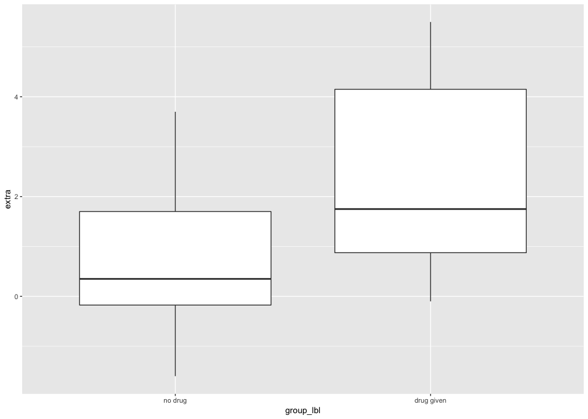
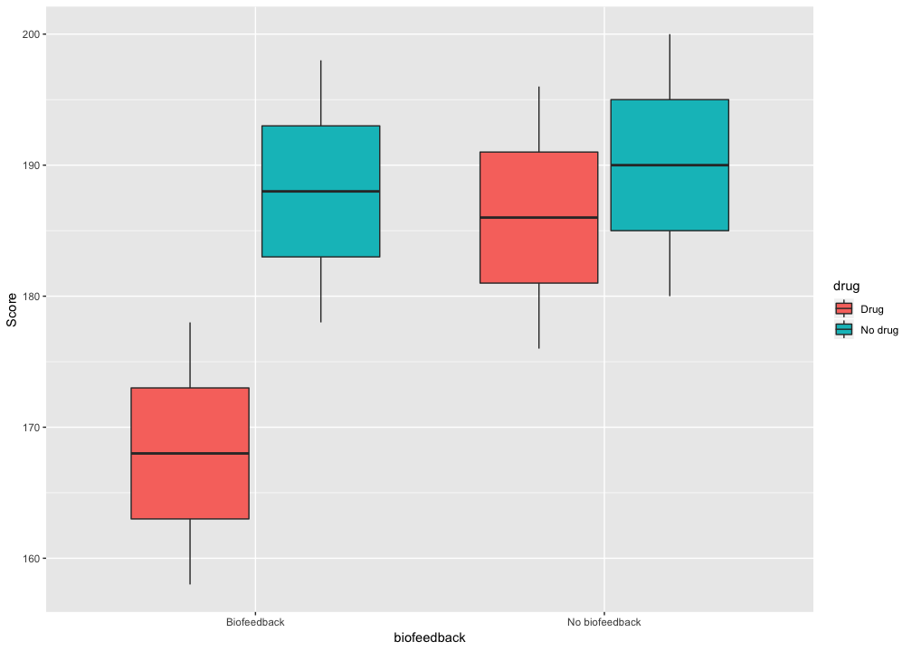
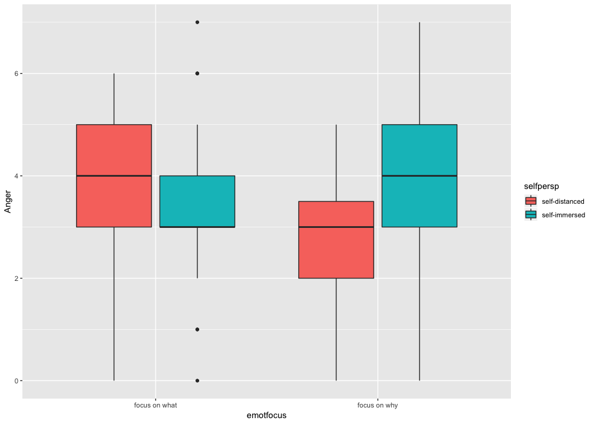
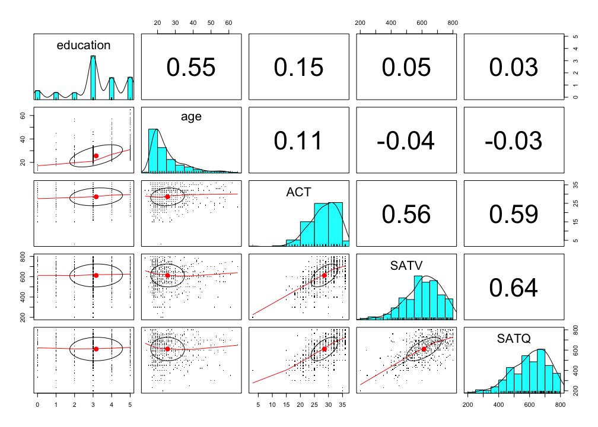
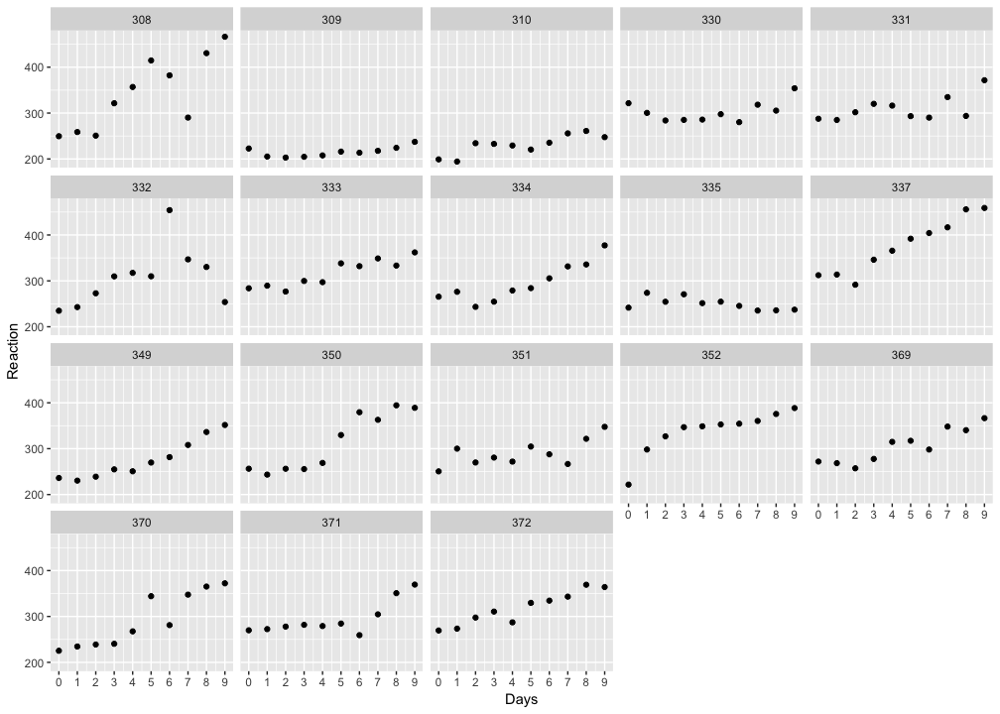
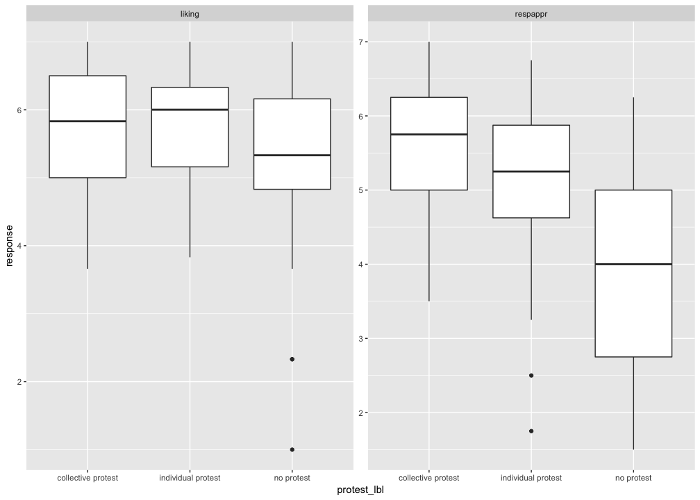
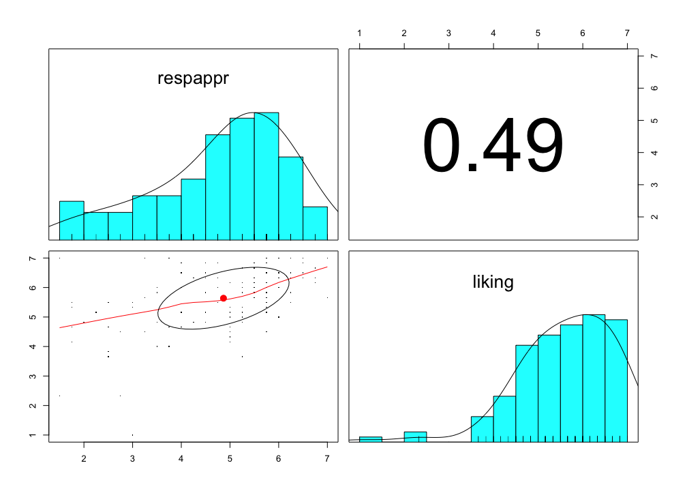
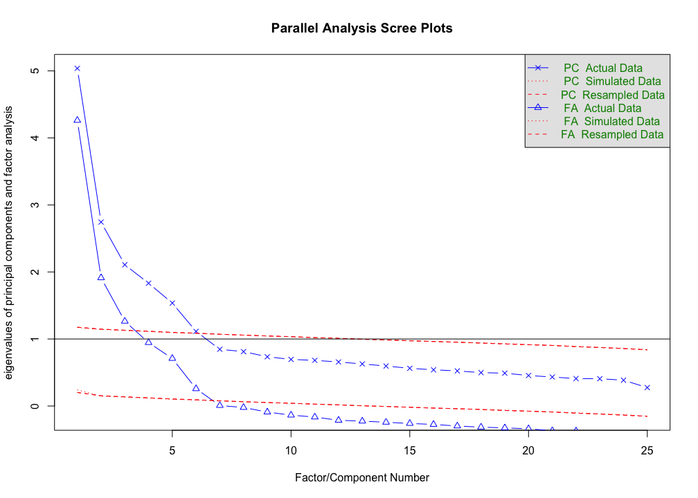

# Install and/or load packages for this session
> - `install.packages()`: "Download and install packages from CRAN-like repositories or from local files."
> - `library()`: loads your package you installed
> - **Best Practice Note.** `install.packages()` downloads files from the internet, so it's "polite" to "comment out" (# = comment) this code before you share it with people so they don't download files they don't really want by accident


```r
# install.packages("tidyverse")
# install.packages("psych")
# install.packages("GPArotation")
# install.packages("car")
# install.packages("lme4")
# install.packages("lmerTest")
# install.packages("lavaan")
# install.packages("AMCP")

library(tidyverse)
library(psych)
library(car)
library(lme4)
library(lmerTest)
library(lavaan)
library(AMCP)

# When packages contain functions with the same name, R has to "decide" which function stays and which is ignored. In this session, I want recode from the dplyr package, so I save that specific function to the object recode
recode <- dplyr::recode
```

# How do I generate summary/descriptive statistics of my data?
> - **Sse psych**
> - **psych Package Summary.** psych is a package for personality, psychometric, and psychological research. It has been developed at Northwestern University (maintained by William Revelle) to include functions most useful for personality and psychological research.

**Source.** `help("psych")`

# Example: Generate descriptive statistics.
> - **C3T3.** "Although different mood states have, of course, always been of interest to clinicians, recent years have seen a profusion of studies attempting to manipulate mood states in controlled laboratory studies. In such induced-mood research, participants typically are **randomly assigned to one of three groups: a depressed-mood induction, a neutral-mood induction, or an elated-mood induction.** One study (Pruitt, 1988) used selected videoslips from several movies and public television programs as the mood-induction treatments. After viewing the video for her assigned condition, each participant was asked to indicate her mood on various scales. In addition, each subject was herself **videotaped, and her facial expressions of emotion were rated on a scale of 1 to 7 (1 indicating sad; 4, neutral; and 7, happy) by an assistant** who viewed the videotapes but was kept "blind" regarding the subjects' assigned conditions."

**Source.** `help("C3T3")` and Maxwell, Delaney, & Kelley, (2018). *Designing experiments and analyzing data: A model comparison perspective.* (3rd ed.). Routledge.


```r
# The semicolon is equivalent to starting a new line of code
data("C3T3"); C3T3 <- as_tibble(C3T3)
C3T3 %>% sample_n(size = 15)
```

<div class="kable-table">

 Condition   Rating
----------  -------
         3        4
         3        2
         2        4
         2        4
         3        4
         3        4
         1        7
         2        4
         1        7
         1        5
         3        3
         1        5
         2        4
         3        2
         1        5

</div>

## Example: Generate descriptive statistics.
> - `recode()`: Recodes values in a vector; use `` for numbers (see example below)

**Source.** `help("recode")`


```r
C3T3 <- C3T3 %>% 
  mutate(condition_lbl = recode(Condition, `1` = "Pleasant/elated", `2` = "Neutral", `3` = "Unpleasant/depressed"))

# print random subset
C3T3 %>% sample_n(size = 15)
```

<div class="kable-table">

 Condition   Rating  condition_lbl        
----------  -------  ---------------------
         1        7  Pleasant/elated      
         1        7  Pleasant/elated      
         2        5  Neutral              
         3        3  Unpleasant/depressed 
         3        4  Unpleasant/depressed 
         1        7  Pleasant/elated      
         1        5  Pleasant/elated      
         3        4  Unpleasant/depressed 
         2        4  Neutral              
         1        7  Pleasant/elated      
         2        3  Neutral              
         3        1  Unpleasant/depressed 
         2        4  Neutral              
         2        4  Neutral              
         3        4  Unpleasant/depressed 

</div>

```r
# Count/Tally
C3T3 %>% count(Condition, condition_lbl)
```

<div class="kable-table">

 Condition  condition_lbl            n
----------  ---------------------  ---
         1  Pleasant/elated         10
         2  Neutral                 10
         3  Unpleasant/depressed    10

</div>

## Example: Generate descriptive statistics.
> - `describe()`: "There are many summary statistics available in R; this function provides the ones most useful for scale construction and item analysis in classic psychometrics. Range is most useful for the first pass in a data set, to check for coding errors."
> - `pull()`: "Pull out a single variable" (from a data.frame)

**Sources.** `help("describe")` and `help("pull")`


```r
C3T3 %>% 
  pull(Rating) %>% 
  describe()
```

<div class="kable-table">

      vars    n       mean         sd   median    trimmed      mad   min   max   range        skew     kurtosis          se
---  -----  ---  ---------  ---------  -------  ---------  -------  ----  ----  ------  ----------  -----------  ----------
X1       1   30   4.333333   1.582955        4   4.333333   1.4826     1     7       6   0.2203649   -0.5567278   0.2890068

</div>

# Example: Generate descriptive statistics by one grouping variable.
> - `describe()`: "There are many summary statistics available in R; this function provides the ones most useful for scale construction and item analysis in classic psychometrics. Range is most useful for the first pass in a data set, to check for coding errors."
> - `describeBy()`: "Report basic summary statistics by a grouping variable. Useful if the grouping variable is some experimental variable and data are to be aggregated for plotting. Partly a wrapper for by and describe"

**Sources.** `help("describe")` and `help("describeBy")`


```r
C3T3 %>% 
  pull(Rating) %>% 
  describeBy(group = pull(C3T3, condition_lbl), mat = TRUE)
```

<div class="kable-table">

      item   group1                  vars    n   mean          sd   median   trimmed      mad   min   max   range         skew   kurtosis          se
----  -----  ---------------------  -----  ---  -----  ----------  -------  --------  -------  ----  ----  ------  -----------  ---------  ----------
X11   1      Neutral                    1   10      4   0.6666667      4.0     4.000   0.0000     3     5       2    0.0000000     -0.975   0.2108185
X12   2      Pleasant/elated            1   10      6   1.1547005      6.5     6.125   0.7413     4     7       3   -0.3897114     -1.650   0.3651484
X13   3      Unpleasant/depressed       1   10      3   1.0540926      3.0     3.125   1.4826     1     4       3   -0.5122890     -1.218   0.3333333

</div>

# How do I test whether the difference between two group means = 0?
> - `t.test()`: "Performs one and two sample t-tests on vectors of data."

**Source.** `help("t.test")`

## Example: Test whether the difference between two mean increases in hours of sleep = 0
> - **sleep.** "Data which show the effect of two soporific drugs (increase in hours of sleep compared to control) on 10 patients."
>     + **extra.** numeric increase in hours of sleep
>     + **group.** drug given

**Source.** `help("sleep")`


```r
sleep <- sleep %>% 
  mutate(group_lbl = recode(group, `1` = "no drug", `2` = "drug given"),
         givedrug = recode(group_lbl, "no drug" = -1 / 2, "drug given" = 1 / 2))

# print random subset
sleep %>% sample_n(size = 15)
```

<div class="kable-table">

 extra  group   ID   group_lbl     givedrug
------  ------  ---  -----------  ---------
   3.4  1       6    no drug           -0.5
  -0.1  1       5    no drug           -0.5
  -1.2  1       4    no drug           -0.5
   1.6  2       8    drug given         0.5
   2.0  1       10   no drug           -0.5
  -1.6  1       2    no drug           -0.5
   1.9  2       1    drug given         0.5
  -0.2  1       3    no drug           -0.5
   0.8  1       8    no drug           -0.5
   0.0  1       9    no drug           -0.5
   0.8  2       2    drug given         0.5
  -0.1  2       5    drug given         0.5
   4.4  2       6    drug given         0.5
   4.6  2       9    drug given         0.5
   5.5  2       7    drug given         0.5

</div>

```r
# Count/Tally
sleep %>% count(group, group_lbl, givedrug)
```

<div class="kable-table">

group   group_lbl     givedrug    n
------  -----------  ---------  ---
1       no drug           -0.5   10
2       drug given         0.5   10

</div>

## Example: Test whether the difference between two mean increases in hours of sleep = 0
> - **sleep.** "Data which show the effect of two soporific drugs (increase in hours of sleep compared to control) on 10 patients."
>     + **extra.** Numeric	increase in hours of sleep
>     + **group.** Drug given
> - Not a bad idea to visualize data before you model it

**Source.** `help("sleep")`


```r
sleep %>% 
  ggplot(mapping = aes(x = group_lbl, y = extra)) +
  geom_boxplot()
```

<!-- -->

## Example: Test whether the difference between two mean increases in hours of sleep = 0
> - `t.test(formula, var.equal, paired)`
>     + **formula.** "a formula of the form lhs ~ rhs where lhs is a numeric variable giving the data values and rhs a factor with two levels giving the corresponding groups."
>     + **var.equal.** "a logical variable indicating whether to treat the two variances as being equal. If TRUE then the pooled variance is used to estimate the variance otherwise the Welch (or Satterthwaite) approximation to the degrees of freedom is used."
>     + **paired.** "a logical indicating whether you want a paired t-test."

**Source.** `help("t.test")`


```r
# Welch t-test (equal variance not assumed)
t.test(extra ~ group_lbl, data = sleep)
```

```
## 
## 	Welch Two Sample t-test
## 
## data:  extra by group_lbl
## t = -1.8608, df = 17.776, p-value = 0.07939
## alternative hypothesis: true difference in means is not equal to 0
## 95 percent confidence interval:
##  -3.3654832  0.2054832
## sample estimates:
##    mean in group no drug mean in group drug given 
##                     0.75                     2.33
```

```r
# Student t-test (equal variance assumed)
t.test(extra ~ group_lbl, data = sleep, var.equal = TRUE)
```

```
## 
## 	Two Sample t-test
## 
## data:  extra by group_lbl
## t = -1.8608, df = 18, p-value = 0.07919
## alternative hypothesis: true difference in means is not equal to 0
## 95 percent confidence interval:
##  -3.363874  0.203874
## sample estimates:
##    mean in group no drug mean in group drug given 
##                     0.75                     2.33
```

```r
# Paired t-test
t.test(extra ~ group_lbl, data = sleep, paired = TRUE)
```

```
## 
## 	Paired t-test
## 
## data:  extra by group_lbl
## t = -4.0621, df = 9, p-value = 0.002833
## alternative hypothesis: true difference in means is not equal to 0
## 95 percent confidence interval:
##  -2.4598858 -0.7001142
## sample estimates:
## mean of the differences 
##                   -1.58
```

# How do I test specific contrasts using linear regression?
> - `lm()`: "lm is used to fit linear models. It can be used to carry out regression, single stratum analysis of variance and analysis of covariance (although aov may provide a more convenient interface for these)."

**Source.** `help("lm")`

## Example: Test mean difference via linear regression
> - Fit and save the linear model via `lm(formula, data)`
>     + **formula.** "an object of class "formula" (or one that can be coerced to that class): a symbolic description of the model to be fitted."
>     + **data.** "an optional data frame, list or environment (or object coercible by as.data.frame to a data frame) containing the variables in the model. If not found in data, the variables are taken from environment(formula), typically the environment from which lm is called."
> - Save the fitted model as an object called `lm1` (i.e., linear model 1)

**Source.** `help("lm")`


```r
lm1 <- lm(extra ~ givedrug, data = sleep)
```

## Example: Test mean difference via linear regression
> - Print `lm1`'s results with `summary()`
>     + **summary() for lm objects.** "print.summary.lm tries to be smart about formatting the coefficients, standard errors, etc. and additionally gives 'significance stars' if signif.stars is TRUE."
>     + Compare to `t.test(formula, var.equal)`

**Source.** `help("print.summary.lm")`


```r
# Linear Regression Summary
summary(lm1)
```

```
## 
## Call:
## lm(formula = extra ~ givedrug, data = sleep)
## 
## Residuals:
##    Min     1Q Median     3Q    Max 
## -2.430 -1.305 -0.580  1.455  3.170 
## 
## Coefficients:
##             Estimate Std. Error t value Pr(>|t|)   
## (Intercept)   1.5400     0.4245   3.627  0.00193 **
## givedrug      1.5800     0.8491   1.861  0.07919 . 
## ---
## Signif. codes:  0 '***' 0.001 '**' 0.01 '*' 0.05 '.' 0.1 ' ' 1
## 
## Residual standard error: 1.899 on 18 degrees of freedom
## Multiple R-squared:  0.1613,	Adjusted R-squared:  0.1147 
## F-statistic: 3.463 on 1 and 18 DF,  p-value: 0.07919
```

```r
# Compare to Student t-test
t.test(extra ~ givedrug, data = sleep, var.equal = TRUE)
```

```
## 
## 	Two Sample t-test
## 
## data:  extra by givedrug
## t = -1.8608, df = 18, p-value = 0.07919
## alternative hypothesis: true difference in means is not equal to 0
## 95 percent confidence interval:
##  -3.363874  0.203874
## sample estimates:
## mean in group -0.5  mean in group 0.5 
##               0.75               2.33
```

## Example: Test two contrasts ...
> - **Contrast 1.** Pleasant/elated vs. Neutral
> - **Contrast 2.** Pleasant/elated and Neutral combined vs. Unpleasant/depressed
> - compute and save new columns that represent these contrasts
>     + Nick often uses effect coding (i.e., coefficients = difference from grand mean)

**Source.** `help("C3T3")` and Maxwell, Delaney, & Kelley, (2018). *Designing experiments and analyzing data: A model comparison perspective.* (3rd ed.). Routledge.


```r
C3T3 <- C3T3 %>% 
  mutate(plsntVneut = recode(condition_lbl, "Pleasant/elated" = 1 / 2, "Neutral" = -1 / 2, "Unpleasant/depressed" = 0),
         plsntneutVunplsnt = recode(condition_lbl, "Pleasant/elated" = 1 / 4, "Neutral" = 1 / 4, "Unpleasant/depressed" = -1 / 2))

# Print a random subset
C3T3 %>% sample_n(size = 15)
```

<div class="kable-table">

 Condition   Rating  condition_lbl           plsntVneut   plsntneutVunplsnt
----------  -------  ---------------------  -----------  ------------------
         2        4  Neutral                       -0.5                0.25
         2        3  Neutral                       -0.5                0.25
         2        4  Neutral                       -0.5                0.25
         2        5  Neutral                       -0.5                0.25
         1        4  Pleasant/elated                0.5                0.25
         1        7  Pleasant/elated                0.5                0.25
         3        1  Unpleasant/depressed           0.0               -0.50
         3        4  Unpleasant/depressed           0.0               -0.50
         3        4  Unpleasant/depressed           0.0               -0.50
         1        7  Pleasant/elated                0.5                0.25
         1        7  Pleasant/elated                0.5                0.25
         2        4  Neutral                       -0.5                0.25
         2        4  Neutral                       -0.5                0.25
         2        5  Neutral                       -0.5                0.25
         1        5  Pleasant/elated                0.5                0.25

</div>

```r
# Count/Tally
C3T3 %>% count(Condition, condition_lbl, plsntVneut, plsntneutVunplsnt)
```

<div class="kable-table">

 Condition  condition_lbl           plsntVneut   plsntneutVunplsnt    n
----------  ---------------------  -----------  ------------------  ---
         1  Pleasant/elated                0.5                0.25   10
         2  Neutral                       -0.5                0.25   10
         3  Unpleasant/depressed           0.0               -0.50   10

</div>

## Example: test two contrasts ...
> - **Contrast 1.** Pleasant/elated vs. Neutral
> - **Contrast 2.** Pleasant/elated and Neutral combined vs. Unpleasant/depressed
> - Not a bad idea to visualize data before you model it

**Source.** `help("C3T3")` and Maxwell, Delaney, & Kelley, (2018). *Designing experiments and analyzing data: A model comparison perspective.* (3rd ed.). Routledge.


```r
C3T3 %>% 
  ggplot(mapping = aes(x = condition_lbl, y = Rating)) +
  geom_boxplot()
```

<!-- -->

## Example: Test two contrasts ...
> - **Contrast 1.** Pleasant/elated vs. Neutral
> - **Contrast 2.** Pleasant/elated and Neutral combined vs. Unpleasant/depressed
> - Fit and save the linear model via `lm(formula, data)`
>     + **formula.** "an object of class "formula" (or one that can be coerced to that class): a symbolic description of the model to be fitted."
>     + **data.** "an optional data frame, list or environment (or object coercible by as.data.frame to a data frame) containing the variables in the model. If not found in data, the variables are taken from environment(formula), typically the environment from which lm is called."
> Save the fitted model as an object called `lm2` (i.e., linear model 1)

**Source.** `help("lm")`


```r
lm2 <- lm(Rating ~ plsntVneut + plsntneutVunplsnt, data = C3T3)
```

## Example: Test two contrasts ...
> - **Contrast 1.** Pleasant/elated vs. Neutral
> - **Contrast 2.** Pleasant/elated and Neutral combined vs. Unpleasant/depressed
> - print `lm2`'s results with `summary()`
>     + **summary() for lm objects.** "print.summary.lm tries to be smart about formatting the coefficients, standard errors, etc. and additionally gives 'significance stars' if signif.stars is TRUE."

**Source.** `help("print.summary.lm")`


```r
summary(lm2)
```

```
## 
## Call:
## lm(formula = Rating ~ plsntVneut + plsntneutVunplsnt, data = C3T3)
## 
## Residuals:
##    Min     1Q Median     3Q    Max 
##     -2     -1      0      1      1 
## 
## Coefficients:
##                   Estimate Std. Error t value Pr(>|t|)    
## (Intercept)         4.3333     0.1792  24.187  < 2e-16 ***
## plsntVneut          2.0000     0.4389   4.557    1e-04 ***
## plsntneutVunplsnt   2.6667     0.5067   5.262 1.51e-05 ***
## ---
## Signif. codes:  0 '***' 0.001 '**' 0.01 '*' 0.05 '.' 0.1 ' ' 1
## 
## Residual standard error: 0.9813 on 27 degrees of freedom
## Multiple R-squared:  0.6422,	Adjusted R-squared:  0.6157 
## F-statistic: 24.23 on 2 and 27 DF,  p-value: 9.421e-07
```

## Example: Test two contrasts ...
> - **Contrast 1.** Pleasant/elated vs. Neutral
> - **Contrast 2.** Pleasant/elated and Neutral combined vs. Unpleasant/depressed
> - `Anova()`: "**Calculates type-II or type-III analysis-of-variance tables for model objects produced by lm**, glm, multinom (in the nnet package), polr (in the MASS package), coxph (in the survival package), coxme (in the coxme pckage), svyglm (in the survey package), rlm (in the MASS package), lmer in the lme4 package, lme in the nlme package, and (by the default method) for most models with a linear predictor and asymptotically normal coefficients (see details below). **For linear models, F-tests are calculated; for generalized linear models, likelihood-ratio chisquare, Wald chisquare, or F-tests are calculated**; for multinomial logit and proportional-odds logit models, likelihood-ratio tests are calculated. Various test statistics are provided for multivariate linear models produced by lm or manova. Partial-likelihood-ratio tests or Wald tests are provided for Cox models. Wald chi-square tests are provided for fixed effects in linear and generalized linear mixed-effects models. Wald chi-square or F tests are provided in the default case."


```r
Anova(lm2, type = "III")
```

<div class="kable-table">

                        Sum Sq   Df     F value      Pr(>F)
------------------  ----------  ---  ----------  ----------
(Intercept)          563.33333    1   585.00000   0.0000000
plsntVneut            20.00000    1    20.76923   0.0001001
plsntneutVunplsnt     26.66667    1    27.69231   0.0000151
Residuals             26.00000   27          NA          NA

</div>

### Aside about lm(formula)
> - `+`, `:`, and `*`
>     + `:` Means "compute interaction" in model formula
>     + `*` Means "compute all main effects and interactions" in model formula
>     + Example: `variable1 * variable2` expands to `variable1 + variable2 + variable1:variable2`

## Example: Test 3 contrasts (i.e., 2 main effects and an interaction in a 2 x 2 between-subjects design)
> - **C3T3.** "This data is the hypothetical data from a psychologist's evaluation of the effectiveness of biofeedback and drug therapy for treating hypertension (lowering blood pressure). **There are four groups: both biofeedback training and drug therapy, biofeedback but not drug therapy, drug therapy but no biofeedback, and neither biofeedback nor drug therapy** ... As usual, in this data set, the number of subjects is kept small to minimize the computational burden. We assume that the scores in the table represent systolic blood pressure readings taken at the end of the treatment period.  
> The following data consists specifically of blood pressure measurements taken after the end of treatment for five individuals that were randomly assigned to one of four groups. The initial question of interest is whether there is a significant difference between any of the group means, that is, are all of the population group means equal or is there a difference somewhere."

**Source.** `help("C7T1")` and Maxwell, Delaney, & Kelley, (2018). *Designing experiments and analyzing data: A model comparison perspective.* (3rd ed.). Routledge.


```r
data("C7T1")
C7T1 %>% sample_n(size = 15)
```

<div class="kable-table">

 Group   Score
------  ------
     3     186
     2     198
     1     158
     3     196
     4     200
     3     181
     3     191
     4     190
     2     193
     4     180
     2     178
     1     168
     2     183
     4     185
     1     173

</div>

## Example: Test 3 contrasts (i.e., 2 main effects and an interaction in a 2 x 2 between-subjects design)
> - **C3T3.**
>     + **Group.** A numeric vector between 1 and 4 equal to the drug therapy group
>         + Subjects in Groups 1 and 2 received the biofeedback treatment
>         + Subjects in Groups 1 and 3 received the drug treatment
>     + **Score.** The blood pressure of one of the individuals in the study

**Source.** `help("C7T1")` and Maxwell, Delaney, & Kelley, (2018). *Designing experiments and analyzing data: A model comparison perspective.* (3rd ed.). Routledge.


```r
# If any value of Group is equal to any of the values in c(1, 2), then ...
C7T1 <- C7T1 %>% 
  mutate(biofeedback = ifelse(Group %in% c(1, 2), "Biofeedback",
                       ifelse(Group %in% c(3, 4), "No biofeedback", NA)),
         biofeed_cont = recode(biofeedback, "Biofeedback" = 1 / 2, "No biofeedback" = -1 / 2),
         drug = ifelse(Group %in% c(1, 3), "Drug",
                ifelse(Group %in% c(2, 4), "No drug", NA)),
         drug_cont = recode(drug, "Drug" = 1 / 2, "No drug" = -1 / 2),
         group_lbl = interaction(biofeedback, drug, sep = " x "))

# Print Random Subset
C7T1 %>% sample_n(size = 15)
```

<div class="kable-table">

 Group   Score  biofeedback       biofeed_cont  drug       drug_cont  group_lbl                
------  ------  ---------------  -------------  --------  ----------  -------------------------
     3     196  No biofeedback            -0.5  Drug             0.5  No biofeedback x Drug    
     3     186  No biofeedback            -0.5  Drug             0.5  No biofeedback x Drug    
     4     190  No biofeedback            -0.5  No drug         -0.5  No biofeedback x No drug 
     4     185  No biofeedback            -0.5  No drug         -0.5  No biofeedback x No drug 
     2     178  Biofeedback                0.5  No drug         -0.5  Biofeedback x No drug    
     1     163  Biofeedback                0.5  Drug             0.5  Biofeedback x Drug       
     4     200  No biofeedback            -0.5  No drug         -0.5  No biofeedback x No drug 
     3     176  No biofeedback            -0.5  Drug             0.5  No biofeedback x Drug    
     2     183  Biofeedback                0.5  No drug         -0.5  Biofeedback x No drug    
     2     188  Biofeedback                0.5  No drug         -0.5  Biofeedback x No drug    
     2     198  Biofeedback                0.5  No drug         -0.5  Biofeedback x No drug    
     1     158  Biofeedback                0.5  Drug             0.5  Biofeedback x Drug       
     3     181  No biofeedback            -0.5  Drug             0.5  No biofeedback x Drug    
     1     178  Biofeedback                0.5  Drug             0.5  Biofeedback x Drug       
     4     195  No biofeedback            -0.5  No drug         -0.5  No biofeedback x No drug 

</div>

```r
# Count/Tally Observations by Group
C7T1 %>%
  count(Group, group_lbl, biofeedback, drug, biofeed_cont, drug_cont)
```

<div class="kable-table">

 Group  group_lbl                  biofeedback      drug       biofeed_cont   drug_cont    n
------  -------------------------  ---------------  --------  -------------  ----------  ---
     1  Biofeedback x Drug         Biofeedback      Drug                0.5         0.5    5
     2  Biofeedback x No drug      Biofeedback      No drug             0.5        -0.5    5
     3  No biofeedback x Drug      No biofeedback   Drug               -0.5         0.5    5
     4  No biofeedback x No drug   No biofeedback   No drug            -0.5        -0.5    5

</div>

## Example: Test 3 contrasts (i.e., 2 main effects and an interaction in a 2 x 2 between-subjects design)
> - Not a bad idea to visualize data before you model it

**Source.** `help("C3T3")` and Maxwell, Delaney, & Kelley, (2018). *Designing experiments and analyzing data: A model comparison perspective.* (3rd ed.). Routledge.


```r
C7T1 %>% 
  ggplot(mapping = aes(x = biofeedback, y = Score, fill = drug)) +
  geom_boxplot()
```

<!-- -->

## Example: Test 3 contrasts (i.e., 2 main effects and an interaction in a 2 x 2 between-subjects design)
> - **Remember** ...
> - `+`, `:`, and `*`
>     + `:` Means "compute interaction" in model formula
>     + `*` Means "compute all main effects and interactions" in model formula
>     + Example: `variable1 * variable2` expands to `variable1 + variable2 + variable1:variable2`


```r
# Write the model the long way
lm3.1 <- lm(Score ~ biofeed_cont + drug_cont + biofeed_cont:drug_cont, data = C7T1)

# Same Model as Above
lm3.2 <- lm(Score ~ biofeed_cont * drug_cont, data = C7T1)
```

## Example: Test 3 contrasts (i.e., 2 main effects and an interaction in a 2 x 2 between-subjects design)
> - Print `lm2`'s results with `summary()`
>     + **biofeed_cont.** Compares biofeedback to no biofeedback
>     + **drug_cont** Compares drug to no drug
>     + **biofeed_cont.:drug_cont** Compares biofeedback "effect" in no drug treatment condition to biofeedback "effect" in drug treatment condition


```r
# results from model written the long way
summary(lm3.1)
```

```
## 
## Call:
## lm(formula = Score ~ biofeed_cont + drug_cont + biofeed_cont:drug_cont, 
##     data = C7T1)
## 
## Residuals:
##    Min     1Q Median     3Q    Max 
##    -10     -5      0      5     10 
## 
## Coefficients:
##                        Estimate Std. Error t value Pr(>|t|)    
## (Intercept)             183.000      1.768 103.520  < 2e-16 ***
## biofeed_cont            -10.000      3.536  -2.828  0.01211 *  
## drug_cont               -12.000      3.536  -3.394  0.00371 ** 
## biofeed_cont:drug_cont  -16.000      7.071  -2.263  0.03792 *  
## ---
## Signif. codes:  0 '***' 0.001 '**' 0.01 '*' 0.05 '.' 0.1 ' ' 1
## 
## Residual standard error: 7.906 on 16 degrees of freedom
## Multiple R-squared:  0.6063,	Adjusted R-squared:  0.5325 
## F-statistic: 8.213 on 3 and 16 DF,  p-value: 0.001553
```

```r
# results from model written the shortcut way
summary(lm3.2)
```

```
## 
## Call:
## lm(formula = Score ~ biofeed_cont * drug_cont, data = C7T1)
## 
## Residuals:
##    Min     1Q Median     3Q    Max 
##    -10     -5      0      5     10 
## 
## Coefficients:
##                        Estimate Std. Error t value Pr(>|t|)    
## (Intercept)             183.000      1.768 103.520  < 2e-16 ***
## biofeed_cont            -10.000      3.536  -2.828  0.01211 *  
## drug_cont               -12.000      3.536  -3.394  0.00371 ** 
## biofeed_cont:drug_cont  -16.000      7.071  -2.263  0.03792 *  
## ---
## Signif. codes:  0 '***' 0.001 '**' 0.01 '*' 0.05 '.' 0.1 ' ' 1
## 
## Residual standard error: 7.906 on 16 degrees of freedom
## Multiple R-squared:  0.6063,	Adjusted R-squared:  0.5325 
## F-statistic: 8.213 on 3 and 16 DF,  p-value: 0.001553
```

```r
# ANOVA source table
Anova(lm3.2, type = "III")
```

<div class="kable-table">

                          Sum Sq   Df    F value      Pr(>F)
-----------------------  -------  ---  ---------  ----------
(Intercept)               669780    1   10716.48   0.0000000
biofeed_cont                 500    1       8.00   0.0121093
drug_cont                    720    1      11.52   0.0037059
biofeed_cont:drug_cont       320    1       5.12   0.0379173
Residuals                   1000   16         NA          NA

</div>

# Exercise: Play with the `C3E19` dataset from `AMCP`
> - **C3E19.** "Psychologists have investigated under what conditions recalling negative emotions can be helpful as opposed to harmful. The current problem asks you to analyze data like that reported by Kross, E., Ayduk, O., & Mischel, W. (2005). When asking “why” does not hurt: Distinguishing rumination from reflective processing of negative emotions. Psychological Science, 16, 709–715. One hundred fifty-five undergraduate students were asked to “recall an interpersonal experience in which they felt overwhelming anger and hostility,” and were **randomly assigned to one of four conditions instructing them to adopt a perspective combining a type of self-perspective (self-immersed vs. self-distanced) and type of emotional focus (what vs. why).** In the self-immersed perspective, participants were told to “relive the situation as if it were happening to you all over again,” whereas in the self-distanced perspective they were to move away from their experience and watch it unfold from a distance. Participants were to focus on either the specific feelings they were experiencing (what focus) or on the reasons underlying their feelings (why focus). **The dependent variable was a measure of implicit anger, namely, how many of seven target word fragments were completed as anger (e.g., rage, hate) rather than neutral words.** The investigators treated this as a one-way design with four groups."

**Source.** Chapter 3 exercises in Maxwell, Delaney, & Kelley, (2018). *Designing experiments and analyzing data: A model comparison perspective.* (3rd ed.). Routledge.

## Exercise: Play with the `C3E19` dataset from `AMCP`
> - conditions ...
>     + 1 = immersed-what
>     + 2 = immersed-why
>     + 3 = distanced-what
>     + 4 = distanced-why
> - Not a bad idea to visualize the data before you model it; plot somes boxes.
> - Using one factor (i.e., what vs. why or self-immersed vs. self-distanced), test whether the difference in two group means = 0.
> - which contrasts test meaningful research questions? compute new columns with those contrasts. use those new contrasts as predictors in a linear regression.


```r
data("C3E19"); C3E19 <- as_tibble(C3E19)

C3E19 %>% sample_n(size = 15)
```

<div class="kable-table">

  ID   Condition   Anger
----  ----------  ------
  61           2       4
 116           3       6
  89           3       3
 149           4       2
 121           4       2
 102           3       5
  85           3       2
 128           4       4
  39           2       2
  46           2       2
   8           1       3
 101           3       3
  29           1       4
  33           1       6
   9           1       2

</div>

**Source.** Chapter 3 exercises in Maxwell, Delaney, & Kelley, (2018). *Designing experiments and analyzing data: A model comparison perspective.* (3rd ed.). Routledge.


## See below for plot exercise solution
> - Look at this after you've tried to solve yourself

## Exercise: Play with the `C3E19` dataset from `AMCP`
> - Conditions ...
>     + 1 = immersed-what
>     + 2 = immersed-why
>     + 3 = distanced-what
>     + 4 = distanced-why

**Source.** Chapter 3 exercises in Maxwell, Delaney, & Kelley, (2018). *Designing experiments and analyzing data: A model comparison perspective.* (3rd ed.). Routledge.


```r
# If any value of Condition is equal to any of the values in c(1, 2), then ...
C3E19 <- C3E19 %>% 
  mutate(selfpersp = ifelse(Condition %in% c(1, 2), "self-immersed",
                     ifelse(Condition %in% c(3, 4), "self-distanced", NA)),
         immrVdstn = selfpersp %>% recode("self-immersed" = -1 / 2, "self-distanced" = 1 / 2),
         emotfocus = ifelse(Condition %in% c(1, 3), "focus on what",
                     ifelse(Condition %in% c(2, 4), "focus on why", NA)),
         whatVwhy = recode(emotfocus, "focus on what" = -1 / 2, "focus on why" = 1 / 2),
         condition_lbl = interaction(emotfocus, selfpersp, sep = " x "))

# Print a random subset
C7T1 %>% sample_n(size = 15)
```

<div class="kable-table">

 Group   Score  biofeedback       biofeed_cont  drug       drug_cont  group_lbl                
------  ------  ---------------  -------------  --------  ----------  -------------------------
     2     178  Biofeedback                0.5  No drug         -0.5  Biofeedback x No drug    
     3     196  No biofeedback            -0.5  Drug             0.5  No biofeedback x Drug    
     4     200  No biofeedback            -0.5  No drug         -0.5  No biofeedback x No drug 
     4     185  No biofeedback            -0.5  No drug         -0.5  No biofeedback x No drug 
     1     168  Biofeedback                0.5  Drug             0.5  Biofeedback x Drug       
     1     178  Biofeedback                0.5  Drug             0.5  Biofeedback x Drug       
     2     188  Biofeedback                0.5  No drug         -0.5  Biofeedback x No drug    
     1     163  Biofeedback                0.5  Drug             0.5  Biofeedback x Drug       
     3     181  No biofeedback            -0.5  Drug             0.5  No biofeedback x Drug    
     1     173  Biofeedback                0.5  Drug             0.5  Biofeedback x Drug       
     1     158  Biofeedback                0.5  Drug             0.5  Biofeedback x Drug       
     2     193  Biofeedback                0.5  No drug         -0.5  Biofeedback x No drug    
     2     183  Biofeedback                0.5  No drug         -0.5  Biofeedback x No drug    
     3     191  No biofeedback            -0.5  Drug             0.5  No biofeedback x Drug    
     4     195  No biofeedback            -0.5  No drug         -0.5  No biofeedback x No drug 

</div>

```r
# Count/Tally
C3E19 %>% 
  count(Condition, condition_lbl, selfpersp, immrVdstn, emotfocus, whatVwhy)
```

<div class="kable-table">

 Condition  condition_lbl                    selfpersp         immrVdstn  emotfocus        whatVwhy    n
----------  -------------------------------  ---------------  ----------  --------------  ---------  ---
         1  focus on what x self-immersed    self-immersed          -0.5  focus on what        -0.5   38
         2  focus on why x self-immersed     self-immersed          -0.5  focus on why          0.5   39
         3  focus on what x self-distanced   self-distanced          0.5  focus on what        -0.5   39
         4  focus on why x self-distanced    self-distanced          0.5  focus on why          0.5   39

</div>

## Exercise: Play with the `C3E19` dataset from `AMCP`
> - Not a bad idea to visualize the data before you model it; plot somes boxes.

**Source.** Chapter 3 exercises in Maxwell, Delaney, & Kelley, (2018). *Designing experiments and analyzing data: A model comparison perspective.* (3rd ed.). Routledge.


```r
C3E19 %>% 
  ggplot(mapping = aes(x = emotfocus, y = Anger, fill = selfpersp)) +
  geom_boxplot()
```

<!-- -->

## Exercise: Play with the `C3E19` dataset from `AMCP`
> - using one factor (i.e., what vs. why or self-immersed vs. self-distanced), test whether the difference in two group means = 0.


```r
# Count/Tally (remember contrasts)
C3E19 %>% 
  count(Condition, condition_lbl, selfpersp, immrVdstn, emotfocus, whatVwhy)
```

<div class="kable-table">

 Condition  condition_lbl                    selfpersp         immrVdstn  emotfocus        whatVwhy    n
----------  -------------------------------  ---------------  ----------  --------------  ---------  ---
         1  focus on what x self-immersed    self-immersed          -0.5  focus on what        -0.5   38
         2  focus on why x self-immersed     self-immersed          -0.5  focus on why          0.5   39
         3  focus on what x self-distanced   self-distanced          0.5  focus on what        -0.5   39
         4  focus on why x self-distanced    self-distanced          0.5  focus on why          0.5   39

</div>

```r
t.test(Anger ~ selfpersp, data = C3E19)
```

```
## 
## 	Welch Two Sample t-test
## 
## data:  Anger by selfpersp
## t = -1.757, df = 152.56, p-value = 0.08093
## alternative hypothesis: true difference in means is not equal to 0
## 95 percent confidence interval:
##  -0.88677637  0.05194454
## sample estimates:
## mean in group self-distanced  mean in group self-immersed 
##                     3.141026                     3.558442
```

```r
t.test(Anger ~ emotfocus, data = C3E19)
```

```
## 
## 	Welch Two Sample t-test
## 
## data:  Anger by emotfocus
## t = 0.77329, df = 152.97, p-value = 0.4405
## alternative hypothesis: true difference in means is not equal to 0
## 95 percent confidence interval:
##  -0.2878692  0.6581656
## sample estimates:
## mean in group focus on what  mean in group focus on why 
##                    3.441558                    3.256410
```

## Exercise: Play with the `C3E19` dataset from `AMCP`
> - Which contrasts test meaningful research questions? Compute new columns with those contrasts. use those new contrasts as predictors in a linear regression.


```r
# Count/Tally (remember contrasts)
C3E19 %>% 
  count(Condition, condition_lbl, selfpersp, immrVdstn, emotfocus, whatVwhy)
```

<div class="kable-table">

 Condition  condition_lbl                    selfpersp         immrVdstn  emotfocus        whatVwhy    n
----------  -------------------------------  ---------------  ----------  --------------  ---------  ---
         1  focus on what x self-immersed    self-immersed          -0.5  focus on what        -0.5   38
         2  focus on why x self-immersed     self-immersed          -0.5  focus on why          0.5   39
         3  focus on what x self-distanced   self-distanced          0.5  focus on what        -0.5   39
         4  focus on why x self-distanced    self-distanced          0.5  focus on why          0.5   39

</div>

```r
lm4 <- lm(Anger ~ immrVdstn * whatVwhy, data = C3E19)
summary(lm4)
```

```
## 
## Call:
## lm(formula = Anger ~ immrVdstn * whatVwhy, data = C3E19)
## 
## Residuals:
##     Min      1Q  Median      3Q     Max 
## -3.6923 -0.8205  0.1795  1.1795  3.5789 
## 
## Coefficients:
##                    Estimate Std. Error t value Pr(>|t|)    
## (Intercept)          3.3489     0.1178  28.417   <2e-16 ***
## immrVdstn           -0.4157     0.2357  -1.764   0.0798 .  
## whatVwhy            -0.1849     0.2357  -0.784   0.4340    
## immrVdstn:whatVwhy  -0.9123     0.4714  -1.935   0.0548 .  
## ---
## Signif. codes:  0 '***' 0.001 '**' 0.01 '*' 0.05 '.' 0.1 ' ' 1
## 
## Residual standard error: 1.467 on 151 degrees of freedom
## Multiple R-squared:  0.04742,	Adjusted R-squared:  0.0285 
## F-statistic: 2.506 on 3 and 151 DF,  p-value: 0.06125
```

```r
Anova(lm4, type = "III")
```

<div class="kable-table">

                           Sum Sq    Df       F value      Pr(>F)
-------------------  ------------  ----  ------------  ----------
(Intercept)           1738.076544     1   807.5203362   0.0000000
immrVdstn                6.693939     1     3.1100427   0.0798335
whatVwhy                 1.324407     1     0.6153271   0.4340179
immrVdstn:whatVwhy       8.061461     1     3.7454010   0.0548218
Residuals              325.006748   151            NA          NA

</div>

# How do I test correlations?
> - `corr.test()`: "Although the cor function finds the correlations for a matrix, it does not report probability values. cor.test does, but for only one pair of variables at a time. corr.test uses cor to find the correlations for either complete or pairwise data and reports the sample sizes and probability values as well. For symmetric matrices, raw probabilites are reported below the diagonal and correlations adjusted for multiple comparisons above the diagonal. In the case of different x and ys, the default is to adjust the probabilities for multiple tests. Both corr.test and corr.p return raw and adjusted confidence intervals for each correlation."

> - **Source.** help("corr.test")

## Example: Test all pairwise correlations
> - **sat.act.** "Self reported scores on the SAT Verbal, SAT Quantitative and ACT were collected as part of the Synthetic Aperture Personality Assessment (SAPA) web based personality assessment project. Age, gender, and education are also reported. The data from 700 subjects are included here as a demonstration set for correlation and analysis."


```r
sat.act <- as_tibble(sat.act)
sat.act %>% sample_n(size = 15)
```

<div class="kable-table">

 gender   education   age   ACT   SATV   SATQ
-------  ----------  ----  ----  -----  -----
      2           5    56    34    730    700
      2           3    20    31    740    620
      2           3    18    28    700    700
      1           1    18    27    740    670
      2           3    19    33    640    650
      2           3    33    35    760    750
      2           5    26    24    540    530
      2           5    43    32    780    550
      1           3    19    36    600    650
      2           4    23    34    800    740
      2           5    42    27    760    530
      2           4    28    32    650    600
      2           3    44    25    600    600
      1           0    17    35    800    800
      1           3    19    31    670    760

</div>

## Example: Test all pairwise correlations
> - `corr.test(x, use, method, adjust)`
>     + **x.** "A matrix or dataframe"
>     + **Use.** "use = "pairwise" is the default value and will do pairwise deletion of cases. use = "complete" will select just complete cases."
>     + **method.** "method = "pearson" is the default value. The alternatives to be passed to cor are "spearman" and "kendall""
>     + **adjust.** "What adjustment for multiple tests should be used? ("holm", "hochberg", "hommel", "bonferroni", "BH", "BY", "fdr", "none"). See p.adjust for details about why to use "holm" rather than "bonferroni")."
> - **note.** "The t and Standard Errors are returned as objects in the result, but are not normally disPlayed. Confidence intervals are found and printed if using the print(short=FALSE) option."

> - **Source.** `help("corr.test")`


```r
sat.act %>%
  select(education, age, ACT, SATV, SATQ) %>% 
  corr.test(method = "pearson", use = "pairwise", adjust = "none") %>% 
  print(short = FALSE)
```

```
## Call:corr.test(x = ., use = "pairwise", method = "pearson", adjust = "none")
## Correlation matrix 
##           education   age  ACT  SATV  SATQ
## education      1.00  0.55 0.15  0.05  0.03
## age            0.55  1.00 0.11 -0.04 -0.03
## ACT            0.15  0.11 1.00  0.56  0.59
## SATV           0.05 -0.04 0.56  1.00  0.64
## SATQ           0.03 -0.03 0.59  0.64  1.00
## Sample Size 
##           education age ACT SATV SATQ
## education       700 700 700  700  687
## age             700 700 700  700  687
## ACT             700 700 700  700  687
## SATV            700 700 700  700  687
## SATQ            687 687 687  687  687
## Probability values (Entries above the diagonal are adjusted for multiple tests.) 
##           education  age ACT SATV SATQ
## education      0.00 0.00   0 0.22 0.36
## age            0.00 0.00   0 0.26 0.37
## ACT            0.00 0.00   0 0.00 0.00
## SATV           0.22 0.26   0 0.00 0.00
## SATQ           0.36 0.37   0 0.00 0.00
## 
##  Confidence intervals based upon normal theory.  To get bootstrapped values, try cor.ci
##            raw.lower raw.r raw.upper raw.p lower.adj upper.adj
## edctn-age       0.49  0.55      0.60  0.00      0.47      0.62
## edctn-ACT       0.08  0.15      0.23  0.00      0.05      0.26
## edctn-SATV     -0.03  0.05      0.12  0.22     -0.06      0.15
## edctn-SATQ     -0.04  0.03      0.11  0.36     -0.07      0.14
## age-ACT         0.04  0.11      0.18  0.00      0.00      0.21
## age-SATV       -0.12 -0.04      0.03  0.26     -0.15      0.06
## age-SATQ       -0.11 -0.03      0.04  0.37     -0.14      0.07
## ACT-SATV        0.51  0.56      0.61  0.00      0.48      0.63
## ACT-SATQ        0.54  0.59      0.63  0.00      0.51      0.65
## SATV-SATQ       0.60  0.64      0.69  0.00      0.58      0.70
```

## Example: Plot all pairwise correlations
> - `pairs.panels(x, scale, pch)`: "Adapted from the help page for pairs, pairs.panels shows a scatter plot of matrices (SPLOM), with bivariate scatter plots below the diagonal, histograms on the diagonal, and the Pearson correlation above the diagonal. Useful for descriptive statistics of small data sets. If lm=TRUE, linear regression fits are shown for both y by x and x by y. Correlation ellipses are also shown. Points may be given different colors depending upon some grouping variable. Robust fitting is done using lowess or loess regression. Confidence intervals of either the lm or loess are drawn if requested."
>     + **x.** "a data.frame or matrix"
>     + **scale.** "TRUE scales the correlation font by the size of the absolute correlation."
>     + **pch.** "The plot character (defaults to 20 which is a '.')."
>     + see other defaults (there are many)

> - **Source.** `help("pairs.panels")`


```r
sat.act %>%
  select(education, age, ACT, SATV, SATQ) %>% 
  pairs.panels(scale = FALSE, pch = ".")
```

<!-- -->

# How do I model non-indepdendent data?
> - **Use the lme4 package.** "`lme4` provides functions for fitting and analyzing mixed models: linear (`lmer()`), generalized linear (`glmer()`) and nonlinear (`nlmer()`.)"
>     + `lme4` uses modern, efficient linear algebra methods as implemented in the Eigen package, and uses reference classes to avoid undue copying of large objects; it is therefore likely to be faster and more memory-efficient than nlme.
>     + lme4 includes generalized linear mixed model (GLMM) capabilities, via the glmer function.
>     + `lme4` does not currently implement nlme's features for modeling heteroscedasticity and correlation of residuals.
>     + `lme4` does not currently offer the same flexibility as nlme for composing complex variance-covariance structures, but it does implement crossed random effects in a way that is both easier for the user and much faster.
>     + `lme4` offers built-in facilities for likelihood profiling and parametric bootstrapping.
>     + `lme4` is designed to be more modular than nlme, making it easier for downstream package developers and end-users to re-use its components for extensions of the basic mixed model framework. It also allows more flexibility for specifying different functions for optimizing over the random-effects variance-covariance parameters.

**Source.** `help("lme4")`

## Example: Test whether average reaction time change over days = 0.
> - **sleepstudy.** "The average reaction time per day for subjects in a sleep deprivation study. On day 0 the subjects had their normal amount of sleep. Starting that night they were restricted to 3 hours of sleep per night. The observations represent the average reaction time on a series of tests given each day to each subject."
>     + **Reaction.** Average reaction time (ms)
>     + **Days.** Number of days of sleep deprivation

**Source.** `help("sleepstudy")`


```r
sleepstudy <- as_tibble(sleepstudy)
sleepstudy %>% sample_n(size = 15)
```

<div class="kable-table">

 Reaction   Days  Subject 
---------  -----  --------
 309.9976      5  332     
 280.2396      6  330     
 329.6076      5  372     
 284.1912      5  334     
 318.2613      7  330     
 276.7693      2  333     
 354.0487      9  330     
 350.7807      8  371     
 285.7973      4  330     
 232.8416      3  310     
 354.4266      6  352     
 237.2466      9  335     
 272.4428      1  371     
 331.5229      7  334     
 250.5265      0  351     

</div>

## Example: Test whether average reaction time change over days = 0.
> - **sleepstudy.** "The average reaction time per day for subjects in a sleep deprivation study. On day 0 the subjects had their normal amount of sleep. Starting that night they were restricted to 3 hours of sleep per night. The observations represent the average reaction time on a series of tests given each day to each subject."
>     + **Reaction.** Average reaction time (ms)
>     + **Days.** Number of days of sleep deprivation
> - Not a bad idea to visualize the data before you model it

**Source.** `help("sleepstudy")`


```r
ggplot(data = sleepstudy, mapping = aes(x = Days, y = Reaction)) +
  geom_point() +
  scale_x_continuous(breaks = seq(from = 0, to = 9, by = 1)) +
  facet_wrap(facets = ~ Subject)
```

<!-- -->

## Example: Test whether average reaction time change over days = 0.
> - Fit and save the linear mixed effects model via `lmer(formula, data, REML)`
>     + **formula.** "a two-sided linear formula object describing **both the fixed-effects and random-effects part of the model**, with the response on the left of a ~ operator and the terms, separated by + operators, on the right. **Random-effects terms are distinguished by vertical bars (|)** separating expressions for design matrices from grouping factors. Two vertical bars (||) can be used to specify multiple uncorrelated random effects for the same grouping variable."  
>     + **data.** "an optional data frame containing the variables named in formula. By default the variables are taken from the environment from which lmer is called. While data is optional, the package authors strongly recommend its use, especially when later applying methods such as update and drop1 to the fitted model (such methods are not guaranteed to work properly if data is omitted). If data is omitted, variables will be taken from the environment of formula (if specified as a formula) or from the parent frame (if specified as a character vector)."  
>     + **REML.** "logical scalar - Should the estimates be chosen to optimize the REML criterion (as opposed to the log-likelihood)?"

**Source.** `help("lmer")`

## Example: Test whether average reaction time change over days = 0.
> - Fit and save the linear mixed effects model via `lmer(formula, data, REML)`
>     + specify random intercepts and Days slopes for Subjects
> - Save the fitted model as an object called `lmer1` (i.e., linear mixed effects via REML model 1)

**Source.** `help("lmer")`


```r
lmer1 <- lmer(Reaction ~ Days + (1 + Days | Subject), data = sleepstudy, REML = TRUE)
```

## Example: Test whether average reaction time change over days = 0.
> - Fit and save the linear mixed effects model via `lmer(formula, data, REML)`
>     + specify random intercepts and Days slopes for Subjects
> - Save the fitted model as an object called `lmer1` (i.e., linear mixed effects via REML model 1)
> - Print `lmer1`'s results with `summary()`
>     + **summary() for merMod objects.** "Computes and returns a list of summary statistics of the fitted model, the amount of output can be controlled via the print method, see also summary."
> - **note.** `lme4` package developers expect users to know their degrees of freedom. turns out, it's not easy to write computer code that computes the correct df (and then p-values) for general cases. people developed `lmerTest` and `pbkrtest` to compute df and p-values for you, but you should use them cautioulsy. **test them on data where you know the right answer** and move from there.


```r
summary(lmer1)
```

```
## Linear mixed model fit by REML. t-tests use Satterthwaite's method [
## lmerModLmerTest]
## Formula: Reaction ~ Days + (1 + Days | Subject)
##    Data: sleepstudy
## 
## REML criterion at convergence: 1743.6
## 
## Scaled residuals: 
##     Min      1Q  Median      3Q     Max 
## -3.9536 -0.4634  0.0231  0.4633  5.1793 
## 
## Random effects:
##  Groups   Name        Variance Std.Dev. Corr
##  Subject  (Intercept) 611.90   24.737       
##           Days         35.08    5.923   0.07
##  Residual             654.94   25.592       
## Number of obs: 180, groups:  Subject, 18
## 
## Fixed effects:
##             Estimate Std. Error      df t value Pr(>|t|)    
## (Intercept)  251.405      6.824  17.005  36.843  < 2e-16 ***
## Days          10.467      1.546  16.995   6.771 3.27e-06 ***
## ---
## Signif. codes:  0 '***' 0.001 '**' 0.01 '*' 0.05 '.' 0.1 ' ' 1
## 
## Correlation of Fixed Effects:
##      (Intr)
## Days -0.138
```

# How do I test indirect effects?
> **Use the lavaan package.** "The lavaan package is developed to provide useRs, researchers and teachers a free open-source, but commercial-quality package for latent variable modeling. You can use lavaan to estimate a large variety of multivariate statistical models, including path analysis, confirmatory factor analysis, structural equation modeling and growth curve models."

**Source.** [**lavaan: What is lavaan?**](http://lavaan.ugent.be/index.html)

## Example: Test whether the indirect effect of protest on liking through appropriateness = 0
> - **Garcia.** "The reaction of women to women who protest discriminatory treatment was examined in an experiment reported by Garcia et al. (2010). 129 women were given a description of sex discrimination in the workplace (a male lawyer was promoted over a clearly more qualified female lawyer). Subjects then read that the target lawyer felt that the decision was unfair. **Subjects were then randomly assigned to three conditions**: Control (no protest), Individual Protest (“They are treating me unfairly") , or Collective Protest (“The firm is is treating women unfairly").  
**Participants were then asked how much they liked the target (liking)**, how angry they were to the target (anger) and to **evaluate the appropriateness of the target's response (respappr).**"

**Source.** `help("Garcia")`


```r
data("Garcia"); Garcia <- as_tibble(Garcia)
```

```
## Warning in data("Garcia"): data set 'Garcia' not found
```

```r
Garcia %>% sample_n(size = 15)
```

<div class="kable-table">

 protest   sexism   anger   liking   respappr   prot2
--------  -------  ------  -------  ---------  ------
       2     5.37       4     4.00       3.75       1
       0     6.00       4     6.00       3.50       0
       0     4.37       2     4.83       4.25       0
       0     4.75       2     6.16       5.75       0
       2     4.25       1     6.50       6.50       1
       2     4.00       1     4.83       4.25       1
       1     4.25       1     5.66       5.50       1
       2     5.50       1     4.33       5.00       1
       0     4.25       2     5.83       3.50       0
       0     5.00       2     6.16       5.00       0
       1     4.87       1     6.66       5.50       1
       1     5.50       1     5.16       5.00       1
       0     6.37       6     4.66       1.75       0
       1     5.25       4     4.66       4.00       1
       2     4.62       1     5.16       5.25       1

</div>

## Example: Test whether the indirect effect of protest on liking through appropriateness = 0
> - **Garcia.**
>     + **protest.** "0 = no protest, 1 = Individual Protest, 2 = Collective Protest"
>     + **liking.** "Mean rating of 6 liking ratings of the target."
>     + **respappr.** "Mean of four items of appropriateness of the target's response."

**Source.** `help("Garcia")`


```r
Garcia <- Garcia %>% 
  mutate(protest_lbl = protest %>% recode(`0` = "no protest", `1` = "individual protest", `2` = "collective protest"),
         protestVnone = recode(protest_lbl, "no protest" = -1 / 2, "individual protest" = 1 / 4, "collective protest" = 1 / 4),
         indvVclct = recode(protest_lbl, "no protest" = 0, "individual protest" = -1 / 2, "collective protest" = 1 / 2))

# print random subset
Garcia %>% sample_n(size = 15)
```

<div class="kable-table">

 protest   sexism   anger   liking   respappr   prot2  protest_lbl           protestVnone   indvVclct
--------  -------  ------  -------  ---------  ------  -------------------  -------------  ----------
       0     4.25       2     5.83       3.50       0  no protest                   -0.50         0.0
       0     4.25       5     5.00       6.00       0  no protest                   -0.50         0.0
       0     5.12       6     5.50       3.00       0  no protest                   -0.50         0.0
       0     4.75       5     6.50       4.00       0  no protest                   -0.50         0.0
       0     4.00       1     6.83       4.75       0  no protest                   -0.50         0.0
       0     5.25       1     6.00       4.75       0  no protest                   -0.50         0.0
       0     6.00       4     6.00       3.50       0  no protest                   -0.50         0.0
       1     5.62       5     5.16       4.50       1  individual protest            0.25        -0.5
       0     4.75       1     7.00       1.50       0  no protest                   -0.50         0.0
       2     5.12       2     4.66       5.00       1  collective protest            0.25         0.5
       0     5.50       5     5.50       1.75       0  no protest                   -0.50         0.0
       2     4.62       1     5.50       4.75       1  collective protest            0.25         0.5
       1     4.87       2     4.16       1.75       1  individual protest            0.25        -0.5
       2     6.12       1     7.00       5.75       1  collective protest            0.25         0.5
       0     5.62       1     6.16       5.50       0  no protest                   -0.50         0.0

</div>

```r
# Count/Tally
Garcia %>% 
  count(protest, protest_lbl, protestVnone, indvVclct)
```

<div class="kable-table">

 protest  protest_lbl           protestVnone   indvVclct    n
--------  -------------------  -------------  ----------  ---
       0  no protest                   -0.50         0.0   41
       1  individual protest            0.25        -0.5   43
       2  collective protest            0.25         0.5   45

</div>

## Example: Test whether the indirect effect of protest on liking through appropriateness = 0
> - **Garcia.**
>     + **protest.** "0 = no protest, 1 = Individual Protest, 2 = Collective Protest"
>     + **liking.** "Mean rating of 6 liking ratings of the target."
>     + **respappr.** "Mean of four items of appropriateness of the target's response."
> - Not a bad idea to visualize your data

**Source.** `help("Garcia")`


```r
# Boxplots
Garcia %>% 
  select(protest_lbl, respappr, liking) %>% 
  gather(key = measure, value = response, respappr, liking) %>% 
  ggplot(mapping = aes(x = protest_lbl, y = response)) +
  geom_boxplot() +
  facet_wrap(facets = ~ measure, scales = "free")
```

<!-- -->

```r
# Scatterplot Matrix
Garcia %>% 
  select(respappr, liking) %>% 
  pairs.panels(scale = FALSE, pch = ".")
```

<!-- -->

## Example: Test whether the indirect effect of protest on liking through appropriateness = 0
> - In `lavaan`, you write models as character strings (i.e., text in quotes)
> - `~` still means regress onto, like formulas in `t.test()` and `lm()`
> - But `*` below labels the path like this: `label * predictor`
> - `:=`: "... **defines new parameters which take on values that are an arbitrary function of the original model parameters.** The function, however, must be specified in terms of the parameter labels that are explicitly mentioned in the model syntax. By default, the standard errors for these defined parameters are computed by using the so-called Delta method."
> - Comments (`#`) make code easier to follow

**Source.** `help("model.syntax")` and [**lavaan: mediation**](http://lavaan.ugent.be/tutorial/mediation.html)


```r
model1 <- "# a paths
           respappr ~ a1 * protestVnone + a2 * indvVclct
    
           # b and cprime paths
           liking ~ cp1 * protestVnone + cp2 * indvVclct + b * respappr

           # define indirect and total effect
           indirect1 := a1 * b
           indirect2 := a2 * b
           total1 := cp1 + (a1 * b)
           total2 := cp2 + (a2 * b)"
```

## Example: Test whether the indirect effect of protest on liking through appropriateness = 0
> - `sem(model, data)`: "Fit a Structural Equation Model (SEM)."
>       + **model.** "A description of the user-specified model. Typically, the model is described using the lavaan model syntax. See model.syntax for more information. Alternatively, a parameter table (eg. the output of the lavaanify() function) is also accepted."
>       + **data.** "An optional data frame containing the observed variables used in the model. If some variables are declared as ordered factors, lavaan will treat them as ordinal variables."

**Source.** `help("sem")`


```r
sem1 <- sem(model1, data = Garcia, se = "bootstrap", bootstrap = 10000)
```

## Example: Test whether the indirect effect of protest on liking through appropriateness = 0
> - `summary()`: "signature(object = "lavaan", header = TRUE, fit.measures=FALSE, estimates = TRUE, ci = FALSE, fmi = FALSE, standardized = FALSE, rsquare=FALSE, std.nox = FALSE, modindices=FALSE, ci=FALSE, nd = 3L): Print a nice summary of the model estimates. If header = TRUE, the header section (including fit measures) is printed. If fit.measures = TRUE, additional fit measures are added to the header section. If estimates = TRUE, print the parameter estimates section. If ci = TRUE, add confidence intervals to the parameter estimates section. If fmi = TRUE, add the fmi (fraction of missing information) column, if it is available. If **standardized=TRUE, the standardized solution is also printed.** If rsquare=TRUE, the R-Square values for the dependent variables in the model are printed. If std.nox = TRUE, the std.all column contains the the std.nox column from the parameterEstimates() output. If modindices=TRUE, modification indices are printed for all fixed parameters. The argument nd determines the number of digits after the decimal point to be printed (currently only in the parameter estimates section.) Nothing is returned (use lavInspect or another extractor function to extract information from a fitted model)."

**Source.** `help("lavaan-class")`


```r
summary(sem1, standardized = TRUE)
```

```
## lavaan 0.6-3 ended normally after 27 iterations
## 
##   Optimization method                           NLMINB
##   Number of free parameters                          7
## 
##   Number of observations                           129
## 
##   Estimator                                         ML
##   Model Fit Test Statistic                       0.000
##   Degrees of freedom                                 0
## 
## Parameter Estimates:
## 
##   Standard Errors                            Bootstrap
##   Number of requested bootstrap draws            10000
##   Number of successful bootstrap draws           10000
## 
## Regressions:
##                    Estimate  Std.Err  z-value  P(>|z|)   Std.lv  Std.all
##   respappr ~                                                            
##     prtstVnn  (a1)    1.914    0.336    5.699    0.000    1.914    0.498
##     indvVclc  (a2)    0.349    0.215    1.624    0.104    0.349    0.107
##   liking ~                                                              
##     prtstVnn (cp1)   -0.149    0.271   -0.551    0.582   -0.149   -0.050
##     indvVclc (cp2)   -0.217    0.161   -1.349    0.177   -0.217   -0.085
##     respappr   (b)    0.412    0.078    5.291    0.000    0.412    0.529
## 
## Variances:
##                    Estimate  Std.Err  z-value  P(>|z|)   Std.lv  Std.all
##    .respappr          1.333    0.153    8.705    0.000    1.333    0.739
##    .liking            0.817    0.147    5.563    0.000    0.817    0.747
## 
## Defined Parameters:
##                    Estimate  Std.Err  z-value  P(>|z|)   Std.lv  Std.all
##     indirect1         0.789    0.201    3.921    0.000    0.789    0.263
##     indirect2         0.144    0.094    1.533    0.125    0.144    0.057
##     total1            0.639    0.299    2.137    0.033    0.639    0.214
##     total2           -0.073    0.186   -0.391    0.696   -0.073   -0.029
```

## Example: Test whether the indirect effect of protest on liking through appropriateness = 0
> - `parameterestimates(standardized, boot.ci.type)`: "Parameter estimates of a latent variable model."
>     + **standardized.** "Logical. If TRUE, standardized estimates are added to the output"
>     + **boot.ci.type.** "If bootstrapping was used, the type of interval required. The value should be one of "norm", "basic", "perc", or "bca.simple". For the first three options, see the help page of the boot.ci function in the boot package. **The "bca.simple" option produces intervals using the adjusted bootstrap percentile (BCa) method, but with no correction for acceleration (only for bias).**"

**Source.** `help("parameterestimates")`


```r
parameterestimates(sem1, standardized = TRUE, boot.ci.type = "bca.simple")
```

<div class="kable-table">

lhs            op   rhs            label               est          se            z      pvalue     ci.lower    ci.upper       std.lv      std.all      std.nox
-------------  ---  -------------  ----------  -----------  ----------  -----------  ----------  -----------  ----------  -----------  -----------  -----------
respappr       ~    protestVnone   a1            1.9143337   0.3358988    5.6991380   0.0000000    1.2524241   2.5729066    1.9143337    0.4978330    1.4255383
respappr       ~    indvVclct      a2            0.3490956   0.2149001    1.6244551   0.1042787   -0.0600705   0.7738429    0.3490956    0.1073361    0.2599595
liking         ~    protestVnone   cp1          -0.1492718   0.2710488   -0.5507193   0.5818261   -0.6625258   0.4033662   -0.1492718   -0.0498550   -0.1427590
liking         ~    indvVclct      cp2          -0.2165091   0.1605011   -1.3489575   0.1773506   -0.5258459   0.1055746   -0.2165091   -0.0854953   -0.2070628
liking         ~    respappr       b             0.4119100   0.0778528    5.2908839   0.0000001    0.2601596   0.5661851    0.4119100    0.5290137    0.5290137
respappr       ~~   respappr                     1.3331580   0.1531461    8.7051405   0.0000000    1.0747008   1.6872144    1.3331580    0.7392717    0.7392717
liking         ~~   liking                       0.8165578   0.1467872    5.5628673   0.0000000    0.5950974   1.2174986    0.8165578    0.7468589    0.7468589
protestVnone   ~~   protestVnone                 0.1219578   0.0000000           NA          NA    0.1219578   0.1219578    0.1219578    1.0000000    0.1219578
protestVnone   ~~   indvVclct                    0.0018478   0.0000000           NA          NA    0.0018478   0.0018478    0.0018478    0.0128151    0.0018478
indvVclct      ~~   indvVclct                    0.1704825   0.0000000           NA          NA    0.1704825   0.1704825    0.1704825    1.0000000    0.1704825
indirect1      :=   a1*b           indirect1     0.7885332   0.2011013    3.9210739   0.0000882    0.4555420   1.2566061    0.7885332    0.2633605    0.7541293
indirect2      :=   a2*b           indirect2     0.1437960   0.0938045    1.5329322   0.1252926   -0.0166019   0.3593498    0.1437960    0.0567822    0.1375221
total1         :=   cp1+(a1*b)     total1        0.6392614   0.2991532    2.1369033   0.0326059    0.1002381   1.2716309    0.6392614    0.2135055    0.6113702
total2         :=   cp2+(a2*b)     total2       -0.0727132   0.1859474   -0.3910415   0.6957666   -0.4404445   0.2973255   -0.0727132   -0.0287130   -0.0695407

</div>

# How do I conduct explortatory factor analyses?
> **Use the psych package.**
>     + `fa.parallel()`: "Scree plots of data or correlation matrix compared to random “parallel" matrices"
>     + `fa()`: "Exploratory Factor analysis using MinRes (minimum residual) as well as EFA by Principal Axis, Weighted Least Squares or Maximum Likelihood"

**sources.** `help("fa.parallel")` and `help("fa")`

## Example: Conduct a parallel analysis to help asses how many factor to extract
> - **bfi.** "25 personality self report items taken from the International Personality Item Pool (ipip.ori.org) were included as part of the Synthetic Aperture Personality Assessment (SAPA) web based personality assessment project. The data from 2800 subjects are included here as a demonstration set for scale construction, factor analysis, and Item Response Theory analysis. Three additional demographic variables (sex, education, and age) are also included."


```r
bfi %>% sample_n(size = 15)
```

<div class="kable-table">

 A1   A2   A3   A4   A5   C1   C2   C3   C4   C5   E1   E2   E3   E4   E5   N1   N2   N3   N4   N5   O1   O2   O3   O4   O5   gender   education   age
---  ---  ---  ---  ---  ---  ---  ---  ---  ---  ---  ---  ---  ---  ---  ---  ---  ---  ---  ---  ---  ---  ---  ---  ---  -------  ----------  ----
  2    6    6    4    5    6    2    5    4    1    1    1    6    6    6    4    3    2    2    1    6    2    5    6    2        1           1    21
  2    6    4    5    5    3    2    3    4    6    2    4    2    4    4    3    4    2    2    4    5    4    5    3    2        2           1    18
  4    4    4    5    4    3    1    2    5    5    4    5    3    2    3    4    4    5    5    6    6    1    5    6    2        2           1    18
  2    5    5    6    6    5    5    2    2    2    2    2    5    6    4    1    1    4    5    4    5    5    5    5    2        2           1    22
  3    5    2    4    2    5    4    6    2    2    5    4    4    5    5    3    3    2    3    1    4    2    4    6    2        1           5    24
  6    5    6    6    5    6    6    6    1    3    6    6    4    4    5    4    5    4    4    4    6    1    3    6    3        2           3    23
  2    4    4    2    2    5    5    6    2    4    4    4    2    5    1    6    6    6    6    5    6    1    5    6    1        1           4    31
  1    6    5    6    6    4    5    4    5    6    3    4    6    5    5    5    5    6    2   NA    6    1    1    5    2        2           3    22
  2    4    5    2    4    3    4    3    5    5    2    4    3    4    4    4    4    2    5    3    2    6    5    3    4        1           2    23
  1    6    6    5    5    6    6    6    1    1    4    5    5    1    5    3    5    1    1    1    6    2    5    5    5        2           5    52
  1   NA    5    6    6    5    3    6    1    4    1    1    6    5    6    1    2    1    1    1    6    1    5    6    1        1           2    50
  3    3    4    2    3    3    3    3    3    4    3    4    4    4    2    3    3    2    3    3    3    4    3    4    4        1           1    19
  1    5    5    6    6    5    6    4    2    2    5    4    5    5    5    4    4    2    5    4    4    1    3    4    2        2           3    24
  2    6    5    6    4    4    4    4    3    4    2    3    5    4    5    3    4    4    4    4    5    1    5    5    2        2           4    20
  3    4    4    3    4    5    5    3    4    5    4    3    3    3    4    3    4    2    1    2    6    4    5    5    3        1           3    19

</div>

**Source.** `help("bfi")`

## Example: conduct a parallel analysis to help asses how many factor to extract
> - `fa.parallel(x, fm)`
>     + **x.** "A data.frame or data matrix of scores. If the matrix is square, it is assumed to be a correlation matrix. Otherwise, correlations (with pairwise deletion) will be found"
>     + **fm.** "What factor method to use. (minres, ml, uls, wls, gls, pa) See fa for details."

**Source.** `help("fa.parallel")`


```r
bfi %>%
  select(A1:O5) %>% 
  fa.parallel(fm = "minres")
```

<!-- -->

```
## Parallel analysis suggests that the number of factors =  6  and the number of components =  6
```

## Example: Extract 5 factors in an exploratory factor analysis
> - `fa(r, nfactors, rotate, fm, use)`
>     + **r.** "A correlation or covariance matrix or a raw data matrix. If raw data, the correlation matrix will be found using pairwise deletion. If covariances are supplied, they will be converted to correlations unless the covar option is TRUE."
>     + **nfactors.** "Number of factors to extract, default is 1"
>     + **rotate.** ""none", "varimax", "quartimax", "bentlerT", "equamax", "varimin", "geominT" and "bifactor" are orthogonal rotations. "Promax", "promax", "oblimin", "simplimax", "bentlerQ, "geominQ" and "biquartimin" and "cluster" are possible oblique transformations of the solution. The default is to do a oblimin transformation, although versions prior to 2009 defaulted to varimax. SPSS seems to do a Kaiser normalization before doing Promax, this is done here by the call to "promax" which does the normalization before calling Promax in GPArotation."
>     + **fm.** "Factoring method fm="minres" will do a minimum residual as will fm = "uls". Both of these use a first derivative. fm = "ols" differs very slightly from "minres" in that it minimizes the entire residual matrix using an OLS procedure but uses the empirical first derivative. This will be slower. fm = "wls" will do a weighted least squares (WLS) solution, fm = "gls" does a generalized weighted least squares (GLS), fm = "pa" will do the principal factor solution, fm = "ml" will do a maximum likelihood factor analysis. fm = "minchi" will minimize the sample size weighted chi square when treating pairwise correlations with different number of subjects per pair. fm = "minrank" will do a minimum rank factor analysis. "old.min" will do minimal residual the way it was done prior to April, 2017 (see discussion below). fm = "alpha" will do alpha factor analysis as described in Kaiser and Coffey (1965)"
>     + **Use.** "How to treat missing data, use="pairwise" is the default". See cor for other options."

**Source.** `help("fa")`


```r
bfi %>%
  select(A1:O5) %>% 
  fa(nfactors = 5, rotate = "oblimin", fm = "minres", use = "pairwise") %>% 
  print(cut = 0.30, sort = TRUE)
```

```
## Loading required namespace: GPArotation
```

```
## Factor Analysis using method =  minres
## Call: fa(r = ., nfactors = 5, rotate = "oblimin", fm = "minres", use = "pairwise")
## Standardized loadings (pattern matrix) based upon correlation matrix
##    item   MR2   MR1   MR3   MR5   MR4   h2   u2 com
## N1   16  0.81                         0.65 0.35 1.1
## N2   17  0.78                         0.60 0.40 1.0
## N3   18  0.71                         0.55 0.45 1.1
## N5   20  0.49                         0.35 0.65 2.0
## N4   19  0.47 -0.39                   0.49 0.51 2.3
## E2   12       -0.68                   0.54 0.46 1.1
## E4   14        0.59                   0.53 0.47 1.5
## E1   11       -0.56                   0.35 0.65 1.2
## E5   15        0.42                   0.40 0.60 2.6
## E3   13        0.42                   0.44 0.56 2.6
## C2    7              0.67             0.45 0.55 1.2
## C4    9             -0.61             0.45 0.55 1.2
## C3    8              0.57             0.32 0.68 1.1
## C5   10             -0.55             0.43 0.57 1.4
## C1    6              0.55             0.33 0.67 1.2
## A3    3                    0.66       0.52 0.48 1.1
## A2    2                    0.64       0.45 0.55 1.0
## A5    5                    0.53       0.46 0.54 1.5
## A4    4                    0.43       0.28 0.72 1.7
## A1    1                   -0.41       0.19 0.81 2.0
## O3   23                          0.61 0.46 0.54 1.2
## O5   25                         -0.54 0.30 0.70 1.2
## O1   21                          0.51 0.31 0.69 1.1
## O2   22                         -0.46 0.26 0.74 1.7
## O4   24       -0.32              0.37 0.25 0.75 2.7
## 
##                        MR2  MR1  MR3  MR5  MR4
## SS loadings           2.57 2.20 2.03 1.99 1.59
## Proportion Var        0.10 0.09 0.08 0.08 0.06
## Cumulative Var        0.10 0.19 0.27 0.35 0.41
## Proportion Explained  0.25 0.21 0.20 0.19 0.15
## Cumulative Proportion 0.25 0.46 0.66 0.85 1.00
## 
##  With factor correlations of 
##       MR2   MR1   MR3   MR5   MR4
## MR2  1.00 -0.21 -0.19 -0.04 -0.01
## MR1 -0.21  1.00  0.23  0.33  0.17
## MR3 -0.19  0.23  1.00  0.20  0.19
## MR5 -0.04  0.33  0.20  1.00  0.19
## MR4 -0.01  0.17  0.19  0.19  1.00
## 
## Mean item complexity =  1.5
## Test of the hypothesis that 5 factors are sufficient.
## 
## The degrees of freedom for the null model are  300  and the objective function was  7.23 with Chi Square of  20163.79
## The degrees of freedom for the model are 185  and the objective function was  0.65 
## 
## The root mean square of the residuals (RMSR) is  0.03 
## The df corrected root mean square of the residuals is  0.04 
## 
## The harmonic number of observations is  2762 with the empirical chi square  1392.16  with prob <  5.6e-184 
## The total number of observations was  2800  with Likelihood Chi Square =  1808.94  with prob <  4.3e-264 
## 
## Tucker Lewis Index of factoring reliability =  0.867
## RMSEA index =  0.056  and the 90 % confidence intervals are  0.054 0.058
## BIC =  340.53
## Fit based upon off diagonal values = 0.98
## Measures of factor score adequacy             
##                                                    MR2  MR1  MR3  MR5  MR4
## Correlation of (regression) scores with factors   0.92 0.89 0.88 0.88 0.84
## Multiple R square of scores with factors          0.85 0.79 0.77 0.77 0.71
## Minimum correlation of possible factor scores     0.70 0.59 0.54 0.54 0.42
```

# More Exercises
> - Datasets
>     + `data()`
>     + `data(package = "psych")`
>     + `data(package = "lme4")`
>     + `data(package = "AMCP")`
>     + `data(package = "lavaan")`
> - using datasets from above, complete these exercises:
>     + Describe 2 or more interval/ratio variables with `describe()`
>     + Describe 2 or more interval/ratio variables by a grouping variable with `describeBy()`
>     + Test whether two groups means are equal with `t.test()`
>     + Test whether multiple contrasts = 0 using `lm()` and `Anova()`
>     + Test whether multiple regression coefficients = 0 using `lm()`
>     + Test whether multiple correlations = 0 using `corr.test()`
>     + Visualize correlations and single variable histograms with `pairs.panels()`
>     + Reproduce `lmer()` examples from [**lme4: Mixed-effects modeling
with R**](http://lme4.r-forge.r-project.org/book/front.pdf)
>     + Reproduce `sem()` and `cfa()` examples from the [**lavaan website**](http://lavaan.ugent.be/)
>     + Reproduce `fa()` examples from [**An introduction to the psych package: Part II Scale construction and psychometrics**](https://cran.r-project.org/web/packages/psych/vignettes/overview.pdf)
>     + Use the `help()` function, the [**tidyverse website**](https://www.tidyverse.org/), and Google (e.g., "contrasts in R") to troubleshoot problems

# Why we don't want to recommend factors ...
> - **factor type.** "A factor is a vector that can contain only predefined values, and is used to store categorical data. Factors are built on top of integer vectors using two attributes: the class, “factor”, which makes them behave differently from regular integer vectors, and the levels, which defines the set of allowed values."
> - `factor(levels, labels)`: "factor returns an object of class "factor" which has a set of integer codes the length of x with a "levels" attribute of mode character and unique (!anyDuplicated(.)) entries."
>     + **levels.** "an optional vector of the unique values (as character strings) that x might have taken. The default is the unique set of values taken by as.character(x), sorted into increasing order of x."
>     + **labels.** "either an optional character vector of labels for the levels (in the same order as levels after removing those in exclude), or a character string of length 1."

**Sources.** [Advanced R: Data Structures](http://adv-r.had.co.nz/Data-structures.html)


```r
C3E19 <- C3E19 %>%
  mutate(selfperspF = factor(selfpersp, levels = c("self-immersed", "self-distanced"), labels = c("self-immersed", "self-distanced")),
         emotfocusF = factor(emotfocus, levels = c("focus on what", "focus on why"), labels = c("focus on what", "focus on why")))

# Count/Tally
C3E19 %>% 
  count(selfpersp, selfperspF, emotfocus, emotfocusF)
```

<div class="kable-table">

selfpersp        selfperspF       emotfocus       emotfocusF        n
---------------  ---------------  --------------  --------------  ---
self-distanced   self-distanced   focus on what   focus on what    39
self-distanced   self-distanced   focus on why    focus on why     39
self-immersed    self-immersed    focus on what   focus on what    38
self-immersed    self-immersed    focus on why    focus on why     39

</div>

# Why we don't want to recommend factors ...
> - Instead of using our effect-coded variables, let's use factors.


```r
# For Comparison
lm4 <- lm(Anger ~ immrVdstn * whatVwhy, data = C3E19)

# Using Factors
lm5 <- lm(Anger ~ selfperspF * emotfocusF, data = C3E19)
```

## Why we don't want to recommend factors ...
> - Instead of using our effect-coded variables, let's use factors.
> - Compare results -- why are they different?


```r
summary(lm4)
```

```
## 
## Call:
## lm(formula = Anger ~ immrVdstn * whatVwhy, data = C3E19)
## 
## Residuals:
##     Min      1Q  Median      3Q     Max 
## -3.6923 -0.8205  0.1795  1.1795  3.5789 
## 
## Coefficients:
##                    Estimate Std. Error t value Pr(>|t|)    
## (Intercept)          3.3489     0.1178  28.417   <2e-16 ***
## immrVdstn           -0.4157     0.2357  -1.764   0.0798 .  
## whatVwhy            -0.1849     0.2357  -0.784   0.4340    
## immrVdstn:whatVwhy  -0.9123     0.4714  -1.935   0.0548 .  
## ---
## Signif. codes:  0 '***' 0.001 '**' 0.01 '*' 0.05 '.' 0.1 ' ' 1
## 
## Residual standard error: 1.467 on 151 degrees of freedom
## Multiple R-squared:  0.04742,	Adjusted R-squared:  0.0285 
## F-statistic: 2.506 on 3 and 151 DF,  p-value: 0.06125
```

```r
summary(lm5)
```

```
## 
## Call:
## lm(formula = Anger ~ selfperspF * emotfocusF, data = C3E19)
## 
## Residuals:
##     Min      1Q  Median      3Q     Max 
## -3.6923 -0.8205  0.1795  1.1795  3.5789 
## 
## Coefficients:
##                                                 Estimate Std. Error
## (Intercept)                                      3.42105    0.23799
## selfperspFself-distanced                         0.04049    0.33441
## emotfocusFfocus on why                           0.27126    0.33441
## selfperspFself-distanced:emotfocusFfocus on why -0.91228    0.47139
##                                                 t value Pr(>|t|)    
## (Intercept)                                      14.375   <2e-16 ***
## selfperspFself-distanced                          0.121   0.9038    
## emotfocusFfocus on why                            0.811   0.4186    
## selfperspFself-distanced:emotfocusFfocus on why  -1.935   0.0548 .  
## ---
## Signif. codes:  0 '***' 0.001 '**' 0.01 '*' 0.05 '.' 0.1 ' ' 1
## 
## Residual standard error: 1.467 on 151 degrees of freedom
## Multiple R-squared:  0.04742,	Adjusted R-squared:  0.0285 
## F-statistic: 2.506 on 3 and 151 DF,  p-value: 0.06125
```

## Why we don't want to recommend factors ...
> - Instead of using our effect-coded variables, let's use factors.
> - Compare results -- why are they different?
> - Because R contrasts are reference-group coded (i.e., dummy-coded) by default


```r
contrasts(C3E19$selfperspF)
```

```
##                self-distanced
## self-immersed               0
## self-distanced              1
```

```r
contrasts(C3E19$emotfocusF)
```

```
##               focus on why
## focus on what            0
## focus on why             1
```

## Why we don't want to recommend factors ...
> - Instead of using our effect-coded variables, let's use factors.
> - Compare results -- why are they different?
> - Because R contrasts are reference-group coded (i.e., dummy-coded) by default
> - Here's how the main effects and interactions were coded in `lm()`
>     + DC = dummy code, EC = effect code
>     + Compare the effect-coded interaction to the dummy-coded interaction


```r
C3E19 <- C3E19 %>% 
  mutate(immrVdstnDC = recode(immrVdstn, `-0.5` = 0, `0.5` = 1),
         whatVwhyDC = recode(whatVwhy, `-0.5` = 0, `0.5` = 1),
         interactionEC = immrVdstn * whatVwhy,
         interactionDC = immrVdstnDC * whatVwhyDC)

# Count/Tally
C3E19 %>% 
  count(selfperspF, emotfocusF, immrVdstn, whatVwhy, interactionEC, immrVdstnDC, whatVwhyDC, interactionDC)
```

<div class="kable-table">

selfperspF       emotfocusF       immrVdstn   whatVwhy   interactionEC   immrVdstnDC   whatVwhyDC   interactionDC    n
---------------  --------------  ----------  ---------  --------------  ------------  -----------  --------------  ---
self-immersed    focus on what         -0.5       -0.5            0.25             0            0               0   38
self-immersed    focus on why          -0.5        0.5           -0.25             0            1               0   39
self-distanced   focus on what          0.5       -0.5           -0.25             1            0               0   39
self-distanced   focus on why           0.5        0.5            0.25             1            1               1   39

</div>

## Why we don't want to recommend factors ...
> From [Rich Gonzalez, p. 32](http://www-personal.umich.edu/~gonzo/coursenotes/file8.pdf): "The entry in the first row/fourth column is 0 but it should be a 1 to code the correct interaction term. The mathematics of regression are such that the total R2 for the full model (all three predictors) will be correct if you enter these three predictors, but the test of the main effects will be wrong because the resulting codes are not the ones intended by the researcher. One needs to be very careful when using dummy coding. Because of their simplicity dummy codes are the most frequently used codes in regression and **it makes me wonder how many incorrect main effects are reported in the literature.**"
> - Be careful when you code your effects! :-)


```r
# Use effect codes
contrasts(C3E19$selfperspF) <- c(-0.5, 0.5)
contrasts(C3E19$emotfocusF) <- c(-0.5, 0.5)

# Print to make sure things are coded like you expect them to be
contrasts(C3E19$selfperspF)
```

```
##                [,1]
## self-immersed  -0.5
## self-distanced  0.5
```

```r
contrasts(C3E19$emotfocusF)
```

```
##               [,1]
## focus on what -0.5
## focus on why   0.5
```

```r
# Now you get the same results
summary(lm4)
```

```
## 
## Call:
## lm(formula = Anger ~ immrVdstn * whatVwhy, data = C3E19)
## 
## Residuals:
##     Min      1Q  Median      3Q     Max 
## -3.6923 -0.8205  0.1795  1.1795  3.5789 
## 
## Coefficients:
##                    Estimate Std. Error t value Pr(>|t|)    
## (Intercept)          3.3489     0.1178  28.417   <2e-16 ***
## immrVdstn           -0.4157     0.2357  -1.764   0.0798 .  
## whatVwhy            -0.1849     0.2357  -0.784   0.4340    
## immrVdstn:whatVwhy  -0.9123     0.4714  -1.935   0.0548 .  
## ---
## Signif. codes:  0 '***' 0.001 '**' 0.01 '*' 0.05 '.' 0.1 ' ' 1
## 
## Residual standard error: 1.467 on 151 degrees of freedom
## Multiple R-squared:  0.04742,	Adjusted R-squared:  0.0285 
## F-statistic: 2.506 on 3 and 151 DF,  p-value: 0.06125
```

```r
summary(lm(Anger ~ selfperspF * emotfocusF, data = C3E19))
```

```
## 
## Call:
## lm(formula = Anger ~ selfperspF * emotfocusF, data = C3E19)
## 
## Residuals:
##     Min      1Q  Median      3Q     Max 
## -3.6923 -0.8205  0.1795  1.1795  3.5789 
## 
## Coefficients:
##                         Estimate Std. Error t value Pr(>|t|)    
## (Intercept)               3.3489     0.1178  28.417   <2e-16 ***
## selfperspF1              -0.4157     0.2357  -1.764   0.0798 .  
## emotfocusF1              -0.1849     0.2357  -0.784   0.4340    
## selfperspF1:emotfocusF1  -0.9123     0.4714  -1.935   0.0548 .  
## ---
## Signif. codes:  0 '***' 0.001 '**' 0.01 '*' 0.05 '.' 0.1 ' ' 1
## 
## Residual standard error: 1.467 on 151 degrees of freedom
## Multiple R-squared:  0.04742,	Adjusted R-squared:  0.0285 
## F-statistic: 2.506 on 3 and 151 DF,  p-value: 0.06125
```

# Resources
> - [**UCLA Institute for Digital Research and Education: R**](http://stats.idre.ucla.edu/r/) statistics and programming tutorials for R, among other helpful related resources
> - [**The Personality Project: Using R for psychological research**](https://www.personality-project.org/r/r.guide.html) seemingly endless tutorials and explainers about R programming for (personality-themed) psychology research; also, some tutorials cover the psych package, which is written by Michigan Psychology alumni, William Revelle (1973)
> - [**RExRepos: R code examples for a number of common data analysis tasks**](http://dwoll.de/rexrepos/) just like it reads, how-to guide for common procedures
> - [**lme4: Mixed-effects modeling
with R**](http://lme4.r-forge.r-project.org/book/front.pdf) pretty accessible book by Douglas Bates who authored both the nlme and lme4 packages for R; the examples are great even if the maths get hairy.
> - [**lavaan: latent variable analysis**](http://lavaan.ugent.be/) overview and tutorials for the best sem package (IMO) in R (Disclaimer: No support for discrete latent variables, aka mixture modeling, latent class analysis)
