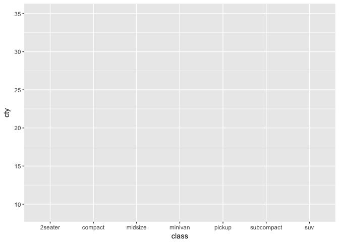
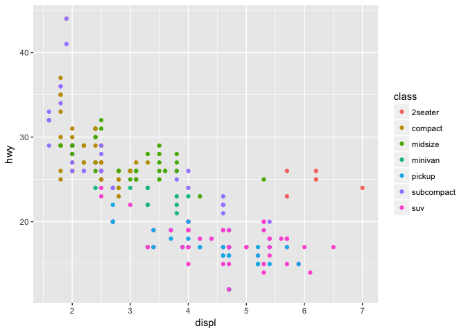

# install and/or load packages for this session
- `install.packages()`: "Download and install packages from CRAN-like repositories or from local files."  
- `library()`: loads your package you installed  
- **best practice note.** `install.packages()` downloads files from the internet, so it's "polite" to "comment out" (# = comment) this code before you share it with people so they don't download files they don't really want by accident.  

# install and/or load packages for this session


```r
# install.packages("tidyverse")
# install.packages("psych")
# install.packages("knitr")
# install.packages("lme4")
# install.packages("fivethirtyeight")

library(tidyverse)
library(knitr)
library(psych)
library(lme4)
library(fivethirtyeight)
```

# how do I answer research questions with plots?
- **use ggplot2.**
- **ggplot2 metaphor.** think of a ggplot2 plot like a "map of the world" that you build one layer at a time.
- imagine a map of the world without land (i.e., water only).
- now imagine adding "layers" (e.g., continents, colors, mountains, legends). ggplot2's kinda like that.


# how do I answer research questions with plots?
> 1. [**grammar of graphics**](http://vita.had.co.nz/papers/layered-grammar.html), a visualization philosophy
> 2. start with `ggplot()`
> 3. supply a dataset and aesthetic mapping, `aes()`
> 4. add on ...
>     + **layers**, like `geom_point()` or `geom_histogram()`
>     + **scales**, like `scale_colour_brewer()`
>     + **faceting specifications**, like `facet_wrap()`
>     + **coordinate systems**, like `coord_flip()`
    
**source.** [**ggplot2.tidyverse.org**](ggplot2.tidyverse.org)

# example: do cars with big engines use more fuel than cars with small engines?
> - **mpg dataset.** "This dataset contains a subset of the fuel economy data that the EPA makes available on [**http://fueleconomy.gov**](http://fueleconomy.gov). It contains only models which had a new release every year between 1999 and 2008 - this was used as a proxy for the popularity of the car."

**sources.** [**R for Data Science**](http://r4ds.had.co.nz/data-visualisation.html) and `help("mpg")`


```r
mpg %>% sample_n(size = 15)
```

<div class="kable-table">

manufacturer   model                  displ   year   cyl  trans        drv    cty   hwy  fl   class   
-------------  --------------------  ------  -----  ----  -----------  ----  ----  ----  ---  --------
nissan         maxima                   3.5   2008     6  auto(av)     f       19    25  p    midsize 
chevrolet      corvette                 7.0   2008     8  manual(m6)   r       15    24  p    2seater 
ford           f150 pickup 4wd          4.6   1999     8  manual(m5)   4       13    16  r    pickup  
toyota         camry                    2.2   1999     4  manual(m5)   f       21    29  r    midsize 
toyota         camry                    3.0   1999     6  manual(m5)   f       18    26  r    midsize 
audi           a6 quattro               3.1   2008     6  auto(s6)     4       17    25  p    midsize 
toyota         toyota tacoma 4wd        4.0   2008     6  auto(l5)     4       16    20  r    pickup  
dodge          ram 1500 pickup 4wd      4.7   2008     8  manual(m6)   4       12    16  r    pickup  
chevrolet      malibu                   3.6   2008     6  auto(s6)     f       17    26  r    midsize 
toyota         camry solara             3.3   2008     6  auto(s5)     f       18    27  r    compact 
toyota         camry solara             2.4   2008     4  auto(s5)     f       22    31  r    compact 
audi           a4 quattro               2.8   1999     6  auto(l5)     4       15    25  p    compact 
dodge          dakota pickup 4wd        4.7   2008     8  auto(l5)     4       14    19  r    pickup  
chevrolet      c1500 suburban 2wd       5.3   2008     8  auto(l4)     r       14    20  r    suv     
chevrolet      malibu                   3.1   1999     6  auto(l4)     f       18    26  r    midsize 

</div>

# example: do cars with big engines use more fuel than cars with small engines?
> 1. start with mapping and `aes()`
>     + **displ.** engine displacement, in litres (bigger numbers = greater engine size)
>     + **hwy.** highway miles per gallon (bigger numbers = using less fuel each mile)
>     + you are mapping aesthetics onto data
>     + x-axis position maps onto displ
>     + y-axis position maps onto hwy
>     + x-position and y-position are aesthetics: things that we can perceive on the graphic


```r
ggplot(data = mpg, mapping = aes(x = displ, y = hwy))
```

<!-- -->

# example: do cars with big engines use more fuel than cars with small engines?
> 2. add a layer, like `geom_point()`
  >     + layers determine physical representations of data

**source.** [**A layered grammar of graphics**](http://vita.had.co.nz/papers/layered-grammar.pdf)


```r
ggplot(data = mpg, mapping = aes(x = displ, y = hwy)) +
  geom_point()
```

<!-- -->

# example: what types have cars have big engines but decent highway mpg?
> 3. add a new aesthetic mapping, like color
  >     + **class.** "type" of car
  >     + color maps onto class

**source.** [A layered grammar of graphics](http://vita.had.co.nz/papers/layered-grammar.pdf)


```r
ggplot(data = mpg, mapping = aes(x = displ, y = hwy, color = class)) +
  geom_point()
```

<!-- -->

# which type of car has better mpg in the city?
> - **cty.** city miles per gallon
>     + use new x- and y-axis aesthetics with `aes()`
>     + now x-position maps onto class
>     + and y-position maps onto cty


```r
ggplot(data = mpg, mapping = aes(x = class, y = cty))
```

<!-- -->

# which type of car has better mpg in the city?
> - add a boxplot layer
>     + boxplots are a complex layer
>     + e.g., they require statistics like fences, hinges, and outliers in addition to the shapes we see

**source.** [A layered grammar of graphics](http://vita.had.co.nz/papers/layered-grammar.pdf)


```r
ggplot(data = mpg, mapping = aes(x = class, y = cty)) +
  geom_boxplot()
```

<!-- -->

# which type of car has better mpg in the city?
> - add a statistical summary layer
>     + normative bars representing means + 95% confidence intervals
>     + `stat_summary()`: "Summarise y values at unique/binned x"
>     + `mean_cl_normal()`: "... computes 3 summary variables: the sample mean and lower and upper Gaussian confidence limits based on the t-distribution."

**sources.** `help("stat_summary")` and `help("mean_cl_normal")`


```r
ggplot(data = mpg, mapping = aes(x = class, y = cty)) +
  stat_summary(geom = "bar", fun.data = mean_cl_normal) +
  stat_summary(geom = "errorbar", fun.data = mean_cl_normal, width = 0)
```

<!-- -->

# which type of car has better mpg in the city?
> - **cty.** city miles per gallon  
> - standard bars representing means + 95% confidence intervals  
> - `stat_summary()`: "Summarise y values at unique/binned x"  
> - `mean_cl_normal()`: "... computes 3 summary variables: the sample mean and lower and upper Gaussian   confidence limits based on the t-distribution."  
> - fill the bars with fill = white, and color their outline with color = "black"

**sources.** `help("stat_summary")` and `help("mean_cl_normal")`


```r
ggplot(data = mpg, mapping = aes(x = class, y = cty)) +
  stat_summary(geom = "bar", fun.data = mean_cl_normal, fill = "white", color = "black") +
  stat_summary(geom = "errorbar", fun.data = mean_cl_normal, width = 0)
```

<!-- -->

# exercise: play with the sleepstudy dataset that comes with `lme4`
> - **sleepstudy.** "The average reaction time per day for subjects in a sleep deprivation study. On day 0 the subjects had their normal amount of sleep. Starting that night they were restricted to 3 hours of sleep per night. The observations represent the average reaction time on a series of tests given each day to each subject."

**source.** `help(sleepstudy)`


```r
sleepstudy %>% sample_n(size = 15)
```

<div class="kable-table">

       Reaction   Days  Subject 
----  ---------  -----  --------
171    269.4117      0  372     
31     321.5426      0  330     
108    308.1020      7  349     
65     297.1710      4  333     
24     232.8416      3  310     
166    284.5120      5  371     
66     338.1665      5  333     
126    304.6336      5  351     
135    348.7402      4  352     
158    347.5855      7  370     
61     283.8424      0  333     
5      356.8519      4  308     
82     273.9472      1  335     
103    238.9256      2  349     
75     279.0244      4  334     

</div>

# exercise: play with the sleepstudy dataset that comes with `lme4`
> - **sleepstudy.**
>     + does average reaction time change over time?
>     + does change over time depend on Subject?
>     + **hint.** `help(facet_wrap)`

**source.** `help(sleepstudy)`


# see below for plot exercise solution
> - look at this after you've tried to solve yourself


```r
ggplot(data = sleepstudy, mapping = aes(x = Days, y = Reaction)) +
  geom_point() +
  scale_x_continuous(breaks = seq(from = 0, to = 9, by = 1)) +
  facet_wrap(facets = ~ Subject)
```

<!-- -->

# exercise: play with the `US_births_2000_2014` dataset that comes with the `fivethirtyeight` package
> - "The raw data behind the story "Some People Are Too Superstitious To Have A Baby On Friday The 13th" [**Some people aare too superstitious to have a baby on friday the 13th**](https://fivethirtyeight.com/features/some-people-are-too-superstitious-to-have-a-baby-on-friday-the-13th/)."

**source.** `help(US_births_2000_2014)`

# exercise: play with the `US_births_2000_2014` dataset that comes with the `fivethirtyeight` package


```r
US_births_2000_2014 %>% sample_n(size = 15)
```

<div class="kable-table">

 year   month   date_of_month  date         day_of_week    births
-----  ------  --------------  -----------  ------------  -------
 2008       4               3  2008-04-03   Thurs           13340
 2005       1               5  2005-01-05   Wed             12671
 2005      10               9  2005-10-09   Sun              7508
 2006      11               1  2006-11-01   Wed             13969
 2009       8               9  2009-08-09   Sun              7683
 2006       3              31  2006-03-31   Fri             12406
 2013      11              15  2013-11-15   Fri             12339
 2003      10              30  2003-10-30   Thurs           12600
 2008       4              29  2008-04-29   Tues            13313
 2014       4              20  2014-04-20   Sun              6877
 2005       1              14  2005-01-14   Fri             12562
 2008       2               5  2008-02-05   Tues            13447
 2013       2              11  2013-02-11   Mon             11460
 2008       3              10  2008-03-10   Mon             12648
 2001       3              13  2001-03-13   Tues            12534

</div>

# exercise: play with the `US_births_2000_2014` dataset that comes with the `fivethirtyeight` package
> - do births change over the week?
> - does the weekly pattern of births change over the years?

**source.** `help(US_births_2000_2014)`


# see below for plot exercise solution
> - look at this after you've tried to solve yourself


```r
ggplot(data = US_births_2000_2014, mapping = aes(x = day_of_week, y = births)) +
  geom_point() +
  facet_wrap(facets = ~ year)
```

<!-- -->

# resources
> - [**R for Data Science: Import, Tidy, Transform, Visualize, and Model Data**](http://r4ds.had.co.nz/). This guide is extremely useful in general, but see [**Chapter 3**](http://r4ds.had.co.nz/data-visualisation.html) for an introduction to data visualization.
> - [**tidyverse: ggplot2.**](http://ggplot2.tidyverse.org/index.html) ggplot2 bible (also check out the rest of the tidyverse website)
> - [**R Base Graphics: An Idiot's Guide.**](http://rpubs.com/SusanEJohnston/7953) if you want to plot with Base graphics like an R hipster (a hipstR ...) here's a jumping off point


