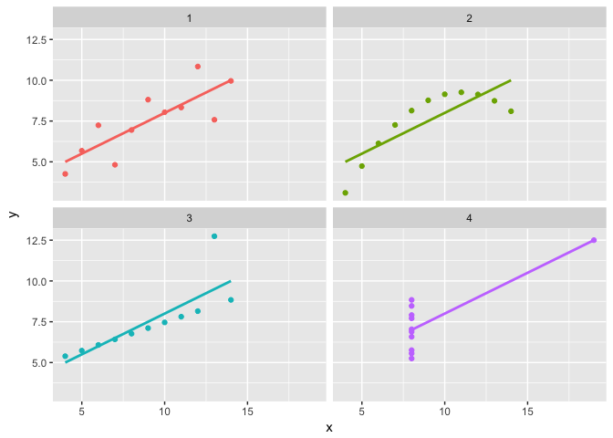
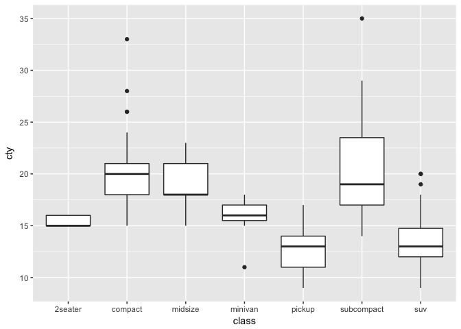
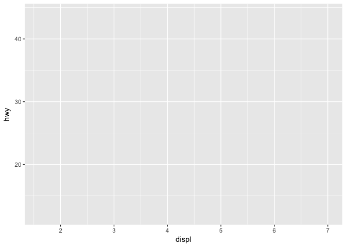
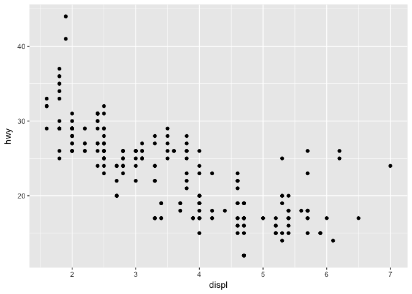
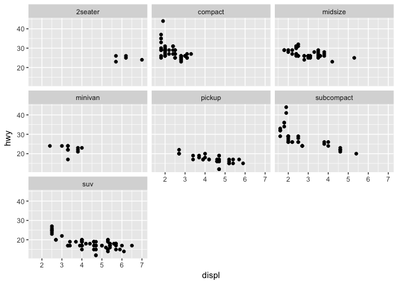
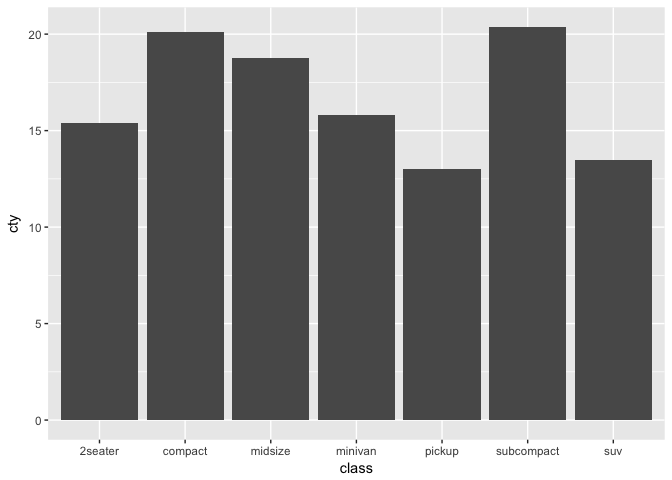
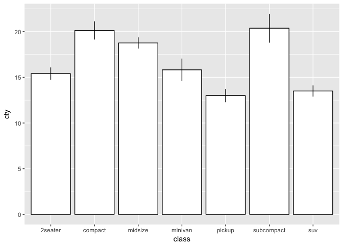
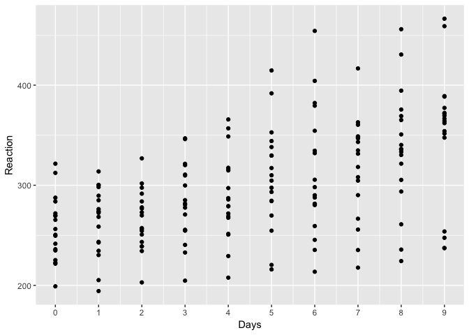

# install and/or load packages for this session
- `install.packages()`: "Download and install packages from CRAN-like repositories or from local files."  
- `library()`: loads your package you installed  
- **best practice note.** `install.packages()` downloads files from the internet, so it's "polite" to "comment out" (# = comment) this code before you share it with people so they don't download files they don't really want by accident.  

# install and/or load packages for this session


```r
# install.packages("tidyverse")
# install.packages("psych")
# install.packages("datasauRus")
# install.packages("lme4")
# install.packages("fivethirtyeight")

library(tidyverse)
library(psych)
library(datasauRus)
library(lme4)
library(fivethirtyeight)
```

# Anscombe's quartet

## same descriptives ...


```r
describe(anscombe)
```

<div class="kable-table">

      vars    n       mean         sd   median    trimmed        mad    min     max   range         skew     kurtosis          se
---  -----  ---  ---------  ---------  -------  ---------  ---------  -----  ------  ------  -----------  -----------  ----------
x1       1   11   9.000000   3.316625     9.00   9.000000   4.447800   4.00   14.00   10.00    0.0000000   -1.5289256   1.0000000
x2       2   11   9.000000   3.316625     9.00   9.000000   4.447800   4.00   14.00   10.00    0.0000000   -1.5289256   1.0000000
x3       3   11   9.000000   3.316625     9.00   9.000000   4.447800   4.00   14.00   10.00    0.0000000   -1.5289256   1.0000000
x4       4   11   9.000000   3.316625     8.00   8.000000   0.000000   8.00   19.00   11.00    2.4669110    4.5206612   1.0000000
y1       5   11   7.500909   2.031568     7.58   7.490000   1.823598   4.26   10.84    6.58   -0.0483735   -1.1991228   0.6125408
y2       6   11   7.500909   2.031657     8.14   7.794444   1.467774   3.10    9.26    6.16   -0.9786929   -0.5143191   0.6125676
y3       7   11   7.500000   2.030424     7.11   7.152222   1.527078   5.39   12.74    7.35    1.3801204    1.2400439   0.6121958
y4       8   11   7.500909   2.030578     7.04   7.195556   1.897728   5.25   12.50    7.25    1.1207739    0.6287512   0.6122425

</div>

## same linear regression results ...


```r
summary(lm(y1 ~ x1, data = anscombe))
```

```
## 
## Call:
## lm(formula = y1 ~ x1, data = anscombe)
## 
## Residuals:
##      Min       1Q   Median       3Q      Max 
## -1.92127 -0.45577 -0.04136  0.70941  1.83882 
## 
## Coefficients:
##             Estimate Std. Error t value Pr(>|t|)   
## (Intercept)   3.0001     1.1247   2.667  0.02573 * 
## x1            0.5001     0.1179   4.241  0.00217 **
## ---
## Signif. codes:  0 '***' 0.001 '**' 0.01 '*' 0.05 '.' 0.1 ' ' 1
## 
## Residual standard error: 1.237 on 9 degrees of freedom
## Multiple R-squared:  0.6665,	Adjusted R-squared:  0.6295 
## F-statistic: 17.99 on 1 and 9 DF,  p-value: 0.00217
```

```r
summary(lm(y2 ~ x2, data = anscombe))
```

```
## 
## Call:
## lm(formula = y2 ~ x2, data = anscombe)
## 
## Residuals:
##     Min      1Q  Median      3Q     Max 
## -1.9009 -0.7609  0.1291  0.9491  1.2691 
## 
## Coefficients:
##             Estimate Std. Error t value Pr(>|t|)   
## (Intercept)    3.001      1.125   2.667  0.02576 * 
## x2             0.500      0.118   4.239  0.00218 **
## ---
## Signif. codes:  0 '***' 0.001 '**' 0.01 '*' 0.05 '.' 0.1 ' ' 1
## 
## Residual standard error: 1.237 on 9 degrees of freedom
## Multiple R-squared:  0.6662,	Adjusted R-squared:  0.6292 
## F-statistic: 17.97 on 1 and 9 DF,  p-value: 0.002179
```

```r
summary(lm(y3 ~ x3, data = anscombe))
```

```
## 
## Call:
## lm(formula = y3 ~ x3, data = anscombe)
## 
## Residuals:
##     Min      1Q  Median      3Q     Max 
## -1.1586 -0.6146 -0.2303  0.1540  3.2411 
## 
## Coefficients:
##             Estimate Std. Error t value Pr(>|t|)   
## (Intercept)   3.0025     1.1245   2.670  0.02562 * 
## x3            0.4997     0.1179   4.239  0.00218 **
## ---
## Signif. codes:  0 '***' 0.001 '**' 0.01 '*' 0.05 '.' 0.1 ' ' 1
## 
## Residual standard error: 1.236 on 9 degrees of freedom
## Multiple R-squared:  0.6663,	Adjusted R-squared:  0.6292 
## F-statistic: 17.97 on 1 and 9 DF,  p-value: 0.002176
```

```r
summary(lm(y4 ~ x4, data = anscombe))
```

```
## 
## Call:
## lm(formula = y4 ~ x4, data = anscombe)
## 
## Residuals:
##    Min     1Q Median     3Q    Max 
## -1.751 -0.831  0.000  0.809  1.839 
## 
## Coefficients:
##             Estimate Std. Error t value Pr(>|t|)   
## (Intercept)   3.0017     1.1239   2.671  0.02559 * 
## x4            0.4999     0.1178   4.243  0.00216 **
## ---
## Signif. codes:  0 '***' 0.001 '**' 0.01 '*' 0.05 '.' 0.1 ' ' 1
## 
## Residual standard error: 1.236 on 9 degrees of freedom
## Multiple R-squared:  0.6667,	Adjusted R-squared:  0.6297 
## F-statistic:    18 on 1 and 9 DF,  p-value: 0.002165
```

## but the plots ...


```r
tibble(set = rep(1:4, each = nrow(anscombe)) %>% factor(),
       x = with(anscombe, c(x1, x2, x3, x4)),
       y = with(anscombe, c(y1, y2, y3, y4))) %>% 
  ggplot(mapping = aes(x = x, y = y, color = set)) +
  geom_point() +
  geom_smooth(method = "lm", se = FALSE) +
  facet_wrap(facets = ~ set) +
  theme(legend.position = "none")
```

<!-- -->

# datasaurus dozen

## same descriptives ...


```r
with(datasaurus_dozen, describeBy(x, group = dataset, mat = TRUE))
```

<div class="kable-table">

       item   group1        vars     n       mean         sd     median    trimmed        mad        min        max      range         skew     kurtosis         se
-----  -----  -----------  -----  ----  ---------  ---------  ---------  ---------  ---------  ---------  ---------  ---------  -----------  -----------  ---------
X11    1      away             1   142   54.26610   16.76983   53.34030   54.35902   21.22096   15.56075   91.63996   76.07921   -0.0238768   -1.2428294   1.407292
X12    2      bullseye         1   142   54.26873   16.76924   53.84209   53.86032   17.49410   19.28820   91.73554   72.44733    0.1682837   -0.2682028   1.407243
X13    3      circle           1   142   54.26732   16.76001   54.02321   54.07580   16.29359   21.86358   85.66476   63.80118    0.0304864   -0.6690924   1.406469
X14    4      dino             1   142   54.26327   16.76514   53.33330   53.68646   15.96656   22.30770   98.20510   75.89740    0.2807568   -0.2854912   1.406899
X15    5      dots             1   142   54.26030   16.76774   50.97677   54.87898    2.76161   25.44353   77.95444   52.51091   -0.1226525   -0.8711817   1.407117
X16    6      h_lines          1   142   54.26144   16.76590   53.06968   53.87282   17.90469   22.00371   98.28812   76.28441    0.2408185   -0.3549513   1.406963
X17    7      high_lines       1   142   54.26881   16.76670   54.16869   53.91367   16.00184   17.89350   96.08052   78.18702    0.1891617   -0.2816209   1.407031
X18    8      slant_down       1   142   54.26785   16.76676   53.13516   53.83147   16.23906   18.10947   95.59342   77.48394    0.2521441   -0.2597905   1.407035
X19    9      slant_up         1   142   54.26588   16.76885   54.26135   53.68574   16.12922   20.20978   95.26053   75.05075    0.2299168   -0.3829457   1.407211
X110   10     star             1   142   54.26734   16.76896   56.53473   54.33442   22.16494   27.02460   86.43590   59.41129    0.0814822   -1.1882423   1.407220
X111   11     v_lines          1   142   54.26993   16.76996   50.36289   53.56542   28.37296   30.44965   89.50485   59.05520    0.2561127   -0.5817808   1.407304
X112   12     wide_lines       1   142   54.26692   16.77000   64.55023   54.70481   11.67615   27.43963   77.91587   50.47624   -0.3212056   -1.7192867   1.407307
X113   13     x_shape          1   142   54.26015   16.76996   47.13646   53.26637   14.75946   31.10687   85.44619   54.33932    0.4776030   -1.3729389   1.407304

</div>

```r
with(datasaurus_dozen, describeBy(y, group = dataset, mat = TRUE))
```

<div class="kable-table">

       item   group1        vars     n       mean         sd     median    trimmed        mad          min        max      range         skew     kurtosis         se
-----  -----  -----------  -----  ----  ---------  ---------  ---------  ---------  ---------  -----------  ---------  ---------  -----------  -----------  ---------
X11    1      away             1   142   47.83472   26.93974   47.53527   48.23284   35.89123    0.0151193   97.47577   97.46065   -0.0932474   -1.2817225   2.260733
X12    2      bullseye         1   142   47.83082   26.93573   47.38294   47.82848   36.83154    9.6915471   85.87623   76.18468    0.0122276   -1.4540983   2.260396
X13    3      circle           1   142   47.83772   26.93004   51.02502   47.71135   41.71674   16.3265464   85.57813   69.25159    0.0048960   -1.8029697   2.259918
X14    4      dino             1   142   47.83225   26.93540   46.02560   46.90284   30.79242    2.9487000   99.48720   96.53850    0.2472603   -1.0635521   2.260369
X15    5      dots             1   142   47.83983   26.93019   51.29929   46.87745   46.98792   15.7718920   94.24933   78.47744    0.1476910   -1.4088664   2.259931
X16    6      h_lines          1   142   47.83025   26.93988   50.47353   47.23323   29.62371   10.4639152   90.45894   79.99502    0.1487355   -1.1603030   2.260744
X17    7      high_lines       1   142   47.83545   26.94000   32.49920   47.15084   22.76810   14.9139625   87.15221   72.23825    0.2024742   -1.8022348   2.260754
X18    8      slant_down       1   142   47.83590   26.93610   46.40131   47.30665   28.64590    0.3038724   99.64418   99.34031    0.1873369   -0.9492562   2.260428
X19    9      slant_up         1   142   47.83150   26.93861   45.29224   46.83068   33.79656    5.6457775   99.57959   93.93381    0.2554495   -1.0933159   2.260638
X110   10     star             1   142   47.83955   26.93027   50.11055   46.55526   37.29715   14.3655905   92.21499   77.84940    0.2372490   -1.3589160   2.259938
X111   11     v_lines          1   142   47.83699   26.93768   47.11362   46.82624   33.00178    2.7347602   99.69468   96.95992    0.2253746   -1.0479510   2.260560
X112   12     wide_lines       1   142   47.83160   26.93790   46.27933   46.96953   32.58742    0.2170063   99.28376   99.06676    0.2484350   -1.0901205   2.260578
X113   13     x_shape          1   142   47.83972   26.93000   39.87621   46.97941   33.04887    4.5776614   97.83761   93.25995    0.2277144   -1.4442001   2.259915

</div>

## same linear regression results ...


```r
summary(lm(y ~ x, data = datasaurus_dozen[datasaurus_dozen$dataset == "away", ]))
```

```
## 
## Call:
## lm(formula = y ~ x, data = datasaurus_dozen[datasaurus_dozen$dataset == 
##     "away", ])
## 
## Residuals:
##     Min      1Q  Median      3Q     Max 
## -49.481 -24.474   0.422  24.196  49.537 
## 
## Coefficients:
##             Estimate Std. Error t value Pr(>|t|)    
## (Intercept)  53.4251     7.6932   6.944 1.31e-10 ***
## x            -0.1030     0.1355  -0.760    0.448    
## ---
## Signif. codes:  0 '***' 0.001 '**' 0.01 '*' 0.05 '.' 0.1 ' ' 1
## 
## Residual standard error: 26.98 on 140 degrees of freedom
## Multiple R-squared:  0.004112,	Adjusted R-squared:  -0.003001 
## F-statistic: 0.5781 on 1 and 140 DF,  p-value: 0.4483
```

```r
summary(lm(y ~ x, data = datasaurus_dozen[datasaurus_dozen$dataset == "bullseye", ]))
```

```
## 
## Call:
## lm(formula = y ~ x, data = datasaurus_dozen[datasaurus_dozen$dataset == 
##     "bullseye", ])
## 
## Residuals:
##     Min      1Q  Median      3Q     Max 
## -38.506 -23.548  -1.602  22.128  38.384 
## 
## Coefficients:
##             Estimate Std. Error t value Pr(>|t|)    
## (Intercept)  53.8095     7.6904   6.997 9.92e-11 ***
## x            -0.1102     0.1354  -0.813    0.417    
## ---
## Signif. codes:  0 '***' 0.001 '**' 0.01 '*' 0.05 '.' 0.1 ' ' 1
## 
## Residual standard error: 26.97 on 140 degrees of freedom
## Multiple R-squared:  0.004704,	Adjusted R-squared:  -0.002405 
## F-statistic: 0.6617 on 1 and 140 DF,  p-value: 0.4173
```

```r
summary(lm(y ~ x, data = datasaurus_dozen[datasaurus_dozen$dataset == "circle", ]))
```

```
## 
## Call:
## lm(formula = y ~ x, data = datasaurus_dozen[datasaurus_dozen$dataset == 
##     "circle", ])
## 
## Residuals:
##     Min      1Q  Median      3Q     Max 
## -31.649 -28.873   3.759  29.968  37.582 
## 
## Coefficients:
##             Estimate Std. Error t value Pr(>|t|)    
## (Intercept)  53.7970     7.6925   6.993 1.01e-10 ***
## x            -0.1098     0.1355  -0.811    0.419    
## ---
## Signif. codes:  0 '***' 0.001 '**' 0.01 '*' 0.05 '.' 0.1 ' ' 1
## 
## Residual standard error: 26.96 on 140 degrees of freedom
## Multiple R-squared:  0.004671,	Adjusted R-squared:  -0.002439 
## F-statistic: 0.657 on 1 and 140 DF,  p-value: 0.419
```

```r
summary(lm(y ~ x, data = datasaurus_dozen[datasaurus_dozen$dataset == "dino", ]))
```

```
## 
## Call:
## lm(formula = y ~ x, data = datasaurus_dozen[datasaurus_dozen$dataset == 
##     "dino", ])
## 
## Residuals:
##     Min      1Q  Median      3Q     Max 
## -43.439 -23.213  -1.296  21.368  52.050 
## 
## Coefficients:
##             Estimate Std. Error t value Pr(>|t|)    
## (Intercept)  53.4530     7.6934   6.948 1.29e-10 ***
## x            -0.1036     0.1355  -0.764    0.446    
## ---
## Signif. codes:  0 '***' 0.001 '**' 0.01 '*' 0.05 '.' 0.1 ' ' 1
## 
## Residual standard error: 26.98 on 140 degrees of freedom
## Multiple R-squared:  0.004157,	Adjusted R-squared:  -0.002957 
## F-statistic: 0.5844 on 1 and 140 DF,  p-value: 0.4459
```

```r
summary(lm(y ~ x, data = datasaurus_dozen[datasaurus_dozen$dataset == "h_lines", ]))
```

```
## 
## Call:
## lm(formula = y ~ x, data = datasaurus_dozen[datasaurus_dozen$dataset == 
##     "h_lines", ])
## 
## Residuals:
##     Min      1Q  Median      3Q     Max 
## -38.631 -19.015   1.345  22.421  44.139 
## 
## Coefficients:
##             Estimate Std. Error t value Pr(>|t|)    
## (Intercept) 53.21109    7.69546   6.915 1.53e-10 ***
## x           -0.09916    0.13554  -0.732    0.466    
## ---
## Signif. codes:  0 '***' 0.001 '**' 0.01 '*' 0.05 '.' 0.1 ' ' 1
## 
## Residual standard error: 26.98 on 140 degrees of freedom
## Multiple R-squared:  0.003809,	Adjusted R-squared:  -0.003307 
## F-statistic: 0.5353 on 1 and 140 DF,  p-value: 0.4656
```

```r
summary(lm(y ~ x, data = datasaurus_dozen[datasaurus_dozen$dataset == "high_lines", ]))
```

```
## 
## Call:
## lm(formula = y ~ x, data = datasaurus_dozen[datasaurus_dozen$dataset == 
##     "high_lines", ])
## 
## Residuals:
##    Min     1Q Median     3Q    Max 
## -32.37 -24.92 -13.62  28.96  41.13 
## 
## Coefficients:
##             Estimate Std. Error t value Pr(>|t|)    
## (Intercept)  53.8088     7.6927   6.995    1e-10 ***
## x            -0.1101     0.1355  -0.812    0.418    
## ---
## Signif. codes:  0 '***' 0.001 '**' 0.01 '*' 0.05 '.' 0.1 ' ' 1
## 
## Residual standard error: 26.97 on 140 degrees of freedom
## Multiple R-squared:  0.004693,	Adjusted R-squared:  -0.002417 
## F-statistic: 0.6601 on 1 and 140 DF,  p-value: 0.4179
```

```r
summary(lm(y ~ x, data = datasaurus_dozen[datasaurus_dozen$dataset == "slant_down", ]))
```

```
## 
## Call:
## lm(formula = y ~ x, data = datasaurus_dozen[datasaurus_dozen$dataset == 
##     "slant_down", ])
## 
## Residuals:
##     Min      1Q  Median      3Q     Max 
## -47.855 -20.283  -1.849  20.947  51.612 
## 
## Coefficients:
##             Estimate Std. Error t value Pr(>|t|)    
## (Intercept)  53.8497     7.6912   7.001 9.69e-11 ***
## x            -0.1108     0.1355  -0.818    0.415    
## ---
## Signif. codes:  0 '***' 0.001 '**' 0.01 '*' 0.05 '.' 0.1 ' ' 1
## 
## Residual standard error: 26.97 on 140 degrees of freedom
## Multiple R-squared:  0.004758,	Adjusted R-squared:  -0.002351 
## F-statistic: 0.6693 on 1 and 140 DF,  p-value: 0.4147
```

```r
summary(lm(y ~ x, data = datasaurus_dozen[datasaurus_dozen$dataset == "slant_up", ]))
```

```
## 
## Call:
## lm(formula = y ~ x, data = datasaurus_dozen[datasaurus_dozen$dataset == 
##     "slant_up", ])
## 
## Residuals:
##     Min      1Q  Median      3Q     Max 
## -42.039 -22.605  -2.074  23.669  53.404 
## 
## Coefficients:
##             Estimate Std. Error t value Pr(>|t|)    
## (Intercept)  53.8126     7.6910   6.997 9.93e-11 ***
## x            -0.1102     0.1355  -0.814    0.417    
## ---
## Signif. codes:  0 '***' 0.001 '**' 0.01 '*' 0.05 '.' 0.1 ' ' 1
## 
## Residual standard error: 26.97 on 140 degrees of freedom
## Multiple R-squared:  0.004707,	Adjusted R-squared:  -0.002402 
## F-statistic: 0.6621 on 1 and 140 DF,  p-value: 0.4172
```

```r
summary(lm(y ~ x, data = datasaurus_dozen[datasaurus_dozen$dataset == "v_lines", ]))
```

```
## 
## Call:
## lm(formula = y ~ x, data = datasaurus_dozen[datasaurus_dozen$dataset == 
##     "v_lines", ])
## 
## Residuals:
##     Min      1Q  Median      3Q     Max 
## -44.605 -24.261  -1.092  18.186  51.402 
## 
## Coefficients:
##             Estimate Std. Error t value Pr(>|t|)    
## (Intercept)  53.8908     7.6903   7.008 9.38e-11 ***
## x            -0.1116     0.1354  -0.824    0.412    
## ---
## Signif. codes:  0 '***' 0.001 '**' 0.01 '*' 0.05 '.' 0.1 ' ' 1
## 
## Residual standard error: 26.97 on 140 degrees of freedom
## Multiple R-squared:  0.004823,	Adjusted R-squared:  -0.002286 
## F-statistic: 0.6784 on 1 and 140 DF,  p-value: 0.4115
```

```r
summary(lm(y ~ x, data = datasaurus_dozen[datasaurus_dozen$dataset == "wide_lines", ]))
```

```
## 
## Call:
## lm(formula = y ~ x, data = datasaurus_dozen[datasaurus_dozen$dataset == 
##     "wide_lines", ])
## 
## Residuals:
##     Min      1Q  Median      3Q     Max 
## -46.220 -23.863  -0.718  20.934  52.676 
## 
## Coefficients:
##             Estimate Std. Error t value Pr(>|t|)    
## (Intercept)  53.6349     7.6915   6.973 1.12e-10 ***
## x            -0.1069     0.1355  -0.789    0.431    
## ---
## Signif. codes:  0 '***' 0.001 '**' 0.01 '*' 0.05 '.' 0.1 ' ' 1
## 
## Residual standard error: 26.97 on 140 degrees of freedom
## Multiple R-squared:  0.004432,	Adjusted R-squared:  -0.002679 
## F-statistic: 0.6233 on 1 and 140 DF,  p-value: 0.4312
```

```r
summary(lm(y ~ x, data = datasaurus_dozen[datasaurus_dozen$dataset == "x_shape", ]))
```

```
## 
## Call:
## lm(formula = y ~ x, data = datasaurus_dozen[datasaurus_dozen$dataset == 
##     "x_shape", ])
## 
## Residuals:
##     Min      1Q  Median      3Q     Max 
## -45.381 -24.631  -8.142  26.292  50.807 
## 
## Coefficients:
##             Estimate Std. Error t value Pr(>|t|)    
## (Intercept)  53.5542     7.6889   6.965 1.17e-10 ***
## x            -0.1053     0.1354  -0.778    0.438    
## ---
## Signif. codes:  0 '***' 0.001 '**' 0.01 '*' 0.05 '.' 0.1 ' ' 1
## 
## Residual standard error: 26.97 on 140 degrees of freedom
## Multiple R-squared:  0.004301,	Adjusted R-squared:  -0.002811 
## F-statistic: 0.6048 on 1 and 140 DF,  p-value: 0.4381
```

## but the plots ...


```r
ggplot(data = datasaurus_dozen, aes(x = x, y = y, color = dataset)) +
  geom_point() +
  theme(legend.position = "none") +
  facet_wrap(~dataset, ncol = 3)
```

<!-- -->

# how do I answer research questions with plots?
- **use ggplot2.**
- **ggplot2 metaphor.** think of a ggplot2 plot like a "map of the world" that you build one layer at a time.
- imagine a map of the world without land (i.e., water only).
- now imagine adding "layers" (e.g., continents, colors, mountains, legends). ggplot2's kinda like that.


# how do I answer research questions with plots?
> 1. [**grammar of graphics**](http://vita.had.co.nz/papers/layered-grammar.html), a visualization philosophy
> 2. start with `ggplot()`
> 3. supply a dataset and aesthetic mapping, `aes()`
> 4. add on ...
>     + **layers**, like `geom_point()` or `geom_histogram()`
>     + **scales**, like `scale_colour_brewer()`
>     + **faceting specifications**, like `facet_wrap()`
>     + **coordinate systems**, like `coord_flip()`
    
**source.** [**ggplot2.tidyverse.org**](ggplot2.tidyverse.org)

# example: do cars with big engines use more fuel than cars with small engines?
> - **mpg dataset.** "This dataset contains a subset of the fuel economy data that the EPA makes available on [**http://fueleconomy.gov**](http://fueleconomy.gov). It contains only models which had a new release every year between 1999 and 2008 - this was used as a proxy for the popularity of the car."

**sources.** [**R for Data Science**](http://r4ds.had.co.nz/data-visualisation.html) and `help("mpg")`


```r
mpg %>% sample_n(size = 15)
```

<div class="kable-table">

manufacturer   model                  displ   year   cyl  trans        drv    cty   hwy  fl   class      
-------------  --------------------  ------  -----  ----  -----------  ----  ----  ----  ---  -----------
toyota         4runner 4wd              3.4   1999     6  manual(m5)   4       15    17  r    suv        
ford           explorer 4wd             4.0   2008     6  auto(l5)     4       13    19  r    suv        
honda          civic                    1.6   1999     4  auto(l4)     f       24    32  r    subcompact 
chevrolet      malibu                   3.5   2008     6  auto(l4)     f       18    29  r    midsize    
dodge          ram 1500 pickup 4wd      4.7   2008     8  manual(m6)   4       12    16  r    pickup     
subaru         impreza awd              2.5   1999     4  auto(l4)     4       19    26  r    subcompact 
land rover     range rover              4.4   2008     8  auto(s6)     4       12    18  r    suv        
dodge          caravan 2wd              2.4   1999     4  auto(l3)     f       18    24  r    minivan    
chevrolet      c1500 suburban 2wd       6.0   2008     8  auto(l4)     r       12    17  r    suv        
nissan         maxima                   3.0   1999     6  auto(l4)     f       18    26  r    midsize    
chevrolet      malibu                   3.1   1999     6  auto(l4)     f       18    26  r    midsize    
pontiac        grand prix               5.3   2008     8  auto(s4)     f       16    25  p    midsize    
dodge          caravan 2wd              3.3   1999     6  auto(l4)     f       16    22  r    minivan    
ford           mustang                  3.8   1999     6  manual(m5)   r       18    26  r    subcompact 
audi           a4                       2.0   2008     4  auto(av)     f       21    30  p    compact    

</div>

# example: do cars with big engines use more fuel than cars with small engines?
> 1. start with mapping and `aes()`
>     + **displ.** engine displacement, in litres (bigger numbers = greater engine size)
>     + **hwy.** highway miles per gallon (bigger numbers = using less fuel each mile)
>     + you are mapping aesthetics onto data
>     + x-axis position maps onto displ
>     + y-axis position maps onto hwy
>     + x-position and y-position are aesthetics: things that we can perceive on the graphic


```r
ggplot(data = mpg, mapping = aes(x = displ, y = hwy))
```

<!-- -->

# example: do cars with big engines use more fuel than cars with small engines?
> 2. add a layer, like `geom_point()`
  >     + layers determine physical representations of data

**source.** [**A layered grammar of graphics**](http://vita.had.co.nz/papers/layered-grammar.pdf)


```r
ggplot(data = mpg, mapping = aes(x = displ, y = hwy)) +
  geom_point()
```

<!-- -->

# example: what types have cars have big engines but decent highway mpg?
> 3. add a new aesthetic mapping, like color
  >     + **class.** "type" of car
  >     + color maps onto class

**source.** [A layered grammar of graphics](http://vita.had.co.nz/papers/layered-grammar.pdf)


```r
ggplot(data = mpg, mapping = aes(x = displ, y = hwy, color = class)) +
  geom_point()
```

<!-- -->

# which type of car has better mpg in the city?
> - **cty.** city miles per gallon
>     + use new x- and y-axis aesthetics with `aes()`
>     + now x-position maps onto class
>     + and y-position maps onto cty


```r
ggplot(data = mpg, mapping = aes(x = class, y = cty))
```

<!-- -->

# which type of car has better mpg in the city?
> - add a boxplot layer
>     + boxplots are a complex layer
>     + e.g., they require statistics like fences, hinges, and outliers in addition to the shapes we see

**source.** [A layered grammar of graphics](http://vita.had.co.nz/papers/layered-grammar.pdf)


```r
ggplot(data = mpg, mapping = aes(x = class, y = cty)) +
  geom_boxplot()
```

<!-- -->

# which type of car has better mpg in the city?
> - add a statistical summary layer
>     + normative bars representing means + 95% confidence intervals
>     + `stat_summary()`: "Summarise y values at unique/binned x"
>     + `mean_cl_normal()`: "... computes 3 summary variables: the sample mean and lower and upper Gaussian confidence limits based on the t-distribution."

**sources.** `help("stat_summary")` and `help("mean_cl_normal")`


```r
ggplot(data = mpg, mapping = aes(x = class, y = cty)) +
  stat_summary(geom = "bar", fun.data = mean_cl_normal) +
  stat_summary(geom = "errorbar", fun.data = mean_cl_normal, width = 0)
```

<!-- -->

# which type of car has better mpg in the city?
> - **cty.** city miles per gallon  
> - standard bars representing means + 95% confidence intervals  
> - `stat_summary()`: "Summarise y values at unique/binned x"  
> - `mean_cl_normal()`: "... computes 3 summary variables: the sample mean and lower and upper Gaussian   confidence limits based on the t-distribution."  
> - fill the bars with fill = white, and color their outline with color = "black"

**sources.** `help("stat_summary")` and `help("mean_cl_normal")`


```r
ggplot(data = mpg, mapping = aes(x = class, y = cty)) +
  stat_summary(geom = "bar", fun.data = mean_cl_normal, fill = "white", color = "black") +
  stat_summary(geom = "errorbar", fun.data = mean_cl_normal, width = 0)
```

<!-- -->

# exercise: play with the sleepstudy dataset that comes with `lme4`
> - **sleepstudy.** "The average reaction time per day for subjects in a sleep deprivation study. On day 0 the subjects had their normal amount of sleep. Starting that night they were restricted to 3 hours of sleep per night. The observations represent the average reaction time on a series of tests given each day to each subject."

**source.** `help(sleepstudy)`


```r
sleepstudy %>% sample_n(size = 15)
```

<div class="kable-table">

       Reaction   Days  Subject 
----  ---------  -----  --------
164    281.7895      3  371     
109    336.2806      8  349     
62     289.5550      1  333     
168    304.6306      7  371     
18     217.7272      7  309     
75     279.0244      4  334     
144    277.6566      3  369     
110    351.6451      9  349     
58     346.8311      7  332     
146    317.2135      5  369     
105    250.7103      4  349     
139    375.6406      8  352     
91     312.3666      0  337     
79     335.7469      8  334     
149    340.2800      8  369     

</div>

# exercise: play with the sleepstudy dataset that comes with `lme4`
> - **sleepstudy.**
>     + does average reaction time change over time?
>     + does change over time depend on Subject?
>     + **hint.** `help(facet_wrap)`

**source.** `help(sleepstudy)`


# see below for plot exercise solution
> - look at this after you've tried to solve yourself


```r
ggplot(data = sleepstudy, mapping = aes(x = Days, y = Reaction)) +
  geom_point() +
  scale_x_continuous(breaks = seq(from = 0, to = 9, by = 1)) +
  facet_wrap(facets = ~ Subject)
```

<!-- -->

# exercise: play with the `US_births_2000_2014` dataset that comes with the `fivethirtyeight` package
> - "The raw data behind the story "Some People Are Too Superstitious To Have A Baby On Friday The 13th" [**Some people aare too superstitious to have a baby on friday the 13th**](https://fivethirtyeight.com/features/some-people-are-too-superstitious-to-have-a-baby-on-friday-the-13th/)."

**source.** `help(US_births_2000_2014)`

# exercise: play with the `US_births_2000_2014` dataset that comes with the `fivethirtyeight` package


```r
US_births_2000_2014 %>% sample_n(size = 15)
```

<div class="kable-table">

 year   month   date_of_month  date         day_of_week    births
-----  ------  --------------  -----------  ------------  -------
 2012       1              11  2012-01-11   Wed             11860
 2010       3              22  2010-03-22   Mon             11657
 2004      10              29  2004-10-29   Fri             12473
 2006       3              19  2006-03-19   Sun              7355
 2006       7              30  2006-07-30   Sun              8105
 2003      11              24  2003-11-24   Mon             13035
 2014       8               5  2014-08-05   Tues            13415
 2014       5              26  2014-05-26   Mon              7657
 2007       4              21  2007-04-21   Sat              8302
 2001       6               6  2001-06-06   Wed             12804
 2005      11              14  2005-11-14   Mon             12164
 2009       8              24  2009-08-24   Mon             12664
 2002       7              10  2002-07-10   Wed             13264
 2014       2              14  2014-02-14   Fri             12494
 2004       1               4  2004-01-04   Sun              7359

</div>

# exercise: play with the `US_births_2000_2014` dataset that comes with the `fivethirtyeight` package
> - do births change over the week?
> - does the weekly pattern of births change over the years?

**source.** `help(US_births_2000_2014)`


# see below for plot exercise solution
> - look at this after you've tried to solve yourself


```r
ggplot(data = US_births_2000_2014, mapping = aes(x = day_of_week, y = births)) +
  geom_point() +
  facet_wrap(facets = ~ year)
```

<!-- -->

# resources
> - [**R for Data Science: Import, Tidy, Transform, Visualize, and Model Data**](http://r4ds.had.co.nz/). This guide is extremely useful in general, but see [**Chapter 3**](http://r4ds.had.co.nz/data-visualisation.html) for an introduction to data visualization.
> - [**tidyverse: ggplot2.**](http://ggplot2.tidyverse.org/index.html) ggplot2 bible (also check out the rest of the tidyverse website)
> - [**R Base Graphics: An Idiot's Guide.**](http://rpubs.com/SusanEJohnston/7953) if you want to plot with Base graphics like an R hipster (a hipstR ...) here's a jumping off point


