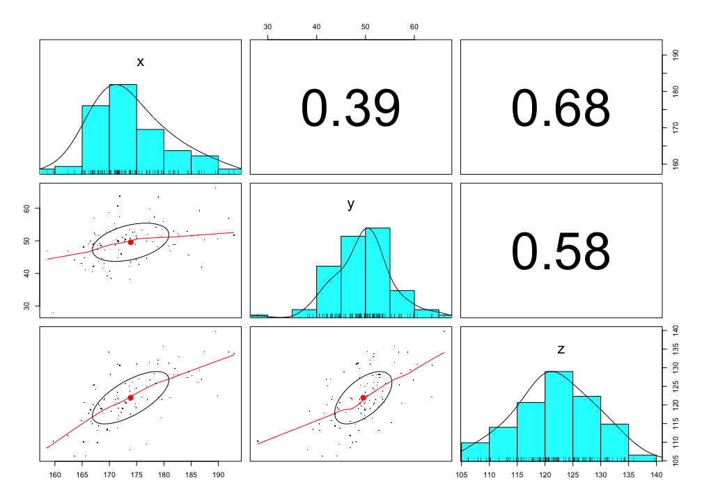
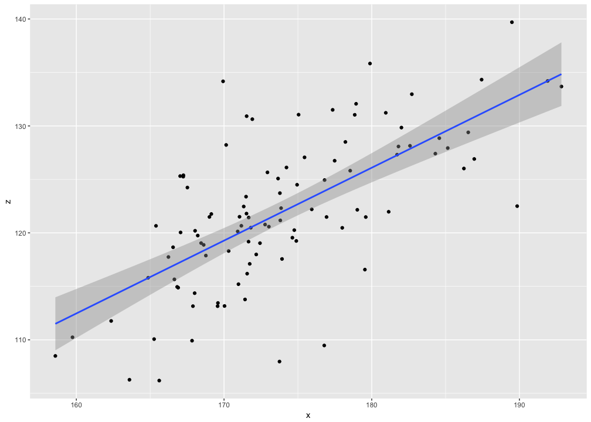

# Day 0. Installation and demonstration
Nicholas Michalak  
6/24/2017  

# install prerequisite packages


```r
# character vector of packages you'll need for your whole analysis
needed_packages <- c("tidyverse", "psych", "haven", "lavaan", "lme4", "lmerTest", "afex", "compute.es")

# source custom function
lapply(list.files(path = "custom_functions/", pattern = "\\.R", full.names = TRUE), source)
```

```
## [[1]]
## [[1]]$value
## function (needed_packages) 
## {
##     have_packages <- needed_packages %in% rownames(installed.packages())
##     if (any(have_packages == FALSE) == TRUE) 
##         install.packages(needed_packages[have_packages == FALSE])
##     lapply(needed_packages, library, character.only = TRUE)
## }
## 
## [[1]]$visible
## [1] FALSE
## 
## 
## [[2]]
## [[2]]$value
## function (y, x, z, sd_values = seq(-3, 3, 0.5), mean_center = TRUE, 
##     alpha = 0.05) 
## {
##     if (mean_center == TRUE) {
##         x <- x - mean(x, na.rm = TRUE)
##         z <- z - mean(z, na.rm = TRUE)
##     }
##     descriptives <- sapply(list(y = y, x = x, z = z), function(v) {
##         round(c(N = sum(is.na(v) == FALSE), Mean = mean(v, na.rm = TRUE), 
##             SD = sd(v, na.rm = TRUE), Median = median(v, na.rm = TRUE), 
##             Min = min(v, na.rm = TRUE), Max = max(v, na.rm = TRUE)), 
##             digits = 3)
##     })
##     model <- lm(y ~ x * z)
##     z_mean <- mean(z, na.rm = TRUE)
##     z_sd <- sd(z, na.rm = TRUE)
##     model_vcov <- vcov(model)
##     est <- list()
##     se <- list()
##     for (i in 1:length(sd_values)) {
##         est[[i]] <- coefficients(model)["x"] + coefficients(model)["x:z"] * 
##             (z_mean + sd_values[i] * z_sd)
##         se[[i]] <- sqrt(model_vcov["x", "x"] + 2 * (z_mean + 
##             sd_values[i] * z_sd) * model_vcov["x", "x:z"] + (z_mean + 
##             sd_values[i] * z_sd) * (z_mean + sd_values[i] * z_sd) * 
##             model_vcov["x:z", "x:z"])
##     }
##     result <- data.frame(z_sd = sd_values * descriptives[3, 3], 
##         est = unlist(est), se = unlist(se))
##     result$t_val <- with(data = result, est/se)
##     result$p_val <- with(data = result, 2 * pt(q = -abs(t_val), 
##         df = model$df.residual))
##     t_crit <- qt(p = 1 - alpha/2, df = model$df.residual)
##     result$lwr_ci <- with(data = result, est - t_crit * se)
##     result$upr_ci <- with(data = result, est + t_crit * se)
##     result[, !colnames(result) %in% "p_val"] <- data.frame(apply(result[, 
##         !colnames(result) %in% "p_val"], 2, function(i) round(i, 
##         3)))
##     print(paste0("Descriptives"))
##     print(descriptives)
##     return(result)
## }
## 
## [[2]]$visible
## [1] FALSE
```

```r
# install needed packages
install_needed_pkgs(needed_packages = needed_packages)
```

```
## Loading tidyverse: ggplot2
## Loading tidyverse: tibble
## Loading tidyverse: tidyr
## Loading tidyverse: readr
## Loading tidyverse: purrr
## Loading tidyverse: dplyr
```

```
## Conflicts with tidy packages ----------------------------------------------
```

```
## filter(): dplyr, stats
## lag():    dplyr, stats
```

```
## 
## Attaching package: 'psych'
```

```
## The following objects are masked from 'package:ggplot2':
## 
##     %+%, alpha
```

```
## This is lavaan 0.5-23.1097
```

```
## lavaan is BETA software! Please report any bugs.
```

```
## 
## Attaching package: 'lavaan'
```

```
## The following object is masked from 'package:psych':
## 
##     cor2cov
```

```
## Loading required package: Matrix
```

```
## 
## Attaching package: 'Matrix'
```

```
## The following object is masked from 'package:tidyr':
## 
##     expand
```

```
## 
## Attaching package: 'lmerTest'
```

```
## The following object is masked from 'package:lme4':
## 
##     lmer
```

```
## The following object is masked from 'package:stats':
## 
##     step
```

```
## Loading required package: lsmeans
```

```
## Loading required package: estimability
```

```
## 
## Attaching package: 'lsmeans'
```

```
## The following object is masked from 'package:lmerTest':
## 
##     lsmeans
```

```
## ************
## Welcome to afex. For support visit: http://afex.singmann.science/
```

```
## - Functions for ANOVAs: aov_car(), aov_ez(), and aov_4()
## - Methods for calculating p-values with mixed(): 'KR', 'S', 'LRT', and 'PB'
## - 'afex_aov' and 'mixed' objects can be passed to lsmeans() for follow-up tests
## - Get and set global package options with: afex_options()
## - Set orthogonal sum-to-zero contrasts globally: set_sum_contrasts()
## - For example analyses see: browseVignettes("afex")
## ************
```

```
## 
## Attaching package: 'afex'
```

```
## The following object is masked from 'package:lme4':
## 
##     lmer
```

```
## [[1]]
##  [1] "dplyr"     "purrr"     "readr"     "tidyr"     "tibble"   
##  [6] "ggplot2"   "tidyverse" "stats"     "graphics"  "grDevices"
## [11] "utils"     "datasets"  "methods"   "base"     
## 
## [[2]]
##  [1] "psych"     "dplyr"     "purrr"     "readr"     "tidyr"    
##  [6] "tibble"    "ggplot2"   "tidyverse" "stats"     "graphics" 
## [11] "grDevices" "utils"     "datasets"  "methods"   "base"     
## 
## [[3]]
##  [1] "haven"     "psych"     "dplyr"     "purrr"     "readr"    
##  [6] "tidyr"     "tibble"    "ggplot2"   "tidyverse" "stats"    
## [11] "graphics"  "grDevices" "utils"     "datasets"  "methods"  
## [16] "base"     
## 
## [[4]]
##  [1] "lavaan"    "haven"     "psych"     "dplyr"     "purrr"    
##  [6] "readr"     "tidyr"     "tibble"    "ggplot2"   "tidyverse"
## [11] "stats"     "graphics"  "grDevices" "utils"     "datasets" 
## [16] "methods"   "base"     
## 
## [[5]]
##  [1] "lme4"      "Matrix"    "lavaan"    "haven"     "psych"    
##  [6] "dplyr"     "purrr"     "readr"     "tidyr"     "tibble"   
## [11] "ggplot2"   "tidyverse" "stats"     "graphics"  "grDevices"
## [16] "utils"     "datasets"  "methods"   "base"     
## 
## [[6]]
##  [1] "lmerTest"  "lme4"      "Matrix"    "lavaan"    "haven"    
##  [6] "psych"     "dplyr"     "purrr"     "readr"     "tidyr"    
## [11] "tibble"    "ggplot2"   "tidyverse" "stats"     "graphics" 
## [16] "grDevices" "utils"     "datasets"  "methods"   "base"     
## 
## [[7]]
##  [1] "afex"         "lsmeans"      "estimability" "lmerTest"    
##  [5] "lme4"         "Matrix"       "lavaan"       "haven"       
##  [9] "psych"        "dplyr"        "purrr"        "readr"       
## [13] "tidyr"        "tibble"       "ggplot2"      "tidyverse"   
## [17] "stats"        "graphics"     "grDevices"    "utils"       
## [21] "datasets"     "methods"      "base"        
## 
## [[8]]
##  [1] "compute.es"   "afex"         "lsmeans"      "estimability"
##  [5] "lmerTest"     "lme4"         "Matrix"       "lavaan"      
##  [9] "haven"        "psych"        "dplyr"        "purrr"       
## [13] "readr"        "tidyr"        "tibble"       "ggplot2"     
## [17] "tidyverse"    "stats"        "graphics"     "grDevices"   
## [21] "utils"        "datasets"     "methods"      "base"
```

# running R code: a complex but important example

## 5 numbers drawn randomly from numbers 1-10


```r
my_numbers <- c(10, 6, 2, 8, 3)
```

## use a "?" before the name of an R function to view detailed information about that function


```r
?c
```

## how long is this vector of numbers? / how many numbers are there?


```r
length(my_numbers)
```

```
## [1] 5
```

## what's the sum of these numbers?


```r
sum(my_numbers)
```

```
## [1] 29
```

## what's the mean / average of these numbers


```r
sum(my_numbers) / length(my_numbers)
```

```
## [1] 5.8
```

## we can also use the `mean()` function


```r
mean(my_numbers)
```

```
## [1] 5.8
```

## how do functions work? 


```r
compute_mean <- function(values) {
  
  sum(values) / length(values)
  
}
```

## now let's use our `compute_mean()` function


```r
compute_mean(values = my_numbers)
```

```
## [1] 5.8
```

## functions are "stupid"; R is "stupid"
> they only do exactly what you tell them to do and assume what they are programmed to assume. what if we add a missing value (a.k.a., NA, "Not available")


```r
my_numbers <- c(10, 6, 2, 8, 3, NA)
```

## now use our `compute_mean()` function on this new vector


```r
compute_mean(values = my_numbers)
```

```
## [1] NA
```

> is this what you expected? Turns out, this isn't a quirky feature of R. R was designed by statisticians and mathematicians. NA represents a value that is unknown. Ask yourself, what is the sum of an unknown value and 17? If you don't know the value, then you don't know the value of adding it to 17 either. Our `compute_mean()` function gives NA for this reason: the mean of 5 values and an unknwon value is NA; it's unknown; it's not available or missing.

## when you use functions throughout this course and into your own research ...
> think about what the functions "assume" or "know"; ask, "What do I want the function to do? What do I expect it to do? Can the function do what I want with the information I gave it?"


```r
compute_mean <- function(values, remove_missing = TRUE) {
  
  if (remove_missing == TRUE) {
    
    values <- na.omit(values)
    
  }
  
  sum(values) / length(values)
  
}
```

## remember this example every time you give data to a function


```r
compute_mean(values = my_numbers, remove_missing = TRUE)
```

```
## [1] 5.8
```

```r
# by the way, the mean() function also has this argument; so does sum() and many other trusty functions
mean(my_numbers, na.rm = TRUE)
```

```
## [1] 5.8
```

# generate data for examples


```r
# create four variables: N, x, z, and y
# 100 observations per variable
N <- 100
id <- 1:100

# set randomizer seed so results can be reproduced
set.seed(1234)

# drawn from random normal distribution
x <- rnorm(n = N, mean = 175, sd = 7)
z <- 0.7 * x + rnorm(n = N, mean = 0, sd = 5)
y <- 0.4 * z + rnorm(n = N, mean = 0, sd = 5)

# store in a dataframe
my_data <- data.frame(id, y, x, z)
```

# descriptives


```r
my_data %>%
  select(x, y, z) %>%
  psych::describe(.)
```

```
##   vars   n   mean   sd median trimmed  mad    min    max range  skew
## x    1 100 173.90 7.03 172.31  173.39 6.64 158.58 192.84 34.26  0.59
## y    2 100  49.55 5.86  49.90   49.50 4.40  27.93  66.13 38.20 -0.15
## z    3 100 121.94 7.04 121.49  122.01 6.79 106.19 139.70 33.51 -0.03
##   kurtosis   se
## x    -0.02 0.70
## y     1.40 0.59
## z    -0.37 0.70
```

# correlation matrix


```r
my_data %>%
  select(x, y, z) %>%
  pairs.panels(pch = ".")
```

<!-- -->

# histograms


```r
my_data %>%
  gather(variable, value, x, y, z) %>%
  ggplot() +
  geom_histogram(aes(x = value)) +
  facet_wrap(~ variable, nrow = 3)
```

```
## `stat_bin()` using `bins = 30`. Pick better value with `binwidth`.
```

<!-- -->

# boxplots


```r
my_data %>%
  gather(variable, value, x, y, z) %>%
  ggplot(aes(x = variable, y = value)) +
  geom_boxplot()
```

<!-- -->

# scatterplots


```r
my_data %>%
  ggplot(aes(x = x, y = z)) +
  geom_point() +
  geom_smooth(method = "lm")
```

<!-- -->

```r
my_data %>%
  ggplot(aes(x = x, y = y)) +
  geom_point() +
  geom_smooth(method = "lm")
```

<!-- -->

```r
my_data %>%
  ggplot(aes(x = z, y = y)) +
  geom_point() +
  geom_smooth(method = "lm")
```

<!-- -->

# correlation tests


```r
my_data %>%
  select(x, y, z) %>%
  corr.test() %>%
  print(short = FALSE)
```

```
## Call:corr.test(x = .)
## Correlation matrix 
##      x    y    z
## x 1.00 0.39 0.68
## y 0.39 1.00 0.58
## z 0.68 0.58 1.00
## Sample Size 
## [1] 100
## Probability values (Entries above the diagonal are adjusted for multiple tests.) 
##   x y z
## x 0 0 0
## y 0 0 0
## z 0 0 0
## 
##  To see confidence intervals of the correlations, print with the short=FALSE option
## 
##  Confidence intervals based upon normal theory.  To get bootstrapped values, try cor.ci
##     lower    r upper p
## x-y  0.21 0.39  0.55 0
## x-z  0.56 0.68  0.77 0
## y-z  0.44 0.58  0.70 0
```

# principal components analysis


```r
my_data %>%
  select(x, y, z) %>%
  principal()
```

```
## Principal Components Analysis
## Call: principal(r = .)
## Standardized loadings (pattern matrix) based upon correlation matrix
##    PC1   h2   u2 com
## x 0.83 0.69 0.31   1
## y 0.77 0.59 0.41   1
## z 0.91 0.83 0.17   1
## 
##                 PC1
## SS loadings    2.11
## Proportion Var 0.70
## 
## Mean item complexity =  1
## Test of the hypothesis that 1 component is sufficient.
## 
## The root mean square of the residuals (RMSR) is  0.16 
##  with the empirical chi square  16.08  with prob <  NA 
## 
## Fit based upon off diagonal values = 0.92
```

# exploratory factor analysis


```r
my_data %>%
  select(x, y, z) %>%
  fa()
```

```
## Factor Analysis using method =  minres
## Call: fa(r = .)
## Standardized loadings (pattern matrix) based upon correlation matrix
##    MR1   h2     u2 com
## x 0.68 0.46 0.5374   1
## y 0.58 0.34 0.6609   1
## z 1.00 1.00 0.0032   1
## 
##                MR1
## SS loadings    1.8
## Proportion Var 0.6
## 
## Mean item complexity =  1
## Test of the hypothesis that 1 factor is sufficient.
## 
## The degrees of freedom for the null model are  3  and the objective function was  1.04 with Chi Square of  100.77
## The degrees of freedom for the model are 0  and the objective function was  0 
## 
## The root mean square of the residuals (RMSR) is  0 
## The df corrected root mean square of the residuals is  NA 
## 
## The harmonic number of observations is  100 with the empirical chi square  0  with prob <  NA 
## The total number of observations was  100  with Likelihood Chi Square =  0.01  with prob <  NA 
## 
## Tucker Lewis Index of factoring reliability =  -Inf
## Fit based upon off diagonal values = 1
## Measures of factor score adequacy             
##                                                 MR1
## Correlation of scores with factors             1.00
## Multiple R square of scores with factors       1.00
## Minimum correlation of possible factor scores  0.99
```

# t-tests


```r
t.test(x, y)
```

```
## 
## 	Welch Two Sample t-test
## 
## data:  x and y
## t = 135.85, df = 191.8, p-value < 2.2e-16
## alternative hypothesis: true difference in means is not equal to 0
## 95 percent confidence interval:
##  122.5489 126.1600
## sample estimates:
## mean of x mean of y 
## 173.90267  49.54825
```

```r
t.test(x, z)
```

```
## 
## 	Welch Two Sample t-test
## 
## data:  x and z
## t = 52.226, df = 198, p-value < 2.2e-16
## alternative hypothesis: true difference in means is not equal to 0
## 95 percent confidence interval:
##  50.00245 53.92672
## sample estimates:
## mean of x mean of y 
##  173.9027  121.9381
```

```r
t.test(z, y)
```

```
## 
## 	Welch Two Sample t-test
## 
## data:  z and y
## t = 79.016, df = 191.71, p-value < 2.2e-16
## alternative hypothesis: true difference in means is not equal to 0
## 95 percent confidence interval:
##  70.58281 74.19685
## sample estimates:
## mean of x mean of y 
## 121.93808  49.54825
```

# classic ANOVA


```r
my_data %>%
  gather(variable, value, x, y, z) %>%
  mutate(id = 1:300) %>%
  aov_car(formula = value ~ variable + Error(id), data = .) %>%
  summary(.)
```

```
## Converting to factor: variable
```

```
## Contrasts set to contr.sum for the following variables: variable
```

```
## Anova Table (Type 3 tests)
## 
## Response: value
##          num Df den Df    MSE      F     ges    Pr(>F)    
## variable      2    297 44.455 8774.7 0.98336 < 2.2e-16 ***
## ---
## Signif. codes:  0 '***' 0.001 '**' 0.01 '*' 0.05 '.' 0.1 ' ' 1
```

# folow up contrasts (classic ANOVA)


```r
my_data %>%
  gather(variable, value, x, y, z) %>%
  mutate(id = 1:300) %>%
  aov_car(formula = value ~ variable + Error(id), data = .) %>%
  lsmeans::lsmeans(specs = "variable") %>%
  contrast(list(xy = c(-1, 1, 0),
                xz = c(-1, 0, 1),
                yz = c(0, -1, 1))) %>%
  confint(.)
```

```
## Converting to factor: variable
```

```
## Contrasts set to contr.sum for the following variables: variable
```

```
##  contrast   estimate        SE  df   lower.CL   upper.CL
##  xy       -124.35442 0.9429202 297 -126.21007 -122.49876
##  xz        -51.96458 0.9429202 297  -53.82024  -50.10893
##  yz         72.38983 0.9429202 297   70.53418   74.24548
## 
## Confidence level used: 0.95
```

# effect sizes


```r
mes(m.1 = mean(x),
    m.2 = mean(y),
    sd.1 = sd(x),
    sd.2 = sd(y),
    n.1 = length(x),
    n.2 = length(y),
    level = .95,
    verbose = TRUE)
```

```
## Mean Differences ES: 
##  
##  d [ 0.95 %CI] = 19.21 [ 19.2 , 19.22 ] 
##   var(d) = 0.94 
##   p-value(d) = 0 
##   U3(d) = 100 % 
##   CLES(d) = 100 % 
##   Cliff's Delta = 1 
##  
##  g [ 0.95 %CI] = 19.14 [ 19.13 , 19.15 ] 
##   var(g) = 0.94 
##   p-value(g) = 0 
##   U3(g) = 100 % 
##   CLES(g) = 100 % 
##  
##  Correlation ES: 
##  
##  r [ 0.95 %CI] = 0.99 [ 0.99 , 0.99 ] 
##   var(r) = 0 
##   p-value(r) = 0 
##  
##  z [ 0.95 %CI] = 2.96 [ 2.96 , 2.96 ] 
##   var(z) = 0.01 
##   p-value(z) = 0 
##  
##  Odds Ratio ES: 
##  
##  OR [ 0.95 %CI] = 1.359473e+15 [ 1.331228e+15 , 1.388318e+15 ] 
##   p-value(OR) = 0 
##  
##  Log OR [ 0.95 %CI] = 34.85 [ 34.82 , 34.87 ] 
##   var(lOR) = 3.1 
##   p-value(Log OR) = 0 
##  
##  Other: 
##  
##  NNT = 1.25 
##  Total N = 200
```

# classic repeated measures ANOVA


```r
my_data %>%
  gather(variable, value, x, y, z) %>%
  aov_car(formula = value ~ variable + Error(id/variable), data = .) %>%
  summary(.)
```

```
## 
## Univariate Type III Repeated-Measures ANOVA Assuming Sphericity
## 
##                  SS num Df Error SS den Df     F    Pr(>F)    
## (Intercept) 3976452      1   9283.4     99 42405 < 2.2e-16 ***
## variable     780154      2   3919.7    198 19705 < 2.2e-16 ***
## ---
## Signif. codes:  0 '***' 0.001 '**' 0.01 '*' 0.05 '.' 0.1 ' ' 1
## 
## 
## Mauchly Tests for Sphericity
## 
##          Test statistic   p-value
## variable        0.90843 0.0090434
## 
## 
## Greenhouse-Geisser and Huynh-Feldt Corrections
##  for Departure from Sphericity
## 
##           GG eps Pr(>F[GG])    
## variable 0.91611  < 2.2e-16 ***
## ---
## Signif. codes:  0 '***' 0.001 '**' 0.01 '*' 0.05 '.' 0.1 ' ' 1
## 
##             HF eps   Pr(>F[HF])
## variable 0.9325246 2.57485e-213
```

# follow-up contrasts (classic RM ANOVA)


```r
my_data %>%
  gather(variable, value, x, y, z) %>%
  aov_car(formula = value ~ variable + Error(id/variable), data = .) %>%
  lsmeans::lsmeans(specs = "variable") %>%
  contrast(list(xy = c(-1, 1, 0),
                xz = c(-1, 0, 1),
                yz = c(0, -1, 1))) %>%
  confint(.)
```

```
##  contrast   estimate        SE  df   lower.CL   upper.CL
##  xy       -124.35442 0.6292271 198 -125.59526 -123.11357
##  xz        -51.96458 0.6292271 198  -53.20543  -50.72374
##  yz         72.38983 0.6292271 198   71.14898   73.63068
## 
## Confidence level used: 0.95
```

# mediation

## write model


```r
# path label comes before variable
# e.g. z ~ a * x = label = regress z on x, label it a
my_mediaition <- "# a path
                    z ~ a * x

                  # b path
                    y ~ b * z

                  # c path
                    y ~ c * x

                  # print total and indirect effects
                    ab := a * b
                    total := c + (a * b)"
```


## fit model


```r
my_mediaition %>%
  sem(data = my_data) %>%
  summary(.)
```

```
## lavaan (0.5-23.1097) converged normally after  15 iterations
## 
##   Number of observations                           100
## 
##   Estimator                                         ML
##   Minimum Function Test Statistic                0.000
##   Degrees of freedom                                 0
## 
## Parameter Estimates:
## 
##   Information                                 Expected
##   Standard Errors                             Standard
## 
## Regressions:
##                    Estimate  Std.Err  z-value  P(>|z|)
##   z ~                                                 
##     x          (a)    0.681    0.073    9.285    0.000
##   y ~                                                 
##     z          (b)    0.488    0.092    5.290    0.000
##     x          (c)   -0.004    0.092   -0.047    0.963
## 
## Variances:
##                    Estimate  Std.Err  z-value  P(>|z|)
##    .z                26.352    3.727    7.071    0.000
##    .y                22.459    3.176    7.071    0.000
## 
## Defined Parameters:
##                    Estimate  Std.Err  z-value  P(>|z|)
##     ab                0.333    0.072    4.596    0.000
##     total             0.328    0.077    4.285    0.000
```

## parameter estimates with boostraped CIs


```r
my_mediaition %>%
  sem(data = my_data,
      se = "bootstrap",
      bootstrap = 1000) %>%
  parameterEstimates(boot.ci.type = "bca.simple")
```

```
##     lhs op     rhs label    est    se      z pvalue ci.lower ci.upper
## 1     z  ~       x     a  0.681 0.072  9.456  0.000    0.538    0.828
## 2     y  ~       z     b  0.488 0.091  5.386  0.000    0.318    0.661
## 3     y  ~       x     c -0.004 0.097 -0.044  0.965   -0.197    0.193
## 4     z ~~       z       26.352 4.216  6.250  0.000   19.174   36.110
## 5     y ~~       y       22.459 3.582  6.270  0.000   16.761   30.816
## 6     x ~~       x       48.938 0.000     NA     NA   48.938   48.938
## 7    ab :=     a*b    ab  0.333 0.070  4.741  0.000    0.212    0.483
## 8 total := c+(a*b) total  0.328 0.086  3.809  0.000    0.163    0.507
```

# moderated regression


```r
my_data %>%
  lm(y ~ x * z, data = .) %>%
  summary(.)
```

```
## 
## Call:
## lm(formula = y ~ x * z, data = .)
## 
## Residuals:
##      Min       1Q   Median       3Q      Max 
## -14.5046  -3.2032   0.3644   2.8399  13.3920 
## 
## Coefficients:
##               Estimate Std. Error t value Pr(>|t|)
## (Intercept) -2.078e+02  1.866e+02  -1.114    0.268
## x            1.148e+00  1.084e+00   1.058    0.293
## z            2.080e+00  1.496e+00   1.391    0.168
## x:z         -9.224e-03  8.651e-03  -1.066    0.289
## 
## Residual standard error: 4.808 on 96 degrees of freedom
## Multiple R-squared:  0.3476,	Adjusted R-squared:  0.3272 
## F-statistic: 17.05 on 3 and 96 DF,  p-value: 5.922e-09
```

## simple slopes


```r
test_slopes(y = y,
            x = x,
            z = z,
            sd_values = seq(-3, 3, 0.5),
            mean_center = TRUE,
            alpha = .05)
```

```
## [1] "Descriptives"
##              y       x       z
## N      100.000 100.000 100.000
## Mean    49.548   0.000   0.000
## SD       5.862   7.031   7.040
## Median  49.898  -1.595  -0.449
## Min     27.929 -15.323 -15.750
## Max     66.127  18.940  17.763
```

```
##      z_sd    est    se  t_val     p_val lwr_ci upr_ci
## 1  -21.12  0.218 0.228  0.953 0.3429087 -0.236  0.671
## 2  -17.60  0.185 0.201  0.921 0.3591453 -0.214  0.584
## 3  -14.08  0.153 0.175  0.875 0.3840237 -0.194  0.499
## 4  -10.56  0.120 0.150  0.802 0.4242678 -0.177  0.418
## 5   -7.04  0.088 0.127  0.688 0.4929933 -0.165  0.341
## 6   -3.52  0.055 0.109  0.506 0.6139225 -0.161  0.272
## 7    0.00  0.023 0.097  0.234 0.8150978 -0.170  0.216
## 8    3.52 -0.010 0.094 -0.103 0.9181227 -0.196  0.177
## 9    7.04 -0.042 0.100 -0.420 0.6751965 -0.241  0.157
## 10  10.56 -0.075 0.115 -0.651 0.5167183 -0.302  0.153
## 11  14.08 -0.107 0.135 -0.796 0.4278729 -0.374  0.160
## 12  17.60 -0.140 0.158 -0.885 0.3785721 -0.453  0.174
## 13  21.12 -0.172 0.183 -0.939 0.3499359 -0.536  0.192
```

# linear mixed effects model


```r
# model summary
my_data %>%
  gather(variable, value, x, y, z) %>%
  lmer(formula = value ~ variable + (1 | id) + (1 | variable), data = .) %>%
  summary(.)
```

```
## Linear mixed model fit by REML t-tests use Satterthwaite approximations
##   to degrees of freedom [lmerMod]
## Formula: value ~ variable + (1 | id) + (1 | variable)
##    Data: .
## 
## REML criterion at convergence: 1897.3
## 
## Scaled residuals: 
##      Min       1Q   Median       3Q      Max 
## -2.32599 -0.57814 -0.05203  0.55597  2.54604 
## 
## Random effects:
##  Groups   Name        Variance Std.Dev.
##  id       (Intercept)   24.66   4.966  
##  variable (Intercept) 3944.38  62.804  
##  Residual               19.80   4.449  
## Number of obs: 300, groups:  id, 100; variable, 3
## 
## Fixed effects:
##             Estimate Std. Error       df t value Pr(>|t|)  
## (Intercept)  173.903     62.808    5.903   2.769    0.033 *
## variabley   -124.354     88.821    5.902  -1.400    0.212  
## variablez    -51.965     88.821    5.902  -0.585    0.580  
## ---
## Signif. codes:  0 '***' 0.001 '**' 0.01 '*' 0.05 '.' 0.1 ' ' 1
## 
## Correlation of Fixed Effects:
##           (Intr) varbly
## variabley -0.707       
## variablez -0.707  0.500
```

## print random intercepts


```r
my_data %>%
  gather(variable, value, x, y, z) %>%
  lmer(formula = value ~ variable + (1 | id) + (1 | variable), data = .) %>%
  coefficients(.)
```

```
## $id
##     (Intercept) variabley variablez
## 1      171.1965 -124.3544 -51.96458
## 2      175.2482 -124.3544 -51.96458
## 3      178.5126 -124.3544 -51.96458
## 4      165.6419 -124.3544 -51.96458
## 5      174.6482 -124.3544 -51.96458
## 6      177.3465 -124.3544 -51.96458
## 7      172.8728 -124.3544 -51.96458
## 8      173.9747 -124.3544 -51.96458
## 9      172.8339 -124.3544 -51.96458
## 10     169.3897 -124.3544 -51.96458
## 11     172.6446 -124.3544 -51.96458
## 12     168.8350 -124.3544 -51.96458
## 13     171.2865 -124.3544 -51.96458
## 14     173.8800 -124.3544 -51.96458
## 15     177.1864 -124.3544 -51.96458
## 16     175.8776 -124.3544 -51.96458
## 17     169.8424 -124.3544 -51.96458
## 18     170.3880 -124.3544 -51.96458
## 19     171.9821 -124.3544 -51.96458
## 20     183.7791 -124.3544 -51.96458
## 21     175.5082 -124.3544 -51.96458
## 22     171.8352 -124.3544 -51.96458
## 23     179.3669 -124.3544 -51.96458
## 24     178.7943 -124.3544 -51.96458
## 25     175.4026 -124.3544 -51.96458
## 26     168.1965 -124.3544 -51.96458
## 27     178.9655 -124.3544 -51.96458
## 28     168.5690 -124.3544 -51.96458
## 29     172.0690 -124.3544 -51.96458
## 30     171.4454 -124.3544 -51.96458
## 31     179.6518 -124.3544 -51.96458
## 32     172.5655 -124.3544 -51.96458
## 33     168.2245 -124.3544 -51.96458
## 34     173.7525 -124.3544 -51.96458
## 35     165.6395 -124.3544 -51.96458
## 36     167.8490 -124.3544 -51.96458
## 37     161.4164 -124.3544 -51.96458
## 38     165.3860 -124.3544 -51.96458
## 39     174.8546 -124.3544 -51.96458
## 40     172.1316 -124.3544 -51.96458
## 41     178.9406 -124.3544 -51.96458
## 42     173.4116 -124.3544 -51.96458
## 43     170.8059 -124.3544 -51.96458
## 44     173.9075 -124.3544 -51.96458
## 45     172.4617 -124.3544 -51.96458
## 46     171.7307 -124.3544 -51.96458
## 47     175.0045 -124.3544 -51.96458
## 48     170.6714 -124.3544 -51.96458
## 49     173.5651 -124.3544 -51.96458
## 50     173.3761 -124.3544 -51.96458
## 51     167.4925 -124.3544 -51.96458
## 52     173.6469 -124.3544 -51.96458
## 53     173.7643 -124.3544 -51.96458
## 54     169.7559 -124.3544 -51.96458
## 55     172.3333 -124.3544 -51.96458
## 56     178.2672 -124.3544 -51.96458
## 57     181.7106 -124.3544 -51.96458
## 58     167.8280 -124.3544 -51.96458
## 59     178.7861 -124.3544 -51.96458
## 60     169.7894 -124.3544 -51.96458
## 61     176.3111 -124.3544 -51.96458
## 62     182.5466 -124.3544 -51.96458
## 63     173.5139 -124.3544 -51.96458
## 64     169.0989 -124.3544 -51.96458
## 65     175.3616 -124.3544 -51.96458
## 66     180.9451 -124.3544 -51.96458
## 67     172.8203 -124.3544 -51.96458
## 68     177.4920 -124.3544 -51.96458
## 69     178.9562 -124.3544 -51.96458
## 70     179.0053 -124.3544 -51.96458
## 71     176.9567 -124.3544 -51.96458
## 72     175.0139 -124.3544 -51.96458
## 73     173.1283 -124.3544 -51.96458
## 74     174.4506 -124.3544 -51.96458
## 75     187.0326 -124.3544 -51.96458
## 76     171.2379 -124.3544 -51.96458
## 77     168.1208 -124.3544 -51.96458
## 78     178.4576 -124.3544 -51.96458
## 79     175.5606 -124.3544 -51.96458
## 80     173.3975 -124.3544 -51.96458
## 81     167.1872 -124.3544 -51.96458
## 82     174.0097 -124.3544 -51.96458
## 83     170.0682 -124.3544 -51.96458
## 84     175.3931 -124.3544 -51.96458
## 85     177.9061 -124.3544 -51.96458
## 86     180.8089 -124.3544 -51.96458
## 87     177.2384 -124.3544 -51.96458
## 88     171.4674 -124.3544 -51.96458
## 89     172.7510 -124.3544 -51.96458
## 90     169.6448 -124.3544 -51.96458
## 91     174.3063 -124.3544 -51.96458
## 92     170.1091 -124.3544 -51.96458
## 93     176.6367 -124.3544 -51.96458
## 94     177.9271 -124.3544 -51.96458
## 95     178.5568 -124.3544 -51.96458
## 96     178.7919 -124.3544 -51.96458
## 97     169.6562 -124.3544 -51.96458
## 98     175.1355 -124.3544 -51.96458
## 99     178.5051 -124.3544 -51.96458
## 100    178.5197 -124.3544 -51.96458
## 
## $variable
##   (Intercept) variabley variablez
## x    173.9027 -124.3544 -51.96458
## y    173.9027 -124.3544 -51.96458
## z    173.9027 -124.3544 -51.96458
## 
## attr(,"class")
## [1] "coef.mer"
```

# latent growth curve

## write model


```r
my_growth <- "# latent intercept
                i =~ 1 * x + 1 * y + 1 * z

              # latent slope
                s =~ 0 * x + 1 * y + 2 * z"
```


## fit model


```r
my_growth %>%
  growth(data = my_data) %>%
  summary(.)
```

```
## Warning in lav_object_post_check(object): lavaan WARNING: some estimated lv
## variances are negative
```

```
## lavaan (0.5-23.1097) converged normally after 391 iterations
## 
##   Number of observations                           100
## 
##   Estimator                                         ML
##   Minimum Function Test Statistic              561.714
##   Degrees of freedom                                 1
##   P-value (Chi-square)                           0.000
## 
## Parameter Estimates:
## 
##   Information                                 Expected
##   Standard Errors                             Standard
## 
## Latent Variables:
##                    Estimate   Std.Err  z-value  P(>|z|)
##   i =~                                                 
##     x                  1.000                           
##     y                  1.000                           
##     z                  1.000                           
##   s =~                                                 
##     x                  0.000                           
##     y                  1.000                           
##     z                  2.000                           
## 
## Covariances:
##                    Estimate   Std.Err  z-value  P(>|z|)
##   i ~~                                                 
##     s               6139.323  870.182    7.055    0.000
## 
## Intercepts:
##                    Estimate   Std.Err  z-value  P(>|z|)
##    .x                  0.000                           
##    .y                  0.000                           
##    .z                  0.000                           
##     i                104.101    0.558  186.561    0.000
##     s                -15.317    0.272  -56.258    0.000
## 
## Variances:
##                    Estimate   Std.Err  z-value  P(>|z|)
##    .x              13783.176 1952.336    7.060    0.000
##    .y               3873.851  550.358    7.039    0.000
##    .z               9571.048 1359.351    7.041    0.000
##     i              -8862.007 1258.094   -7.044    0.000
##     s              -5716.972  811.335   -7.046    0.000
```


## parameter estimates with boostraped CIs


```r
my_growth %>%
  growth(data = my_data,
         se = "bootstrap",
         bootstrap = 1000) %>%
  parameterEstimates(boot.ci.type = "bca.simple")
```

```
## Warning in lav_object_post_check(object): lavaan WARNING: some estimated lv
## variances are negative
```

```
##    lhs op rhs       est       se       z pvalue  ci.lower  ci.upper
## 1    i =~   x     1.000    0.000      NA     NA     1.000     1.000
## 2    i =~   y     1.000    0.000      NA     NA     1.000     1.000
## 3    i =~   z     1.000    0.000      NA     NA     1.000     1.000
## 4    s =~   x     0.000    0.000      NA     NA     0.000     0.000
## 5    s =~   y     1.000    0.000      NA     NA     1.000     1.000
## 6    s =~   z     2.000    0.000      NA     NA     2.000     2.000
## 7    x ~~   x 13783.176 2076.442   6.638  0.000  9285.813 17421.946
## 8    y ~~   y  3873.851  948.834   4.083  0.000  2343.927  6079.147
## 9    z ~~   z  9571.048 2147.868   4.456  0.000  4806.342 13344.610
## 10   i ~~   i -8862.007  646.024 -13.718  0.000 -9618.075 -7033.843
## 11   s ~~   s -5716.972  969.987  -5.894  0.000 -7280.040 -3508.986
## 12   i ~~   s  6139.323  861.917   7.123  0.000  4275.750  7586.303
## 13   x ~1         0.000    0.000      NA     NA     0.000     0.000
## 14   y ~1         0.000    0.000      NA     NA     0.000     0.000
## 15   z ~1         0.000    0.000      NA     NA     0.000     0.000
## 16   i ~1       104.101   10.209  10.197  0.000    86.529   126.896
## 17   s ~1       -15.317    4.481  -3.418  0.001   -23.265    -5.491
```

## print intercepts and slopes


```r
my_growth %>%
  growth(data = my_data) %>%
  predict(.)
```

```
## Warning in lav_object_post_check(object): lavaan WARNING: some estimated lv
## variances are negative

## Warning in lav_object_post_check(object): lavaan WARNING: some estimated lv
## variances are negative
```

```
##                i         s
##   [1,]  1680.976 -1303.104
##   [2,] -1896.261  1646.515
##   [3,] -1298.167   925.222
##   [4,]  1045.222  -340.095
##   [5,] -2351.246  2157.578
##   [6,] -1013.240   675.148
##   [7,] -2843.167  2538.944
##   [8,]  -154.441    91.115
##   [9,]  1280.118  -997.551
##  [10,]  2015.760 -1267.830
##  [11,]  -235.179   353.600
##  [12,]   313.661   238.357
##  [13,] -2670.929  2543.581
##  [14,]  3105.360 -2531.879
##  [15,]  -645.551   503.773
##  [16,]  1273.469 -1266.397
##  [17,] -1607.463  1890.862
##  [18,]  1955.486 -1352.485
##  [19,]  2522.397 -2028.310
##  [20,] -3430.282  2431.801
##  [21,] -1394.861  1142.361
##  [22,] -1560.295  1594.963
##  [23,]  2136.154 -2554.912
##  [24,]  -269.213  -166.651
##  [25,]  3940.259 -3655.793
##  [26,]  2454.603 -1641.150
##  [27,] -4718.496  3666.980
##  [28,] -2343.828  2550.673
##  [29,]  -505.899   787.758
##  [30,]  1311.208  -943.854
##  [31,]   965.910 -1165.251
##  [32,]  1288.891  -945.702
##  [33,]  -475.056  1075.119
##  [34,]  1715.157 -1474.525
##  [35,] -1556.617  2092.312
##  [36,]  1706.510  -876.030
##  [37,]  5079.028 -3209.147
##  [38,] -1881.536  2483.422
##  [39,]  2037.365 -1839.318
##  [40,] -1224.582  1274.343
##  [41,] -2343.343  1867.240
##  [42,]  3437.955 -3065.650
##  [43,]  3255.244 -2509.241
##  [44,]  -583.777   541.553
##  [45,]  1394.520 -1164.463
##  [46,]  1609.619 -1246.617
##  [47,]  3056.515 -2956.857
##  [48,]  1551.060 -1134.940
##  [49,]  1290.193 -1090.859
##  [50,]   957.204  -772.515
##  [51,]   923.770  -330.717
##  [52,]  -195.240   159.425
##  [53,]  3903.941 -3523.374
##  [54,] -1140.327  1363.128
##  [55,]  1532.748 -1039.429
##  [56,]  2282.899 -2263.211
##  [57,] -3778.728  2792.562
##  [58,]   106.866   609.369
##  [59,] -3725.604  3118.350
##  [60,]   190.195   176.040
##  [61,] -3305.117  2821.882
##  [62,] -3060.091  2311.285
##  [63,]  -896.330   928.854
##  [64,]  2156.293 -1290.417
##  [65,]   440.583  -454.861
##  [66,]  -200.144  -148.099
##  [67,]  4692.196 -4085.480
##  [68,]  -523.460   470.241
##  [69,] -2502.192  1969.025
##  [70,]  1725.693 -1942.706
##  [71,]  3497.242 -3287.253
##  [72,] -1195.165   874.536
##  [73,]  -867.375   863.913
##  [74,] -5102.542  4608.272
##  [75,] -1729.266   449.342
##  [76,]  -759.559  1076.891
##  [77,] -1320.886  1629.875
##  [78,]  5580.265 -5473.658
##  [79,]   152.578  -160.798
##  [80,]   -14.733   109.228
##  [81,] -3940.216  4334.669
##  [82,]  -456.693   449.115
##  [83,]  4093.655 -3274.424
##  [84,]   175.619  -276.570
##  [85,]  1542.745 -1501.337
##  [86,]  2619.161 -2848.313
##  [87,]  2403.375 -2235.645
##  [88,]  -255.141   545.202
##  [89,]  3071.682 -2424.986
##  [90,]   865.005  -395.120
##  [91,] -1921.815  1701.594
##  [92,] -5843.827  5706.617
##  [93,] -1696.457  1682.797
##  [94,]   383.490  -466.299
##  [95,]  3013.522 -3218.049
##  [96,] -1246.576   645.417
##  [97,]  3619.444 -2747.994
##  [98,] -2459.767  2309.611
##  [99,] -1154.404   772.193
## [100,] -6647.475  5805.464
```

