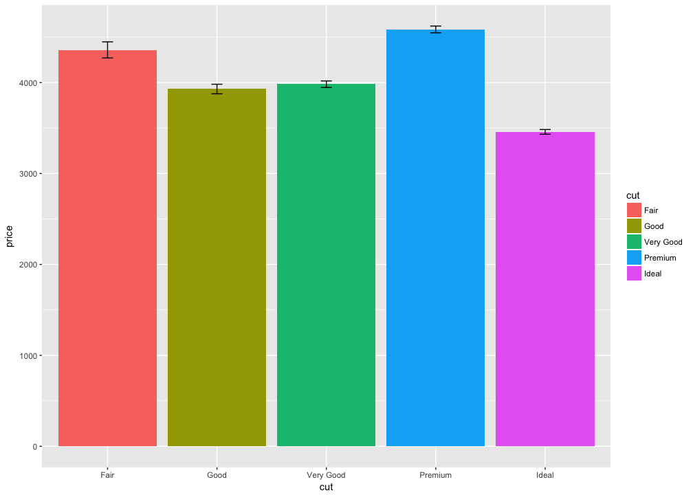
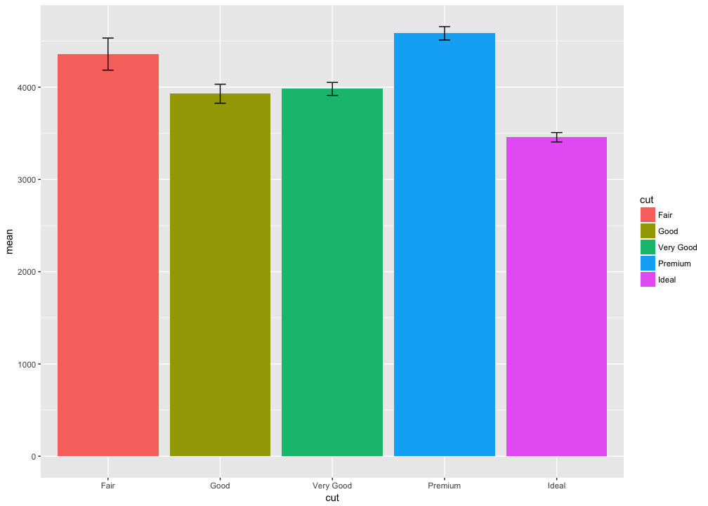

# Plotting bars with ggplot2
Nick Michalak  
7/11/2017  

# install and load packages


```r
# vector of needed packages
needed_packages <- c("tidyverse")

# for every package in needed_packages, apply the library function
# look for character strings
lapply(needed_packages, library, character.only = TRUE)
```

```
## Loading tidyverse: ggplot2
## Loading tidyverse: tibble
## Loading tidyverse: tidyr
## Loading tidyverse: readr
## Loading tidyverse: purrr
## Loading tidyverse: dplyr
```

```
## Conflicts with tidy packages ----------------------------------------------
```

```
## filter(): dplyr, stats
## lag():    dplyr, stats
```

```
## [[1]]
##  [1] "dplyr"     "purrr"     "readr"     "tidyr"     "tibble"   
##  [6] "ggplot2"   "tidyverse" "stats"     "graphics"  "grDevices"
## [11] "utils"     "datasets"  "methods"   "base"
```

# `geom_bar()`
> default: stat = "count"


```r
diamonds %>%
  ggplot(mapping = aes(x = cut, fill = cut)) +
  geom_bar()
```

<!-- -->

# `stat_summary()`
## standard errors
> default: mult = 1


```r
diamonds %>%
  ggplot(mapping = aes(x = cut, y = price, fill = cut)) +
  stat_summary(fun.data = "mean_se", geom = "bar", position = "dodge") +
  stat_summary(fun.data = "mean_se", geom = "errorbar", position = "dodge", width = 0.1, fun.args = list(mult = 1))
```

<!-- -->

```r
?ggplot2::mean_se
```

## confidence intervals
> default: conf.int = 0.95


```r
diamonds %>%
  ggplot(mapping = aes(x = cut, y = price, fill = cut)) +
  stat_summary(fun.data = "mean_cl_normal", geom = "bar", position = "dodge") +
  stat_summary(fun.data = "mean_cl_normal", geom = "errorbar", position = "dodge", width = 0.1, fun.args = list(conf.int = 0.95))
```

<!-- -->

```r
?ggplot2::mean_cl_normal
```

# plots from descriptive statistics


```r
diamonds %>%
  group_by(cut) %>%
  summarise(n = n(),
            mean = mean(price),
            sd = sd(price),
            se = sd / sqrt(n),
            t_crit = qt(p = 1 - .05 / 2, df = n - 1),
            moe = se * t_crit) %>%
  ggplot(mapping = aes(x = cut, y = mean, fill = cut, ymin = mean - moe, ymax = mean + moe)) +
  geom_bar(stat = "identity", position = "dodge") +
  geom_errorbar(position = "dodge", width = 0.1)
```

<!-- -->

