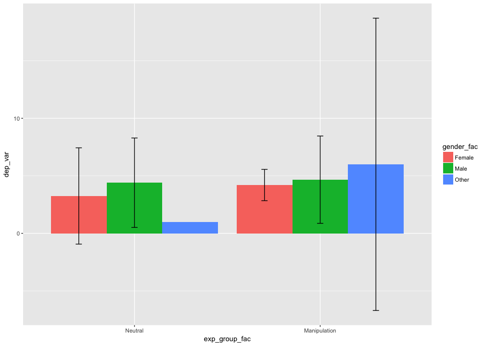

# Day 3. Vectors, strings, factors, and statistics
Nicholas Michalak  
6/24/2017  

# install prerequisite packages


```r
# character vector of packages you'll need for your whole analysis
needed_packages <- c("tidyverse", "magrittr", "forcats", "psych", "haven", "lavaan", "lme4", "lmerTest", "afex", "compute.es", "broom")

# source custom function
lapply(list.files(path = "custom_functions/", pattern = "*.R", full.names = TRUE), source)
```

```
## [[1]]
## [[1]]$value
## function (alpha, m, sd, n, c) 
## {
##     est <- t(c) %*% m
##     k <- length(m)
##     df1 <- sum(n) - k
##     v1 <- sum((n - 1) * sd^2)/df1
##     se1 <- sqrt(v1 * t(c) %*% solve(diag(n)) %*% c)
##     t1 <- est/se1
##     p1 <- 2 * (1 - pt(abs(t1), df1))
##     tcrit1 <- qt(1 - alpha/2, df1)
##     ll1 <- est - tcrit1 * se1
##     ul1 <- est + tcrit1 * se1
##     v2 <- diag(sd^2) %*% (solve(diag(n)))
##     se2 <- sqrt(t(c) %*% v2 %*% c)
##     t2 <- est/se2
##     df2 = (se2^4)/sum(((c^4) * (sd^4)/(n^2 * (n - 1))))
##     p2 <- 2 * (1 - pt(abs(t2), df2))
##     tcrit2 <- qt(1 - alpha/2, df2)
##     ll2 <- est - tcrit2 * se2
##     ul2 <- est + tcrit2 * se2
##     out1 <- t(c(est, se1, t1, df1, p1, ll1, ul1))
##     out2 <- t(c(est, se2, t2, df2, p2, ll2, ul2))
##     out <- rbind(out1, out2)
##     colnames(out) <- c("Estimate", "SE", "t", "df", "p-value", 
##         "LL", "UL")
##     rownames(out) <- c("Equal Variances Assumed:", "Equal Variances Not Assumed:")
##     return(out)
## }
## 
## [[1]]$visible
## [1] FALSE
## 
## 
## [[2]]
## [[2]]$value
## function (alpha, m, sd, n, c) 
## {
##     z <- qnorm(1 - alpha/2)
##     v <- sd^2
##     a <- length(m)
##     s <- sqrt(sum(v)/a)
##     df <- sum(n) - a
##     sp <- sqrt(sum((n - 1) * v)/df)
##     est1 <- (t(c) %*% m)/s
##     est2 <- (t(c) %*% m)/sp
##     a1 <- est1^2/(a^2 * s^4)
##     a2 <- a1 * sum((v^2/(2 * (n - 1))))
##     a3 <- sum((c^2 * v/(n - 1)))/s^2
##     se1 <- sqrt(a2 + a3)
##     ll1 <- est1 - z * se1
##     ul1 <- est1 + z * se1
##     a1 <- est2^2/a^2
##     a2 <- a1 * sum(1/(2 * (n - 1)))
##     a3 <- sum(c^2/n)
##     se2 <- sqrt(a2 + a3)
##     ll2 <- est2 - z * se2
##     ul2 <- est2 + z * se2
##     out1 <- t(c(est1, se1, ll1, ul1))
##     out2 <- t(c(est2, se2, ll2, ul2))
##     out <- rbind(out1, out2)
##     colnames(out) <- c("Estimate", "SE", "LL", "UL")
##     rownames(out) <- c("Equal Variances Not Assumed", "Equal Variances Assumed:")
##     return(out)
## }
## 
## [[2]]$visible
## [1] FALSE
## 
## 
## [[3]]
## [[3]]$value
## function (needed_packages) 
## {
##     have_packages <- needed_packages %in% rownames(installed.packages())
##     if (any(have_packages == FALSE) == TRUE) 
##         install.packages(needed_packages[have_packages == FALSE])
##     lapply(needed_packages, library, character.only = TRUE)
## }
## 
## [[3]]$visible
## [1] FALSE
## 
## 
## [[4]]
## [[4]]$value
## function (y, x, z, sd_values = seq(-3, 3, 0.5), mean_center = TRUE, 
##     alpha = 0.05) 
## {
##     if (mean_center == TRUE) {
##         x <- x - mean(x, na.rm = TRUE)
##         z <- z - mean(z, na.rm = TRUE)
##     }
##     descriptives <- sapply(list(y = y, x = x, z = z), function(v) {
##         round(c(N = sum(is.na(v) == FALSE), Mean = mean(v, na.rm = TRUE), 
##             SD = sd(v, na.rm = TRUE), Median = median(v, na.rm = TRUE), 
##             Min = min(v, na.rm = TRUE), Max = max(v, na.rm = TRUE)), 
##             digits = 3)
##     })
##     model <- lm(y ~ x * z)
##     z_mean <- mean(z, na.rm = TRUE)
##     z_sd <- sd(z, na.rm = TRUE)
##     model_vcov <- vcov(model)
##     est <- list()
##     se <- list()
##     for (i in 1:length(sd_values)) {
##         est[[i]] <- coefficients(model)["x"] + coefficients(model)["x:z"] * 
##             (z_mean + sd_values[i] * z_sd)
##         se[[i]] <- sqrt(model_vcov["x", "x"] + 2 * (z_mean + 
##             sd_values[i] * z_sd) * model_vcov["x", "x:z"] + (z_mean + 
##             sd_values[i] * z_sd) * (z_mean + sd_values[i] * z_sd) * 
##             model_vcov["x:z", "x:z"])
##     }
##     result <- data.frame(z_sd = sd_values * descriptives[3, 3], 
##         est = unlist(est), se = unlist(se))
##     result$t_val <- with(data = result, est/se)
##     result$p_val <- with(data = result, 2 * pt(q = -abs(t_val), 
##         df = model$df.residual))
##     t_crit <- qt(p = 1 - alpha/2, df = model$df.residual)
##     result$lwr_ci <- with(data = result, est - t_crit * se)
##     result$upr_ci <- with(data = result, est + t_crit * se)
##     result[, !colnames(result) %in% "p_val"] <- data.frame(apply(result[, 
##         !colnames(result) %in% "p_val"], 2, function(i) round(i, 
##         3)))
##     print(paste0("Descriptives"))
##     print(descriptives)
##     return(result)
## }
## 
## [[4]]$visible
## [1] FALSE
```

```r
# install needed packages
install_needed_pkgs(needed_packages = needed_packages)
```

```
## Loading tidyverse: ggplot2
## Loading tidyverse: tibble
## Loading tidyverse: tidyr
## Loading tidyverse: readr
## Loading tidyverse: purrr
## Loading tidyverse: dplyr
```

```
## Conflicts with tidy packages ----------------------------------------------
```

```
## filter(): dplyr, stats
## lag():    dplyr, stats
```

```
## 
## Attaching package: 'magrittr'
```

```
## The following object is masked from 'package:purrr':
## 
##     set_names
```

```
## The following object is masked from 'package:tidyr':
## 
##     extract
```

```
## 
## Attaching package: 'psych'
```

```
## The following objects are masked from 'package:ggplot2':
## 
##     %+%, alpha
```

```
## 
## Attaching package: 'haven'
```

```
## The following object is masked from 'package:forcats':
## 
##     as_factor
```

```
## This is lavaan 0.5-23.1097
```

```
## lavaan is BETA software! Please report any bugs.
```

```
## 
## Attaching package: 'lavaan'
```

```
## The following object is masked from 'package:psych':
## 
##     cor2cov
```

```
## Loading required package: Matrix
```

```
## 
## Attaching package: 'Matrix'
```

```
## The following object is masked from 'package:tidyr':
## 
##     expand
```

```
## 
## Attaching package: 'lmerTest'
```

```
## The following object is masked from 'package:lme4':
## 
##     lmer
```

```
## The following object is masked from 'package:stats':
## 
##     step
```

```
## Loading required package: lsmeans
```

```
## Loading required package: estimability
```

```
## 
## Attaching package: 'lsmeans'
```

```
## The following object is masked from 'package:lmerTest':
## 
##     lsmeans
```

```
## ************
## Welcome to afex. For support visit: http://afex.singmann.science/
```

```
## - Functions for ANOVAs: aov_car(), aov_ez(), and aov_4()
## - Methods for calculating p-values with mixed(): 'KR', 'S', 'LRT', and 'PB'
## - 'afex_aov' and 'mixed' objects can be passed to lsmeans() for follow-up tests
## - Get and set global package options with: afex_options()
## - Set orthogonal sum-to-zero contrasts globally: set_sum_contrasts()
## - For example analyses see: browseVignettes("afex")
## ************
```

```
## 
## Attaching package: 'afex'
```

```
## The following object is masked from 'package:lme4':
## 
##     lmer
```

```
## [[1]]
##  [1] "dplyr"     "purrr"     "readr"     "tidyr"     "tibble"   
##  [6] "ggplot2"   "tidyverse" "stats"     "graphics"  "grDevices"
## [11] "utils"     "datasets"  "methods"   "base"     
## 
## [[2]]
##  [1] "magrittr"  "dplyr"     "purrr"     "readr"     "tidyr"    
##  [6] "tibble"    "ggplot2"   "tidyverse" "stats"     "graphics" 
## [11] "grDevices" "utils"     "datasets"  "methods"   "base"     
## 
## [[3]]
##  [1] "forcats"   "magrittr"  "dplyr"     "purrr"     "readr"    
##  [6] "tidyr"     "tibble"    "ggplot2"   "tidyverse" "stats"    
## [11] "graphics"  "grDevices" "utils"     "datasets"  "methods"  
## [16] "base"     
## 
## [[4]]
##  [1] "psych"     "forcats"   "magrittr"  "dplyr"     "purrr"    
##  [6] "readr"     "tidyr"     "tibble"    "ggplot2"   "tidyverse"
## [11] "stats"     "graphics"  "grDevices" "utils"     "datasets" 
## [16] "methods"   "base"     
## 
## [[5]]
##  [1] "haven"     "psych"     "forcats"   "magrittr"  "dplyr"    
##  [6] "purrr"     "readr"     "tidyr"     "tibble"    "ggplot2"  
## [11] "tidyverse" "stats"     "graphics"  "grDevices" "utils"    
## [16] "datasets"  "methods"   "base"     
## 
## [[6]]
##  [1] "lavaan"    "haven"     "psych"     "forcats"   "magrittr" 
##  [6] "dplyr"     "purrr"     "readr"     "tidyr"     "tibble"   
## [11] "ggplot2"   "tidyverse" "stats"     "graphics"  "grDevices"
## [16] "utils"     "datasets"  "methods"   "base"     
## 
## [[7]]
##  [1] "lme4"      "Matrix"    "lavaan"    "haven"     "psych"    
##  [6] "forcats"   "magrittr"  "dplyr"     "purrr"     "readr"    
## [11] "tidyr"     "tibble"    "ggplot2"   "tidyverse" "stats"    
## [16] "graphics"  "grDevices" "utils"     "datasets"  "methods"  
## [21] "base"     
## 
## [[8]]
##  [1] "lmerTest"  "lme4"      "Matrix"    "lavaan"    "haven"    
##  [6] "psych"     "forcats"   "magrittr"  "dplyr"     "purrr"    
## [11] "readr"     "tidyr"     "tibble"    "ggplot2"   "tidyverse"
## [16] "stats"     "graphics"  "grDevices" "utils"     "datasets" 
## [21] "methods"   "base"     
## 
## [[9]]
##  [1] "afex"         "lsmeans"      "estimability" "lmerTest"    
##  [5] "lme4"         "Matrix"       "lavaan"       "haven"       
##  [9] "psych"        "forcats"      "magrittr"     "dplyr"       
## [13] "purrr"        "readr"        "tidyr"        "tibble"      
## [17] "ggplot2"      "tidyverse"    "stats"        "graphics"    
## [21] "grDevices"    "utils"        "datasets"     "methods"     
## [25] "base"        
## 
## [[10]]
##  [1] "compute.es"   "afex"         "lsmeans"      "estimability"
##  [5] "lmerTest"     "lme4"         "Matrix"       "lavaan"      
##  [9] "haven"        "psych"        "forcats"      "magrittr"    
## [13] "dplyr"        "purrr"        "readr"        "tidyr"       
## [17] "tibble"       "ggplot2"      "tidyverse"    "stats"       
## [21] "graphics"     "grDevices"    "utils"        "datasets"    
## [25] "methods"      "base"        
## 
## [[11]]
##  [1] "broom"        "compute.es"   "afex"         "lsmeans"     
##  [5] "estimability" "lmerTest"     "lme4"         "Matrix"      
##  [9] "lavaan"       "haven"        "psych"        "forcats"     
## [13] "magrittr"     "dplyr"        "purrr"        "readr"       
## [17] "tidyr"        "tibble"       "ggplot2"      "tidyverse"   
## [21] "stats"        "graphics"     "grDevices"    "utils"       
## [25] "datasets"     "methods"      "base"
```

# integer
> subject ID


```r
(subj_id <- 1:20)
```

```
##  [1]  1  2  3  4  5  6  7  8  9 10 11 12 13 14 15 16 17 18 19 20
```

# logical
> did this subject fail the pre-screen?


```r
(failed_prescreen <- c(TRUE, FALSE, FALSE, FALSE, TRUE, TRUE, FALSE, TRUE, TRUE, TRUE, FALSE, TRUE, FALSE, FALSE, FALSE, TRUE, FALSE, FALSE, FALSE, FALSE))
```

```
##  [1]  TRUE FALSE FALSE FALSE  TRUE  TRUE FALSE  TRUE  TRUE  TRUE FALSE
## [12]  TRUE FALSE FALSE FALSE  TRUE FALSE FALSE FALSE FALSE
```

# character / factor
> experimental group


```r
# character vector
(exp_group <- c("Treatment", "Control", "Control", "Treatment", "Treatment", "Control", "Treatment", "Control", "Treatment", "Treatment", "Treatment", "Control", "Control", "Treatment", "Control", "Control", "Treatment", "Control", "Treatment", "Control"))
```

```
##  [1] "Treatment" "Control"   "Control"   "Treatment" "Treatment"
##  [6] "Control"   "Treatment" "Control"   "Treatment" "Treatment"
## [11] "Treatment" "Control"   "Control"   "Treatment" "Control"  
## [16] "Control"   "Treatment" "Control"   "Treatment" "Control"
```

```r
# convert to factor vector
(exp_group_fac <- parse_factor(exp_group,
                               levels = c("Treatment", "Control")))
```

```
##  [1] Treatment Control   Control   Treatment Treatment Control   Treatment
##  [8] Control   Treatment Treatment Treatment Control   Control   Treatment
## [15] Control   Control   Treatment Control   Treatment Control  
## Levels: Treatment Control
```

## modify factor order


```r
(exp_group_fac <- parse_factor(exp_group,
                               levels = c("Control", "Treatment")))
```

```
##  [1] Treatment Control   Control   Treatment Treatment Control   Treatment
##  [8] Control   Treatment Treatment Treatment Control   Control   Treatment
## [15] Control   Control   Treatment Control   Treatment Control  
## Levels: Control Treatment
```

## modify factor levels


```r
(exp_group_fac <- recode_factor(exp_group_fac, Control = "Neutral", Treatment = "Manipulation"))
```

```
##  [1] Manipulation Neutral      Neutral      Manipulation Manipulation
##  [6] Neutral      Manipulation Neutral      Manipulation Manipulation
## [11] Manipulation Neutral      Neutral      Manipulation Neutral     
## [16] Neutral      Manipulation Neutral      Manipulation Neutral     
## Levels: Neutral Manipulation
```

> gender


```r
gender_fac <- as_factor(c("Female", "Female", "Male", "Female", "Other", "Male", "Female",  "Male", "Other", "Male", "Female", "Female", "Female", "Male", "Male", "Female", "Female", "Male", "Male", "Other"))
```

# numeric
> dependent variable


```r
(dep_var <- c(4, 2, 7, 3, 5, 6, 6, 1, 7, 3, 4, 1, 3, 6, 1, 7, 4, 7, 5, 1))
```

```
##  [1] 4 2 7 3 5 6 6 1 7 3 4 1 3 6 1 7 4 7 5 1
```

# combine them into a "tibble"


```r
(my_data <- tibble(subj_id, exp_group, exp_group_fac, dep_var, gender_fac, failed_prescreen))
```

```
## # A tibble: 20 x 6
##    subj_id exp_group exp_group_fac dep_var gender_fac failed_prescreen
##      <int>     <chr>        <fctr>   <dbl>     <fctr>            <lgl>
##  1       1 Treatment  Manipulation       4     Female             TRUE
##  2       2   Control       Neutral       2     Female            FALSE
##  3       3   Control       Neutral       7       Male            FALSE
##  4       4 Treatment  Manipulation       3     Female            FALSE
##  5       5 Treatment  Manipulation       5      Other             TRUE
##  6       6   Control       Neutral       6       Male             TRUE
##  7       7 Treatment  Manipulation       6     Female            FALSE
##  8       8   Control       Neutral       1       Male             TRUE
##  9       9 Treatment  Manipulation       7      Other             TRUE
## 10      10 Treatment  Manipulation       3       Male             TRUE
## 11      11 Treatment  Manipulation       4     Female            FALSE
## 12      12   Control       Neutral       1     Female             TRUE
## 13      13   Control       Neutral       3     Female            FALSE
## 14      14 Treatment  Manipulation       6       Male            FALSE
## 15      15   Control       Neutral       1       Male            FALSE
## 16      16   Control       Neutral       7     Female             TRUE
## 17      17 Treatment  Manipulation       4     Female            FALSE
## 18      18   Control       Neutral       7       Male            FALSE
## 19      19 Treatment  Manipulation       5       Male            FALSE
## 20      20   Control       Neutral       1      Other            FALSE
```

# review

## `summarise()`


```r
my_data %>%
  group_by(failed_prescreen) %>%
  summarise(n = n())
```

```
## # A tibble: 2 x 2
##   failed_prescreen     n
##              <lgl> <int>
## 1            FALSE    12
## 2             TRUE     8
```

## `count()`


```r
my_data %>%
  count(failed_prescreen)
```

```
## # A tibble: 2 x 2
##   failed_prescreen     n
##              <lgl> <int>
## 1            FALSE    12
## 2             TRUE     8
```

## `filter()`


```r
my_data %>%
  filter(failed_prescreen == FALSE)
```

```
## # A tibble: 12 x 6
##    subj_id exp_group exp_group_fac dep_var gender_fac failed_prescreen
##      <int>     <chr>        <fctr>   <dbl>     <fctr>            <lgl>
##  1       2   Control       Neutral       2     Female            FALSE
##  2       3   Control       Neutral       7       Male            FALSE
##  3       4 Treatment  Manipulation       3     Female            FALSE
##  4       7 Treatment  Manipulation       6     Female            FALSE
##  5      11 Treatment  Manipulation       4     Female            FALSE
##  6      13   Control       Neutral       3     Female            FALSE
##  7      14 Treatment  Manipulation       6       Male            FALSE
##  8      15   Control       Neutral       1       Male            FALSE
##  9      17 Treatment  Manipulation       4     Female            FALSE
## 10      18   Control       Neutral       7       Male            FALSE
## 11      19 Treatment  Manipulation       5       Male            FALSE
## 12      20   Control       Neutral       1      Other            FALSE
```

## `geom_histogram()` and aesetics


```r
my_data %>%
  ggplot(mapping = aes(x = dep_var, fill = failed_prescreen)) +
  geom_histogram(binwidth = 1, color = "white", position = "dodge")
```

<!-- -->

### `facet_wrap()`


```r
my_data %>%
  ggplot(mapping = aes(x = dep_var, fill = failed_prescreen)) +
  geom_histogram(binwidth = 1, color = "white") +
  facet_wrap(~ failed_prescreen)
```

<!-- -->

## `geom_boxplot()`


```r
my_data %>%
  ggplot(mapping = aes(x = exp_group_fac, y = dep_var, fill = gender_fac)) +
  geom_boxplot()
```

<!-- -->

## `geom_violin()`


```r
my_data %>%
  ggplot(mapping = aes(x = exp_group_fac, y = dep_var, fill = gender_fac)) +
  geom_violin()
```

<!-- -->

## `stat_summary()`


```r
my_data %>%
  ggplot(mapping = aes(x = exp_group_fac, y = dep_var, fill = gender_fac)) +
  stat_summary(fun.data = "mean_cl_normal", geom = "bar", position = position_dodge(0.9)) +
  stat_summary(fun.data = "mean_cl_normal", geom = "errorbar", width = 0.1, position = position_dodge(0.9))
```

```
## Warning: Removed 1 rows containing missing values (geom_errorbar).
```

<!-- -->

## grouped descriptives
> Note: `%$%` is called the "exposition pipe operator." From the [magrittr documentation](https://cran.r-project.org/web/packages/magrittr/magrittr.pdf) description, "Some functions, e.g. lm and aggregate, have a data argument, which allows the direct use of names inside the data as part of the call. This operator exposes the contents of the left-hand side object to the expression on the right to give a similar benefit, see the examples."

### quick `%$%` example (where `%>%` wouldn't work)


```r
iris %$%
  cor(Sepal.Length, Sepal.Width)
```

```
## [1] -0.1175698
```

### now to grouped descriptives


```r
my_data %$%
  describeBy(x = dep_var, group = exp_group_fac, mat = TRUE)
```

```
##     item       group1 vars  n mean       sd median trimmed    mad min max
## X11    1      Neutral    1 10  3.6 2.796824    2.5   3.500 2.2239   1   7
## X12    2 Manipulation    1 10  4.7 1.337494    4.5   4.625 1.4826   3   7
##     range      skew kurtosis        se
## X11     6 0.2610916 -1.98091 0.8844333
## X12     4 0.2407395 -1.40203 0.4229526
```

### cite your tools


```r
citation("psych")
```

```
## 
## To cite the psych package in publications use:
## 
##   Revelle, W. (2017) psych: Procedures for Personality and
##   Psychological Research, Northwestern University, Evanston,
##   Illinois, USA, https://CRAN.R-project.org/package=psych Version
##   = 1.7.5.
## 
## A BibTeX entry for LaTeX users is
## 
##   @Manual{,
##     title = {psych: Procedures for Psychological, Psychometric, and Personality Research},
##     author = {William Revelle},
##     organization = { Northwestern University},
##     address = { Evanston, Illinois},
##     year = {2017},
##     note = {R package version 1.7.5},
##     url = {https://CRAN.R-project.org/package=psych},
##   }
```

## `t.test()`
* I make all arguments explcit


```r
t.test(formula = dep_var ~ exp_group_fac,
       data = my_data,
       alternative = "two.sided",
       mu = 0,
       paired = FALSE,
       var.equal = FALSE,
       conf.level = .95)
```

```
## 
## 	Welch Two Sample t-test
## 
## data:  dep_var by exp_group_fac
## t = -1.122, df = 12.912, p-value = 0.2823
## alternative hypothesis: true difference in means is not equal to 0
## 95 percent confidence interval:
##  -3.219415  1.019415
## sample estimates:
##      mean in group Neutral mean in group Manipulation 
##                        3.6                        4.7
```

### less explicit
* if you don't name arguments explictly, make sure you give argument input in order


```r
t.test(dep_var ~ exp_group_fac, my_data)
```

```
## 
## 	Welch Two Sample t-test
## 
## data:  dep_var by exp_group_fac
## t = -1.122, df = 12.912, p-value = 0.2823
## alternative hypothesis: true difference in means is not equal to 0
## 95 percent confidence interval:
##  -3.219415  1.019415
## sample estimates:
##      mean in group Neutral mean in group Manipulation 
##                        3.6                        4.7
```

# Big Five data from [personality-testing.info](http://personality-testing.info/_rawdata/)


```r
(big_five <- "example_tidy_data/big_five_may_2014/big_five_may_2014.csv" %>%
  read_tsv() %>%
  mutate(race_fac = recode(race, `1`  =  "Mixed Race", `2`  =  "Arctic (Siberian, Eskimo)", `3`  =  "Caucasian (European)", `4` = "Caucasian (Indian)", `5` = "Caucasian (Middle East)", `6` = "Caucasian (North African, Other)", `7` = "Indigenous Australian", `8` = "Native American", `9` = "North East Asian (Mongol, Tibetan, Korean Japanese, etc)", `10` = "Pacific (Polynesian, Micronesian, etc)", `11` = "South East Asian (Chinese, Thai, Malay, Filipino, etc)", `12` = "West African, Bushmen, Ethiopian", `13` = "Other (0 = missed)"),
         eng_nat_fac = recode(engnat, `1` = "yes", `2` = "no", `0` = "missed"),
         gender_fac = recode(gender, `1` = "Male", `2` = "Female", `3` = "Other", `0` = "missed"),
         hand_fac = recode(hand, `1` = "Right", `2` = "Left", `3` = "Both", `0` = "missed"),
         source_fac = recode(source, `1` = "from another page on the test website", `2` = "from google", `3` = "from facebook", `4` = 'from any url with ".edu" in its domain name (e.g. xxx.edu, xxx.edu.au)', `5` = "other source, or HTTP Referer not provided")) %>%
  select(age, country, race, race_fac, engnat, eng_nat_fac, gender, gender_fac, hand, hand_fac, source, source_fac, everything()))
```

```
## Parsed with column specification:
## cols(
##   .default = col_integer(),
##   country = col_character()
## )
```

```
## See spec(...) for full column specifications.
```

```
## Warning: Unreplaced values treated as NA as .x is not compatible. Please
## specify replacements exhaustively or supply .default
```

```
## # A tibble: 19,719 x 62
##      age country  race
##    <int>   <chr> <int>
##  1    53      US     3
##  2    46      US    13
##  3    14      PK     1
##  4    19      RO     3
##  5    25      US    11
##  6    31      US    13
##  7    20      US     5
##  8    23      IN     4
##  9    39      US     5
## 10    18      US     3
## # ... with 19,709 more rows, and 59 more variables: race_fac <chr>,
## #   engnat <int>, eng_nat_fac <chr>, gender <int>, gender_fac <chr>,
## #   hand <int>, hand_fac <chr>, source <int>, source_fac <chr>, E1 <int>,
## #   E2 <int>, E3 <int>, E4 <int>, E5 <int>, E6 <int>, E7 <int>, E8 <int>,
## #   E9 <int>, E10 <int>, N1 <int>, N2 <int>, N3 <int>, N4 <int>, N5 <int>,
## #   N6 <int>, N7 <int>, N8 <int>, N9 <int>, N10 <int>, A1 <int>, A2 <int>,
## #   A3 <int>, A4 <int>, A5 <int>, A6 <int>, A7 <int>, A8 <int>, A9 <int>,
## #   A10 <int>, C1 <int>, C2 <int>, C3 <int>, C4 <int>, C5 <int>, C6 <int>,
## #   C7 <int>, C8 <int>, C9 <int>, C10 <int>, O1 <int>, O2 <int>, O3 <int>,
## #   O4 <int>, O5 <int>, O6 <int>, O7 <int>, O8 <int>, O9 <int>, O10 <int>
```

# more descriptives examples

* see psych package ([an overview of the psych package](http://personality-project.org/r/overview.pdf)) for many trusty tools

## extraversion


```r
big_five %>%
  select(num_range(prefix = "E", range = 1:10)) %>%
  psych::describe()
```

```
##     vars     n mean   sd median trimmed  mad min max range  skew kurtosis
## E1     1 19719 2.63 1.23      3    2.57 1.48   0   5     5  0.21    -0.96
## E2     2 19719 2.76 1.31      3    2.70 1.48   0   5     5  0.21    -1.08
## E3     3 19719 3.42 1.24      4    3.50 1.48   0   5     5 -0.36    -0.88
## E4     4 19719 3.15 1.22      3    3.19 1.48   0   5     5 -0.10    -0.94
## E5     5 19719 3.43 1.28      4    3.53 1.48   0   5     5 -0.40    -0.94
## E6     6 19719 2.45 1.24      2    2.34 1.48   0   5     5  0.54    -0.74
## E7     7 19719 2.87 1.43      3    2.83 1.48   0   5     5  0.12    -1.32
## E8     8 19719 3.38 1.27      3    3.45 1.48   0   5     5 -0.28    -1.00
## E9     9 19719 3.09 1.40      3    3.12 1.48   0   5     5 -0.09    -1.28
## E10   10 19719 3.59 1.30      4    3.71 1.48   0   5     5 -0.51    -0.93
##       se
## E1  0.01
## E2  0.01
## E3  0.01
## E4  0.01
## E5  0.01
## E6  0.01
## E7  0.01
## E8  0.01
## E9  0.01
## E10 0.01
```

# some correlation matrix examples

## `pairs.panels()`


```r
big_five %>%
  select(num_range(prefix = "E", range = 1:10)) %>%
  pairs.panels(pch = ".")
```

<!-- -->

## `cor.plot()`


```r
big_five %>%
  select(num_range(prefix = "E", range = 1:10)) %>%
  cor.plot(numbers = TRUE)
```

<!-- -->

## `cor.test()`
* explicit argument names again


```r
big_five %$%
  cor.test(E1, E2,
           alternative = "two.sided",
           method = "pearson",
           exact = NULL,
           conf.level = .95)
```

```
## 
## 	Pearson's product-moment correlation
## 
## data:  E1 and E2
## t = -65.174, df = 19717, p-value < 2.2e-16
## alternative hypothesis: true correlation is not equal to 0
## 95 percent confidence interval:
##  -0.4324256 -0.4094576
## sample estimates:
##        cor 
## -0.4210091
```

## `corr.test()`
* from psych package
* takes matrix or dataframe input
* explicit argument names again


```r
big_five %>%
  select(num_range(prefix = "E", range = 1:10)) %>%
  corr.test(use = "complete",
            method = "pearson",
            adjust = "none",
            alpha = .05,
            ci = TRUE) %>%
  print(short = FALSE)
```

```
## Call:corr.test(x = ., use = "complete", method = "pearson", adjust = "none", 
##     alpha = 0.05, ci = TRUE)
## Correlation matrix 
##        E1    E2    E3    E4    E5    E6    E7    E8    E9   E10
## E1   1.00 -0.42  0.47 -0.48  0.48 -0.35  0.59 -0.37  0.46 -0.41
## E2  -0.42  1.00 -0.45  0.53 -0.54  0.57 -0.48  0.37 -0.36  0.46
## E3   0.47 -0.45  1.00 -0.48  0.59 -0.39  0.58 -0.32  0.42 -0.47
## E4  -0.48  0.53 -0.48  1.00 -0.51  0.47 -0.50  0.45 -0.45  0.51
## E5   0.48 -0.54  0.59 -0.51  1.00 -0.48  0.63 -0.34  0.42 -0.54
## E6  -0.35  0.57 -0.39  0.47 -0.48  1.00 -0.41  0.32 -0.33  0.41
## E7   0.59 -0.48  0.58 -0.50  0.63 -0.41  1.00 -0.34  0.43 -0.53
## E8  -0.37  0.37 -0.32  0.45 -0.34  0.32 -0.34  1.00 -0.51  0.38
## E9   0.46 -0.36  0.42 -0.45  0.42 -0.33  0.43 -0.51  1.00 -0.37
## E10 -0.41  0.46 -0.47  0.51 -0.54  0.41 -0.53  0.38 -0.37  1.00
## Sample Size 
## [1] 19719
## Probability values (Entries above the diagonal are adjusted for multiple tests.) 
##     E1 E2 E3 E4 E5 E6 E7 E8 E9 E10
## E1   0  0  0  0  0  0  0  0  0   0
## E2   0  0  0  0  0  0  0  0  0   0
## E3   0  0  0  0  0  0  0  0  0   0
## E4   0  0  0  0  0  0  0  0  0   0
## E5   0  0  0  0  0  0  0  0  0   0
## E6   0  0  0  0  0  0  0  0  0   0
## E7   0  0  0  0  0  0  0  0  0   0
## E8   0  0  0  0  0  0  0  0  0   0
## E9   0  0  0  0  0  0  0  0  0   0
## E10  0  0  0  0  0  0  0  0  0   0
## 
##  To see confidence intervals of the correlations, print with the short=FALSE option
## 
##  Confidence intervals based upon normal theory.  To get bootstrapped values, try cor.ci
##        lower     r upper p
## E1-E2  -0.43 -0.42 -0.41 0
## E1-E3   0.46  0.47  0.49 0
## E1-E4  -0.49 -0.48 -0.47 0
## E1-E5   0.47  0.48  0.49 0
## E1-E6  -0.36 -0.35 -0.33 0
## E1-E7   0.58  0.59  0.60 0
## E1-E8  -0.38 -0.37 -0.35 0
## E1-E9   0.44  0.46  0.47 0
## E1-E10 -0.43 -0.41 -0.40 0
## E2-E3  -0.46 -0.45 -0.43 0
## E2-E4   0.52  0.53  0.54 0
## E2-E5  -0.55 -0.54 -0.53 0
## E2-E6   0.56  0.57  0.58 0
## E2-E7  -0.49 -0.48 -0.47 0
## E2-E8   0.36  0.37  0.39 0
## E2-E9  -0.38 -0.36 -0.35 0
## E2-E10  0.45  0.46  0.47 0
## E3-E4  -0.49 -0.48 -0.47 0
## E3-E5   0.58  0.59  0.60 0
## E3-E6  -0.41 -0.39 -0.38 0
## E3-E7   0.57  0.58  0.59 0
## E3-E8  -0.33 -0.32 -0.31 0
## E3-E9   0.41  0.42  0.43 0
## E3-E10 -0.48 -0.47 -0.46 0
## E4-E5  -0.52 -0.51 -0.50 0
## E4-E6   0.46  0.47  0.49 0
## E4-E7  -0.51 -0.50 -0.49 0
## E4-E8   0.43  0.45  0.46 0
## E4-E9  -0.46 -0.45 -0.44 0
## E4-E10  0.50  0.51  0.52 0
## E5-E6  -0.49 -0.48 -0.47 0
## E5-E7   0.62  0.63  0.64 0
## E5-E8  -0.36 -0.34 -0.33 0
## E5-E9   0.40  0.42  0.43 0
## E5-E10 -0.55 -0.54 -0.53 0
## E6-E7  -0.42 -0.41 -0.39 0
## E6-E8   0.31  0.32  0.33 0
## E6-E9  -0.34 -0.33 -0.32 0
## E6-E10  0.40  0.41  0.42 0
## E7-E8  -0.36 -0.34 -0.33 0
## E7-E9   0.42  0.43  0.44 0
## E7-E10 -0.54 -0.53 -0.52 0
## E8-E9  -0.52 -0.51 -0.50 0
## E8-E10  0.37  0.38  0.39 0
## E9-E10 -0.38 -0.37 -0.36 0
```

# regression

## `lm()`
* to be honest, I don't understand *all* of the arguments in `lm()`


```r
big_five %>%
  lm(formula = E1 ~ E2 + E3, data = .)
```

```
## 
## Call:
## lm(formula = E1 ~ E2 + E3, data = .)
## 
## Coefficients:
## (Intercept)           E2           E3  
##      2.0883      -0.2455       0.3565
```

## `summary()`


```r
big_five %>%
  lm(formula = E1 ~ E2 + E3, data = .) %>%
  summary()
```

```
## 
## Call:
## lm(formula = E1 ~ E2 + E3, data = .)
## 
## Residuals:
##     Min      1Q  Median      3Q     Max 
## -2.6253 -0.6669 -0.0233  0.6896  3.7825 
## 
## Coefficients:
##              Estimate Std. Error t value Pr(>|t|)    
## (Intercept)  2.088341   0.035319   59.13   <2e-16 ***
## E2          -0.245457   0.006333  -38.76   <2e-16 ***
## E3           0.356475   0.006728   52.99   <2e-16 ***
## ---
## Signif. codes:  0 '***' 0.001 '**' 0.01 '*' 0.05 '.' 0.1 ' ' 1
## 
## Residual standard error: 1.046 on 19716 degrees of freedom
## Multiple R-squared:  0.2798,	Adjusted R-squared:  0.2797 
## F-statistic:  3830 on 2 and 19716 DF,  p-value: < 2.2e-16
```

### interactions
* ":" creates an interaction term between variables
* "*" creates all main effect and interaction terms


```r
big_five %>%
  lm(formula = E1 ~ E2 + E3 + E2:E3, data = .) %>%
  summary()
```

```
## 
## Call:
## lm(formula = E1 ~ E2 + E3 + E2:E3, data = .)
## 
## Residuals:
##     Min      1Q  Median      3Q     Max 
## -2.6767 -0.6767 -0.0196  0.7213  3.6887 
## 
## Coefficients:
##              Estimate Std. Error t value Pr(>|t|)    
## (Intercept)  1.858046   0.058752  31.625  < 2e-16 ***
## E2          -0.171392   0.016377 -10.465  < 2e-16 ***
## E3           0.419950   0.014587  28.789  < 2e-16 ***
## E2:E3       -0.021938   0.004474  -4.903 9.49e-07 ***
## ---
## Signif. codes:  0 '***' 0.001 '**' 0.01 '*' 0.05 '.' 0.1 ' ' 1
## 
## Residual standard error: 1.045 on 19715 degrees of freedom
## Multiple R-squared:  0.2807,	Adjusted R-squared:  0.2806 
## F-statistic:  2564 on 3 and 19715 DF,  p-value: < 2.2e-16
```

```r
# same model
big_five %>%
  lm(formula = E1 ~ E2 * E3, data = .) %>%
  summary()
```

```
## 
## Call:
## lm(formula = E1 ~ E2 * E3, data = .)
## 
## Residuals:
##     Min      1Q  Median      3Q     Max 
## -2.6767 -0.6767 -0.0196  0.7213  3.6887 
## 
## Coefficients:
##              Estimate Std. Error t value Pr(>|t|)    
## (Intercept)  1.858046   0.058752  31.625  < 2e-16 ***
## E2          -0.171392   0.016377 -10.465  < 2e-16 ***
## E3           0.419950   0.014587  28.789  < 2e-16 ***
## E2:E3       -0.021938   0.004474  -4.903 9.49e-07 ***
## ---
## Signif. codes:  0 '***' 0.001 '**' 0.01 '*' 0.05 '.' 0.1 ' ' 1
## 
## Residual standard error: 1.045 on 19715 degrees of freedom
## Multiple R-squared:  0.2807,	Adjusted R-squared:  0.2806 
## F-statistic:  2564 on 3 and 19715 DF,  p-value: < 2.2e-16
```

## `glm()`


```r
big_five %>%
  filter(hand != 3 & hand != 0) %>%
  mutate(right_handed = recode(hand, `1` = 1, `2` = 0)) %>%
  glm(formula = right_handed ~ E2 * E3, data = ., family = binomial) %>%
  summary()
```

```
## 
## Call:
## glm(formula = right_handed ~ E2 * E3, family = binomial, data = .)
## 
## Deviance Residuals: 
##     Min       1Q   Median       3Q      Max  
## -2.2903   0.4235   0.4338   0.4421   0.4585  
## 
## Coefficients:
##              Estimate Std. Error z value Pr(>|z|)    
## (Intercept)  2.243993   0.195483  11.479   <2e-16 ***
## E2          -0.026190   0.054530  -0.480    0.631    
## E3          -0.004887   0.048730  -0.100    0.920    
## E2:E3        0.018354   0.015117   1.214    0.225    
## ---
## Signif. codes:  0 '***' 0.001 '**' 0.01 '*' 0.05 '.' 0.1 ' ' 1
## 
## (Dispersion parameter for binomial family taken to be 1)
## 
##     Null deviance: 11589  on 19147  degrees of freedom
## Residual deviance: 11583  on 19144  degrees of freedom
## AIC: 11591
## 
## Number of Fisher Scoring iterations: 5
```

# Factorial ANOVA

## afex package

### between-subjects ANOVA


```r
my_data %>%
  filter(gender_fac != "Other") %>%
  aov_car(formula = dep_var ~ exp_group_fac * gender_fac + Error(subj_id), data = .) %>%
  summary()
```

```
## Contrasts set to contr.sum for the following variables: exp_group_fac, gender_fac
```

```
## Anova Table (Type 3 tests)
## 
## Response: dep_var
##                          num Df den Df    MSE      F      ges Pr(>F)
## exp_group_fac                 1     13 5.3397 0.2819 0.021226 0.6044
## gender_fac                    1     13 5.3397 0.4978 0.036877 0.4929
## exp_group_fac:gender_fac      1     13 5.3397 0.0889 0.006794 0.7703
```

### specific contrasts


```r
# t-value and p-value
my_data %>%
  mutate(group = interaction(exp_group_fac, gender_fac, sep = "_")) %>%
  filter(gender_fac != "Other") %>%
  aov_car(formula = dep_var ~ group + Error(subj_id), data = .) %>%
  lsmeans::lsmeans(specs = "group") %>%
  contrast(list(exp_group_fac = c(-1, 1, -1, 1),
                gender_fac = c(-1, -1, 1, 1),
                interact = c(1, -1, -1, 1)))
```

```
## Contrasts set to contr.sum for the following variables: group
```

```
##  contrast        estimate       SE df t.ratio p.value
##  exp_group_fac  1.2166667 2.291451 13   0.531  0.6044
##  gender_fac     1.6166667 2.291451 13   0.706  0.4929
##  interact      -0.6833333 2.291451 13  -0.298  0.7703
```

```r
# confidence intervals
my_data %>%
  mutate(group = interaction(exp_group_fac, gender_fac, sep = "_")) %>%
  filter(gender_fac != "Other") %>%
  aov_car(formula = dep_var ~ group + Error(subj_id), data = .) %>%
  lsmeans::lsmeans(specs = "group") %>%
  contrast(list(exp_group_fac = c(-1, 1, -1, 1),
                gender_fac = c(-1, -1, 1, 1),
                interact = c(1, -1, -1, 1))) %>%
  confint()
```

```
## Contrasts set to contr.sum for the following variables: group
```

```
##  contrast        estimate       SE df  lower.CL upper.CL
##  exp_group_fac  1.2166667 2.291451 13 -3.733712 6.167046
##  gender_fac     1.6166667 2.291451 13 -3.333712 6.567046
##  interact      -0.6833333 2.291451 13 -5.633712 4.267046
## 
## Confidence level used: 0.95
```

### cite your tools


```r
citation("afex")
```

```
## 
## To cite package 'afex' in publications use:
## 
##   Henrik Singmann, Ben Bolker, Jake Westfall and Frederik Aust
##   (2017). afex: Analysis of Factorial Experiments. R package
##   version 0.18-0. https://CRAN.R-project.org/package=afex
## 
## A BibTeX entry for LaTeX users is
## 
##   @Manual{,
##     title = {afex: Analysis of Factorial Experiments},
##     author = {Henrik Singmann and Ben Bolker and Jake Westfall and Frederik Aust},
##     year = {2017},
##     note = {R package version 0.18-0},
##     url = {https://CRAN.R-project.org/package=afex},
##   }
```

## straight to contrasts

### Function 23: Confidence interval for a linear contrast of means (between-subjects design) [[Download more functions from Douglas Bonnet's course webpage](https://www.google.com/url?sa=t&rct=j&q=&esrc=s&source=web&cd=1&ved=0ahUKEwjg7bG3u-bUAhVi2IMKHWfSAWwQFggqMAA&url=https%3A%2F%2Fpeople.ucsc.edu%2F~dgbonett%2Fdocs%2Fpsyc204%2F204RFunctions.docx&usg=AFQjCNGRCAg-lE7TwzMSps_A1pmDOEEb8w)]

#### D. Bonnet's example


```r
m <- c(33.5, 37.9, 38.0, 44.1)
sd <- c(3.84, 3.84, 3.65, 4.98)
n <- c(10, 10, 10, 10)
c <- c(0.5, 0.5, -0.5, -0.5)
CIstdmeanBS(alpha = .05, m = m, sd = sd, n = n, c = c)
```

```
##                              Estimate        SE        LL         UL
## Equal Variances Not Assumed -1.301263 0.3692800 -2.025039 -0.5774878
## Equal Variances Assumed:    -1.301263 0.3514511 -1.990095 -0.6124317
```

#### example using `summarise()` and pipes


```r
my_data %>%
  group_by(exp_group_fac) %>%
  summarise(n = n(),
            m = mean(dep_var),
            sd = sd(dep_var)) %$%
  CImeanBS(alpha = .05, m = m, sd = sd, n = n, c = c(-1, 1))
```

```
##                              Estimate        SE        t       df
## Equal Variances Assumed:          1.1 0.9803627 1.122034 18.00000
## Equal Variances Not Assumed:      1.1 0.9803627 1.122034 12.91188
##                                p-value         LL       UL
## Equal Variances Assumed:     0.2765933 -0.9596657 3.159666
## Equal Variances Not Assumed: 0.2822809 -1.0194152 3.219415
```

## effect size

### Function 24: Confidence interval for a standardized linear contrast of means (between-subjects design) [[Download more functions from Douglas Bonnet's course webpage](https://www.google.com/url?sa=t&rct=j&q=&esrc=s&source=web&cd=1&ved=0ahUKEwjg7bG3u-bUAhVi2IMKHWfSAWwQFggqMAA&url=https%3A%2F%2Fpeople.ucsc.edu%2F~dgbonett%2Fdocs%2Fpsyc204%2F204RFunctions.docx&usg=AFQjCNGRCAg-lE7TwzMSps_A1pmDOEEb8w)]

#### D. Bonnet's example: just enter arguments as vector objects


```r
m <- c(33.5, 37.9, 38.0, 44.1)
sd <- c(3.84, 3.84, 3.65, 4.98)
n <- c(10, 10, 10, 10)
c <- c(0.5, 0.5, -0.5, -0.5)
CIstdmeanBS(alpha = .05, m = m, sd = sd, n = n, c = c)
```

```
##                              Estimate        SE        LL         UL
## Equal Variances Not Assumed -1.301263 0.3692800 -2.025039 -0.5774878
## Equal Variances Assumed:    -1.301263 0.3514511 -1.990095 -0.6124317
```

#### example using `summarise()` and pipes


```r
my_data %>%
  group_by(exp_group_fac) %>%
  summarise(n = n(),
            m = mean(dep_var),
            sd = sd(dep_var)) %$%
  CIstdmeanBS(alpha = .05, m = m, sd = sd, n = n, c = c(-1, 1))
```

```
##                              Estimate        SE         LL       UL
## Equal Variances Not Assumed 0.5017887 0.4816354 -0.4421992 1.445777
## Equal Variances Assumed:    0.5017887 0.4549662 -0.3899286 1.393506
```

# Linear Mixed Effects Models

## lme4 package

### sleepstudy data (comes with lme4)
> The average reaction time per day for subjects in a sleep deprivation study. On day 0 the subjects had their normal amount of sleep. Starting that night they were restricted to 3 hours of sleep per night. The observations represent the average reaction time on a series of tests given each day to each subject.
* Reaction: Average reaction time (ms)
* Days: Number of days of sleep deprivation
* Subject: Subject number on which the observation was made.
> Note: I'm borrowing from a dizzyingly insightful blogpost by Tristan Mahr at UW-Madison [Plotting partial pooling in mixed-effects models](https://tjmahr.github.io/plotting-partial-pooling-in-mixed-effects-models/)


```r
?sleepstudy
```

### fit model and summarise


```r
sleepstudy %>%
  lmer(Reaction ~ Days + (1 + Days | Subject), data = ., REML = TRUE) %>%
  summary()
```

```
## Linear mixed model fit by REML t-tests use Satterthwaite approximations
##   to degrees of freedom [lmerMod]
## Formula: Reaction ~ Days + (1 + Days | Subject)
##    Data: .
## 
## REML criterion at convergence: 1743.6
## 
## Scaled residuals: 
##     Min      1Q  Median      3Q     Max 
## -3.9536 -0.4634  0.0231  0.4634  5.1793 
## 
## Random effects:
##  Groups   Name        Variance Std.Dev. Corr
##  Subject  (Intercept) 612.09   24.740       
##           Days         35.07    5.922   0.07
##  Residual             654.94   25.592       
## Number of obs: 180, groups:  Subject, 18
## 
## Fixed effects:
##             Estimate Std. Error      df t value Pr(>|t|)    
## (Intercept)  251.405      6.825  17.000  36.838  < 2e-16 ***
## Days          10.467      1.546  17.000   6.771 3.26e-06 ***
## ---
## Signif. codes:  0 '***' 0.001 '**' 0.01 '*' 0.05 '.' 0.1 ' ' 1
## 
## Correlation of Fixed Effects:
##      (Intr)
## Days -0.138
```

### scatterplot *Reaction* on *Days* for each *Subject*


```r
sleepstudy %>%
  ggplot(aes(x = Days, y = Reaction)) +
  geom_point() +
  geom_smooth(method = "lm") +
  facet_wrap(~ Subject, nrow = 3)
```

<!-- -->

### use `lmList()` to get those intercepts and slopes you see above (no pooling / estimates ignore other participants)


```r
(no_pooling <- 
sleepstudy %>%
  lmList(Reaction ~ Days | Subject, data = .) %>% 
  coefficients() %>%
  as_tibble() %>%
  rownames_to_column(var = "Subject") %>%
  rename(Intercept = `(Intercept)`,
         Slope = Days) %>%
  mutate(model = "No pooling"))
```

```
## # A tibble: 18 x 4
##    Subject Intercept     Slope      model
##      <chr>     <dbl>     <dbl>      <chr>
##  1     308  244.1927 21.764702 No pooling
##  2     309  205.0549  2.261785 No pooling
##  3     310  203.4842  6.114899 No pooling
##  4     330  289.6851  3.008073 No pooling
##  5     331  285.7390  5.266019 No pooling
##  6     332  264.2516  9.566768 No pooling
##  7     333  275.0191  9.142045 No pooling
##  8     334  240.1629 12.253141 No pooling
##  9     335  263.0347 -2.881034 No pooling
## 10     337  290.1041 19.025974 No pooling
## 11     349  215.1118 13.493933 No pooling
## 12     350  225.8346 19.504017 No pooling
## 13     351  261.1470  6.433498 No pooling
## 14     352  276.3721 13.566549 No pooling
## 15     369  254.9681 11.348109 No pooling
## 16     370  210.4491 18.056151 No pooling
## 17     371  253.6360  9.188445 No pooling
## 18     372  267.0448 11.298073 No pooling
```

### use `lm()` to get slope and intercept (full pooling / each participant gets the same value)


```r
(complete_pooling <- 
tibble(Subject = sleepstudy$Subject %>% unique() %>% parse_character(),
       Intercept = sleepstudy %>% lm(Reaction ~ Days, data = .) %>% coefficients() %>% .[["(Intercept)"]],
       Slope = sleepstudy %>% lm(Reaction ~ Days, data = .) %>% coefficients() %>% .[["Days"]]) %>%
  mutate(model = "Complete pooling"))
```

```
## # A tibble: 18 x 4
##    Subject Intercept    Slope            model
##      <chr>     <dbl>    <dbl>            <chr>
##  1     308  251.4051 10.46729 Complete pooling
##  2     309  251.4051 10.46729 Complete pooling
##  3     310  251.4051 10.46729 Complete pooling
##  4     330  251.4051 10.46729 Complete pooling
##  5     331  251.4051 10.46729 Complete pooling
##  6     332  251.4051 10.46729 Complete pooling
##  7     333  251.4051 10.46729 Complete pooling
##  8     334  251.4051 10.46729 Complete pooling
##  9     335  251.4051 10.46729 Complete pooling
## 10     337  251.4051 10.46729 Complete pooling
## 11     349  251.4051 10.46729 Complete pooling
## 12     350  251.4051 10.46729 Complete pooling
## 13     351  251.4051 10.46729 Complete pooling
## 14     352  251.4051 10.46729 Complete pooling
## 15     369  251.4051 10.46729 Complete pooling
## 16     370  251.4051 10.46729 Complete pooling
## 17     371  251.4051 10.46729 Complete pooling
## 18     372  251.4051 10.46729 Complete pooling
```

### use `lmer()` to get slopes and intercepts for each participant (partial pooling / uses individual estimates adjusted by what's known about other participants)


```r
(partial_pooling <- 
sleepstudy %>%
  lmer(Reaction ~ Days + (1 + Days | Subject), data = ., REML = TRUE) %>%
  coefficients() %>%
  .[["Subject"]] %>%
  rownames_to_column(var = "Subject") %>%
  as_tibble() %>%
  rename(Intercept = `(Intercept)`,
         Slope = Days) %>%
  mutate(model = "Partial pooling"))
```

```
## # A tibble: 18 x 4
##    Subject Intercept      Slope           model
##      <chr>     <dbl>      <dbl>           <chr>
##  1     308  253.6637 19.6662579 Partial pooling
##  2     309  211.0065  1.8475828 Partial pooling
##  3     310  212.4449  5.0184061 Partial pooling
##  4     330  275.0956  5.6529547 Partial pooling
##  5     331  273.6653  7.3973914 Partial pooling
##  6     332  260.4446 10.1951153 Partial pooling
##  7     333  268.2455 10.2436615 Partial pooling
##  8     334  244.1725 11.5418620 Partial pooling
##  9     335  251.0714 -0.2848731 Partial pooling
## 10     337  286.2955 19.0955699 Partial pooling
## 11     349  226.1950 11.6407002 Partial pooling
## 12     350  238.3351 17.0814910 Partial pooling
## 13     351  255.9829  7.4520288 Partial pooling
## 14     352  272.2687 14.0032993 Partial pooling
## 15     369  254.6806 11.3395026 Partial pooling
## 16     370  225.7922 15.2897506 Partial pooling
## 17     371  252.2121  9.4791309 Partial pooling
## 18     372  263.7196 11.7513157 Partial pooling
```

### plot these estimates


```r
bind_rows(no_pooling, partial_pooling, complete_pooling) %>% 
  left_join(sleepstudy, by = "Subject") %>%
  ggplot(aes(x = Days, y = Reaction)) +
  geom_point() +
  geom_abline(aes(intercept = Intercept, slope = Slope, color = model)) +
  scale_x_continuous(breaks = seq(0, 9, 1), limits = c(0, 9)) +
  facet_wrap(~ Subject, nrow = 3) +
  theme(legend.position = "top")
```

```
## Warning: Column `Subject` joining character vector and factor, coercing
## into character vector
```

<!-- -->

### cite your tools


```r
citation("lme4")
```

```
## 
## To cite lme4 in publications use:
## 
##   Douglas Bates, Martin Maechler, Ben Bolker, Steve Walker (2015).
##   Fitting Linear Mixed-Effects Models Using lme4. Journal of
##   Statistical Software, 67(1), 1-48. doi:10.18637/jss.v067.i01.
## 
## A BibTeX entry for LaTeX users is
## 
##   @Article{,
##     title = {Fitting Linear Mixed-Effects Models Using {lme4}},
##     author = {Douglas Bates and Martin M{\"a}chler and Ben Bolker and Steve Walker},
##     journal = {Journal of Statistical Software},
##     year = {2015},
##     volume = {67},
##     number = {1},
##     pages = {1--48},
##     doi = {10.18637/jss.v067.i01},
##   }
```

```r
citation("lmerTest")
```

```
## 
## To cite package 'lmerTest' in publications use:
## 
##   Alexandra Kuznetsova, Per Bruun Brockhoff and Rune Haubo Bojesen
##   Christensen (2016). lmerTest: Tests in Linear Mixed Effects
##   Models. R package version 2.0-33.
##   https://CRAN.R-project.org/package=lmerTest
## 
## A BibTeX entry for LaTeX users is
## 
##   @Manual{,
##     title = {lmerTest: Tests in Linear Mixed Effects Models},
##     author = {Alexandra Kuznetsova and Per {Bruun Brockhoff} and Rune {Haubo Bojesen Christensen}},
##     year = {2016},
##     note = {R package version 2.0-33},
##     url = {https://CRAN.R-project.org/package=lmerTest},
##   }
```

# structural equation models

## lavaan package

### mediation example
> "The data for the 50 subjects in this hypothetical study of the effects of room temperature on water consumption are shown in Table 3.1, where X is the temperature in degrees Fahrenheit, M is a self-report measure of thirst at the end of a 2-hour period, and Y is the number of deciliters of water consumed during the last 2 hours of the study. The 50 subjects were in a room for 4 hours doing a variety of tasks including sorting objects, tracking objects on a computer screen, and communicating via an intercom system. The tasks were selected to represent activities of persons alone in contained environments such as a submarine, spacecraft, or space suit. Before the experiment, each participant was acclimated to a standard temperature of 70°F. Temperature, the independent variable, was then manipulated such that each participant was exposed to a specifi c temperature in the room for the 4 hours of the experiment. At the end of 2 hours, the subjects reported how thirsty they were on a 1 to 5 scale from 1 (not at all thirsty) to 5 (very thirsty). During the last 2 hours of the experiment, water was made available in the room, and the number of the deciliters of water the subjects drank was recorded. (MacKinnon, 2008, p. 55-56)" 


```r
subj_num <- 1:50

x <- c(70, 71, 69, 70, 71, 70, 69, 70, 70, 72, 71, 71, 70, 71, 71, 70, 70, 69, 72, 71, 71, 72, 67, 71, 71, 70, 70, 69, 69, 70, 71, 70, 70, 70, 71, 68, 72, 69, 70, 68, 68, 70, 71, 69, 69, 71, 71, 71, 72, 70)

m <- c(4, 4, 1, 1, 3, 4, 3, 5, 4, 5, 2, 3, 5, 4, 4, 2, 4, 3, 3, 3, 2, 3, 1, 4, 3, 3, 2, 3, 4, 3, 2, 1, 2, 2, 4, 2, 4, 3, 3, 3, 3, 4, 4, 2, 3, 3, 4, 3, 4, 2)

y <- c(3, 3, 3, 3, 3, 2, 3, 5, 4, 4, 2, 4, 5, 5, 5, 2, 4, 5, 4, 3, 4, 5, 2, 4, 2, 4, 3, 4, 3, 3, 1, 3, 5, 1, 3, 1, 3, 2, 3, 2, 3, 3, 4, 2, 3, 4, 4, 2, 5, 2)

table_3_1 <- tibble(subj_num, x, m, y)
```

#### write model


```r
mediation_model <- "# a path
                      m ~ a * x

                    # b path
                      y ~ b * m

                    # c path (direct effect)
                      y ~ c * x

                    # print total and indirect effects
                      ab := a * b
                      total := c + (a * b)"
```

#### fit model with `sem()`


```r
mediation_model %>%
  sem(data = table_3_1)
```

```
## lavaan (0.5-23.1097) converged normally after  11 iterations
## 
##   Number of observations                            50
## 
##   Estimator                                         ML
##   Minimum Function Test Statistic                0.000
##   Degrees of freedom                                 0
##   Minimum Function Value               0.0000000000000
```

#### summarise model


```r
mediation_model %>%
  sem(data = table_3_1) %>%
  summary()
```

```
## lavaan (0.5-23.1097) converged normally after  11 iterations
## 
##   Number of observations                            50
## 
##   Estimator                                         ML
##   Minimum Function Test Statistic                0.000
##   Degrees of freedom                                 0
##   Minimum Function Value               0.0000000000000
## 
## Parameter Estimates:
## 
##   Information                                 Expected
##   Standard Errors                             Standard
## 
## Regressions:
##                    Estimate  Std.Err  z-value  P(>|z|)
##   m ~                                                 
##     x          (a)    0.339    0.120    2.824    0.005
##   y ~                                                 
##     m          (b)    0.451    0.142    3.187    0.001
##     x          (c)    0.208    0.129    1.607    0.108
## 
## Variances:
##                    Estimate  Std.Err  z-value  P(>|z|)
##    .m                 0.911    0.182    5.000    0.000
##    .y                 0.912    0.182    5.000    0.000
## 
## Defined Parameters:
##                    Estimate  Std.Err  z-value  P(>|z|)
##     ab                0.153    0.072    2.114    0.035
##     total             0.360    0.132    2.738    0.006
```

#### parameter estimates


```r
mediation_model %>%
  sem(data = table_3_1,
      se = "bootstrap",
      bootstrap = 1000) %>%
  parameterestimates(boot.ci.type = "bca.simple")
```

```
##     lhs op     rhs label   est    se     z pvalue ci.lower ci.upper
## 1     m  ~       x     a 0.339 0.101 3.351  0.001    0.132    0.534
## 2     y  ~       m     b 0.451 0.148 3.041  0.002    0.174    0.769
## 3     y  ~       x     c 0.208 0.128 1.622  0.105   -0.067    0.437
## 4     m ~~       m       0.911 0.155 5.865  0.000    0.651    1.283
## 5     y ~~       y       0.912 0.149 6.122  0.000    0.707    1.374
## 6     x ~~       x       1.268 0.000    NA     NA    1.268    1.268
## 7    ab :=     a*b    ab 0.153 0.065 2.358  0.018    0.050    0.317
## 8 total := c+(a*b) total 0.360 0.113 3.195  0.001    0.124    0.562
```

### confirmatory factor analysis example from lavaan website [A CFA example](http://lavaan.ugent.be/tutorial/cfa.html)
> The classic Holzinger and Swineford (1939) dataset consists of mental ability test scores of seventh- and eighth-grade children from two different schools (Pasteur and Grant-White). In the original dataset (available in the MBESS package), there are scores for 26 tests. However, a smaller subset with 9 variables is more widely used in the literature (for example in Joreskog's 1969 paper, which also uses the 145 subjects from the Grant-White school only).


```r
?HolzingerSwineford1939
```

#### write model


```r
cfa_model <- "# latent variables
                visual  =~ x1 + x2 + x3 
                textual =~ x4 + x5 + x6
                speed   =~ x7 + x8 + x9"
```

#### fit model with `cfa()`


```r
cfa_model %>%
  cfa(data = HolzingerSwineford1939)
```

```
## lavaan (0.5-23.1097) converged normally after  35 iterations
## 
##   Number of observations                           301
## 
##   Estimator                                         ML
##   Minimum Function Test Statistic               85.306
##   Degrees of freedom                                24
##   P-value (Chi-square)                           0.000
```

#### summarise model


```r
cfa_model %>%
  cfa(data = HolzingerSwineford1939) %>%
  summary()
```

```
## lavaan (0.5-23.1097) converged normally after  35 iterations
## 
##   Number of observations                           301
## 
##   Estimator                                         ML
##   Minimum Function Test Statistic               85.306
##   Degrees of freedom                                24
##   P-value (Chi-square)                           0.000
## 
## Parameter Estimates:
## 
##   Information                                 Expected
##   Standard Errors                             Standard
## 
## Latent Variables:
##                    Estimate  Std.Err  z-value  P(>|z|)
##   visual =~                                           
##     x1                1.000                           
##     x2                0.554    0.100    5.554    0.000
##     x3                0.729    0.109    6.685    0.000
##   textual =~                                          
##     x4                1.000                           
##     x5                1.113    0.065   17.014    0.000
##     x6                0.926    0.055   16.703    0.000
##   speed =~                                            
##     x7                1.000                           
##     x8                1.180    0.165    7.152    0.000
##     x9                1.082    0.151    7.155    0.000
## 
## Covariances:
##                    Estimate  Std.Err  z-value  P(>|z|)
##   visual ~~                                           
##     textual           0.408    0.074    5.552    0.000
##     speed             0.262    0.056    4.660    0.000
##   textual ~~                                          
##     speed             0.173    0.049    3.518    0.000
## 
## Variances:
##                    Estimate  Std.Err  z-value  P(>|z|)
##    .x1                0.549    0.114    4.833    0.000
##    .x2                1.134    0.102   11.146    0.000
##    .x3                0.844    0.091    9.317    0.000
##    .x4                0.371    0.048    7.779    0.000
##    .x5                0.446    0.058    7.642    0.000
##    .x6                0.356    0.043    8.277    0.000
##    .x7                0.799    0.081    9.823    0.000
##    .x8                0.488    0.074    6.573    0.000
##    .x9                0.566    0.071    8.003    0.000
##     visual            0.809    0.145    5.564    0.000
##     textual           0.979    0.112    8.737    0.000
##     speed             0.384    0.086    4.451    0.000
```

#### fit measures


```r
cfa_model %>%
  cfa(data = HolzingerSwineford1939) %>%
  fitmeasures() %>%
  tidy() %>%
  mutate(value = round(x, 4)) %>%
  print(n = 42)
```

```
## # A tibble: 42 x 3
##                  names             x      value
##                  <chr>         <dbl>      <dbl>
##  1                npar  2.100000e+01    21.0000
##  2                fmin  1.417035e-01     0.1417
##  3               chisq  8.530552e+01    85.3055
##  4                  df  2.400000e+01    24.0000
##  5              pvalue  8.502553e-09     0.0000
##  6      baseline.chisq  9.188516e+02   918.8516
##  7         baseline.df  3.600000e+01    36.0000
##  8     baseline.pvalue  0.000000e+00     0.0000
##  9                 cfi  9.305597e-01     0.9306
## 10                 tli  8.958395e-01     0.8958
## 11                nnfi  8.958395e-01     0.8958
## 12                 rfi  8.607411e-01     0.8607
## 13                 nfi  9.071607e-01     0.9072
## 14                pnfi  6.047738e-01     0.6048
## 15                 ifi  9.314908e-01     0.9315
## 16                 rni  9.305597e-01     0.9306
## 17                logl -3.737745e+03 -3737.7449
## 18   unrestricted.logl -3.695092e+03 -3695.0922
## 19                 aic  7.517490e+03  7517.4899
## 20                 bic  7.595339e+03  7595.3392
## 21              ntotal  3.010000e+02   301.0000
## 22                bic2  7.528739e+03  7528.7391
## 23               rmsea  9.212148e-02     0.0921
## 24      rmsea.ci.lower  7.141849e-02     0.0714
## 25      rmsea.ci.upper  1.136780e-01     0.1137
## 26        rmsea.pvalue  6.612368e-04     0.0007
## 27                 rmr  8.218433e-02     0.0822
## 28          rmr_nomean  8.218433e-02     0.0822
## 29                srmr  6.520506e-02     0.0652
## 30        srmr_bentler  6.520506e-02     0.0652
## 31 srmr_bentler_nomean  6.520506e-02     0.0652
## 32         srmr_bollen  6.520506e-02     0.0652
## 33  srmr_bollen_nomean  6.520506e-02     0.0652
## 34          srmr_mplus  6.520506e-02     0.0652
## 35   srmr_mplus_nomean  6.520506e-02     0.0652
## 36               cn_05  1.294902e+02   129.4902
## 37               cn_01  1.526540e+02   152.6540
## 38                 gfi  9.433321e-01     0.9433
## 39                agfi  8.937476e-01     0.8937
## 40                pgfi  5.031104e-01     0.5031
## 41                 mfi  9.031773e-01     0.9032
## 42                ecvi  4.229419e-01     0.4229
```

#### parameter estimates


```r
cfa_model %>%
  cfa(data = HolzingerSwineford1939) %>%
  parameterestimates()
```

```
##        lhs op     rhs   est    se      z pvalue ci.lower ci.upper
## 1   visual =~      x1 1.000 0.000     NA     NA    1.000    1.000
## 2   visual =~      x2 0.554 0.100  5.554      0    0.358    0.749
## 3   visual =~      x3 0.729 0.109  6.685      0    0.516    0.943
## 4  textual =~      x4 1.000 0.000     NA     NA    1.000    1.000
## 5  textual =~      x5 1.113 0.065 17.014      0    0.985    1.241
## 6  textual =~      x6 0.926 0.055 16.703      0    0.817    1.035
## 7    speed =~      x7 1.000 0.000     NA     NA    1.000    1.000
## 8    speed =~      x8 1.180 0.165  7.152      0    0.857    1.503
## 9    speed =~      x9 1.082 0.151  7.155      0    0.785    1.378
## 10      x1 ~~      x1 0.549 0.114  4.833      0    0.326    0.772
## 11      x2 ~~      x2 1.134 0.102 11.146      0    0.934    1.333
## 12      x3 ~~      x3 0.844 0.091  9.317      0    0.667    1.022
## 13      x4 ~~      x4 0.371 0.048  7.779      0    0.278    0.465
## 14      x5 ~~      x5 0.446 0.058  7.642      0    0.332    0.561
## 15      x6 ~~      x6 0.356 0.043  8.277      0    0.272    0.441
## 16      x7 ~~      x7 0.799 0.081  9.823      0    0.640    0.959
## 17      x8 ~~      x8 0.488 0.074  6.573      0    0.342    0.633
## 18      x9 ~~      x9 0.566 0.071  8.003      0    0.427    0.705
## 19  visual ~~  visual 0.809 0.145  5.564      0    0.524    1.094
## 20 textual ~~ textual 0.979 0.112  8.737      0    0.760    1.199
## 21   speed ~~   speed 0.384 0.086  4.451      0    0.215    0.553
## 22  visual ~~ textual 0.408 0.074  5.552      0    0.264    0.552
## 23  visual ~~   speed 0.262 0.056  4.660      0    0.152    0.373
## 24 textual ~~   speed 0.173 0.049  3.518      0    0.077    0.270
```

#### modification indices


```r
cfa_model %>%
  cfa(data = HolzingerSwineford1939) %>%
  modificationindices()
```

```
##        lhs op rhs     mi    epc sepc.lv sepc.all sepc.nox
## 25  visual =~  x4  1.211  0.077   0.069    0.059    0.059
## 26  visual =~  x5  7.441 -0.210  -0.189   -0.147   -0.147
## 27  visual =~  x6  2.843  0.111   0.100    0.092    0.092
## 28  visual =~  x7 18.631 -0.422  -0.380   -0.349   -0.349
## 29  visual =~  x8  4.295 -0.210  -0.189   -0.187   -0.187
## 30  visual =~  x9 36.411  0.577   0.519    0.515    0.515
## 31 textual =~  x1  8.903  0.350   0.347    0.297    0.297
## 32 textual =~  x2  0.017 -0.011  -0.011   -0.010   -0.010
## 33 textual =~  x3  9.151 -0.272  -0.269   -0.238   -0.238
## 34 textual =~  x7  0.098 -0.021  -0.021   -0.019   -0.019
## 35 textual =~  x8  3.359 -0.121  -0.120   -0.118   -0.118
## 36 textual =~  x9  4.796  0.138   0.137    0.136    0.136
## 37   speed =~  x1  0.014  0.024   0.015    0.013    0.013
## 38   speed =~  x2  1.580 -0.198  -0.123   -0.105   -0.105
## 39   speed =~  x3  0.716  0.136   0.084    0.075    0.075
## 40   speed =~  x4  0.003 -0.005  -0.003   -0.003   -0.003
## 41   speed =~  x5  0.201 -0.044  -0.027   -0.021   -0.021
## 42   speed =~  x6  0.273  0.044   0.027    0.025    0.025
## 43      x1 ~~  x2  3.606 -0.184  -0.184   -0.134   -0.134
## 44      x1 ~~  x3  0.935 -0.139  -0.139   -0.105   -0.105
## 45      x1 ~~  x4  3.554  0.078   0.078    0.058    0.058
## 46      x1 ~~  x5  0.522 -0.033  -0.033   -0.022   -0.022
## 47      x1 ~~  x6  0.048  0.009   0.009    0.007    0.007
## 48      x1 ~~  x7  5.420 -0.129  -0.129   -0.102   -0.102
## 49      x1 ~~  x8  0.634 -0.041  -0.041   -0.035   -0.035
## 50      x1 ~~  x9  7.335  0.138   0.138    0.117    0.117
## 51      x2 ~~  x3  8.532  0.218   0.218    0.164    0.164
## 52      x2 ~~  x4  0.534 -0.034  -0.034   -0.025   -0.025
## 53      x2 ~~  x5  0.023 -0.008  -0.008   -0.005   -0.005
## 54      x2 ~~  x6  0.785  0.039   0.039    0.031    0.031
## 55      x2 ~~  x7  8.918 -0.183  -0.183   -0.143   -0.143
## 56      x2 ~~  x8  0.054 -0.012  -0.012   -0.010   -0.010
## 57      x2 ~~  x9  1.895  0.075   0.075    0.063    0.063
## 58      x3 ~~  x4  0.142 -0.016  -0.016   -0.012   -0.012
## 59      x3 ~~  x5  7.858 -0.130  -0.130   -0.089   -0.089
## 60      x3 ~~  x6  1.855  0.055   0.055    0.044    0.044
## 61      x3 ~~  x7  0.638 -0.044  -0.044   -0.036   -0.036
## 62      x3 ~~  x8  0.059 -0.012  -0.012   -0.011   -0.011
## 63      x3 ~~  x9  4.126  0.102   0.102    0.089    0.089
## 64      x4 ~~  x5  2.534  0.186   0.186    0.124    0.124
## 65      x4 ~~  x6  6.220 -0.235  -0.235   -0.185   -0.185
## 66      x4 ~~  x7  5.920  0.098   0.098    0.078    0.078
## 67      x4 ~~  x8  3.805 -0.069  -0.069   -0.059   -0.059
## 68      x4 ~~  x9  0.196 -0.016  -0.016   -0.014   -0.014
## 69      x5 ~~  x6  0.916  0.101   0.101    0.072    0.072
## 70      x5 ~~  x7  1.233 -0.049  -0.049   -0.035   -0.035
## 71      x5 ~~  x8  0.347  0.023   0.023    0.018    0.018
## 72      x5 ~~  x9  0.999  0.040   0.040    0.031    0.031
## 73      x6 ~~  x7  0.259 -0.020  -0.020   -0.017   -0.017
## 74      x6 ~~  x8  0.275  0.018   0.018    0.016    0.016
## 75      x6 ~~  x9  0.097 -0.011  -0.011   -0.010   -0.010
## 76      x7 ~~  x8 34.145  0.536   0.536    0.488    0.488
## 77      x7 ~~  x9  5.183 -0.187  -0.187   -0.170   -0.170
## 78      x8 ~~  x9 14.946 -0.423  -0.423   -0.415   -0.415
```

#### implied covariance matrix


```r
cfa_model %>%
  cfa(data = HolzingerSwineford1939) %>%
  fitted()
```

```
## $cov
##    x1    x2    x3    x4    x5    x6    x7    x8    x9   
## x1 1.358                                                
## x2 0.448 1.382                                          
## x3 0.590 0.327 1.275                                    
## x4 0.408 0.226 0.298 1.351                              
## x5 0.454 0.252 0.331 1.090 1.660                        
## x6 0.378 0.209 0.276 0.907 1.010 1.196                  
## x7 0.262 0.145 0.191 0.173 0.193 0.161 1.183            
## x8 0.309 0.171 0.226 0.205 0.228 0.190 0.453 1.022      
## x9 0.284 0.157 0.207 0.188 0.209 0.174 0.415 0.490 1.015
## 
## $mean
## x1 x2 x3 x4 x5 x6 x7 x8 x9 
##  0  0  0  0  0  0  0  0  0
```

#### residual matrix


```r
cfa_model %>%
  cfa(data = HolzingerSwineford1939) %>%
  residuals()
```

```
## $type
## [1] "raw"
## 
## $cov
##    x1     x2     x3     x4     x5     x6     x7     x8     x9    
## x1  0.000                                                        
## x2 -0.041  0.000                                                 
## x3 -0.010  0.124  0.000                                          
## x4  0.097 -0.017 -0.090  0.000                                   
## x5 -0.014 -0.040 -0.219  0.008  0.000                            
## x6  0.077  0.038 -0.032 -0.012  0.005  0.000                     
## x7 -0.177 -0.242 -0.103  0.046 -0.050 -0.017  0.000              
## x8 -0.046 -0.062 -0.013 -0.079 -0.047 -0.024  0.082  0.000       
## x9  0.175  0.087  0.167  0.056  0.086  0.062 -0.042 -0.032  0.000
## 
## $mean
## x1 x2 x3 x4 x5 x6 x7 x8 x9 
##  0  0  0  0  0  0  0  0  0
```

### cite your tools


```r
citation("lavaan")
```

```
## 
## To cite lavaan in publications use:
## 
##   Yves Rosseel (2012). lavaan: An R Package for Structural
##   Equation Modeling. Journal of Statistical Software, 48(2), 1-36.
##   URL http://www.jstatsoft.org/v48/i02/.
## 
## A BibTeX entry for LaTeX users is
## 
##   @Article{,
##     title = {{lavaan}: An {R} Package for Structural Equation Modeling},
##     author = {Yves Rosseel},
##     journal = {Journal of Statistical Software},
##     year = {2012},
##     volume = {48},
##     number = {2},
##     pages = {1--36},
##     url = {http://www.jstatsoft.org/v48/i02/},
##   }
```

