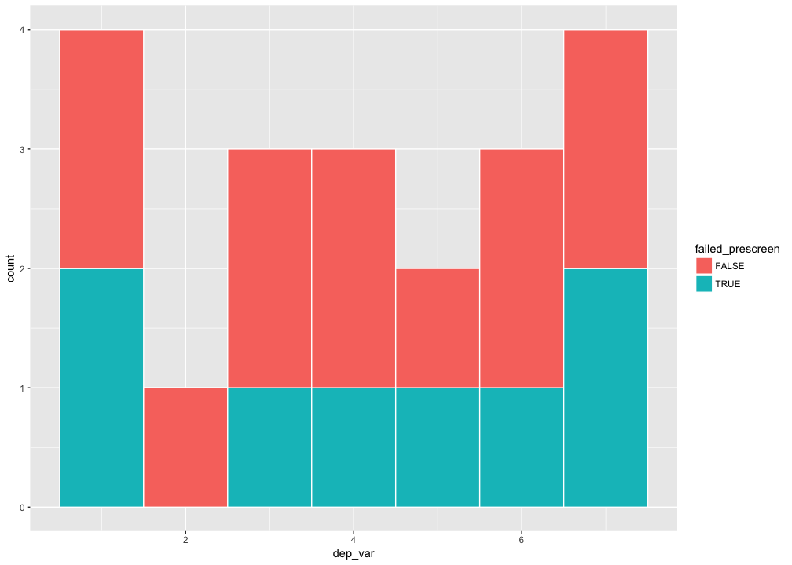
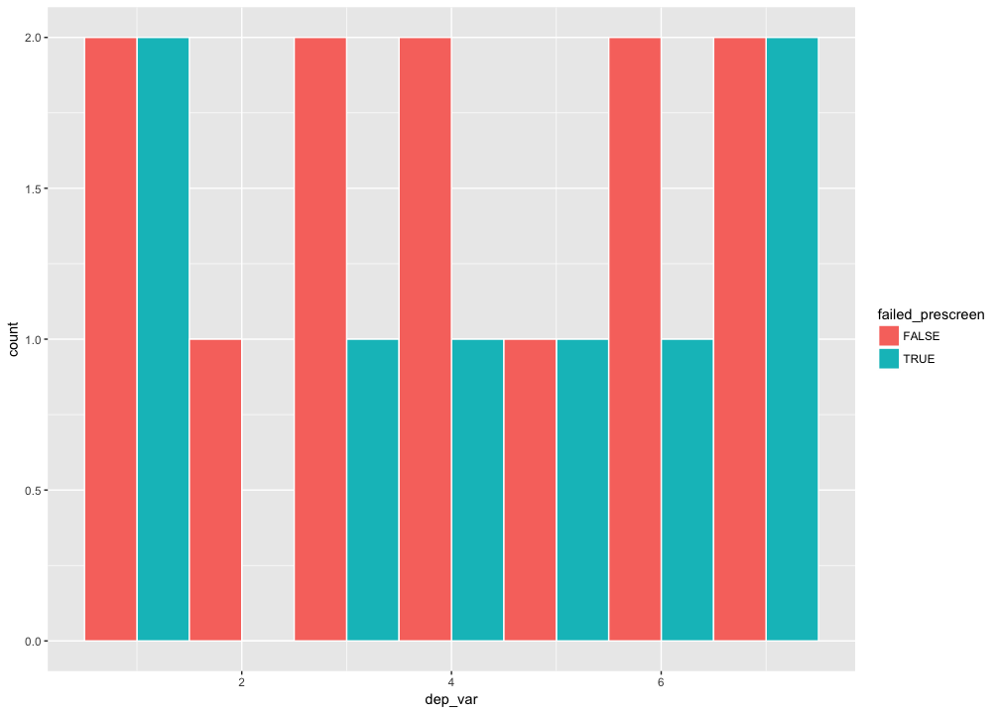
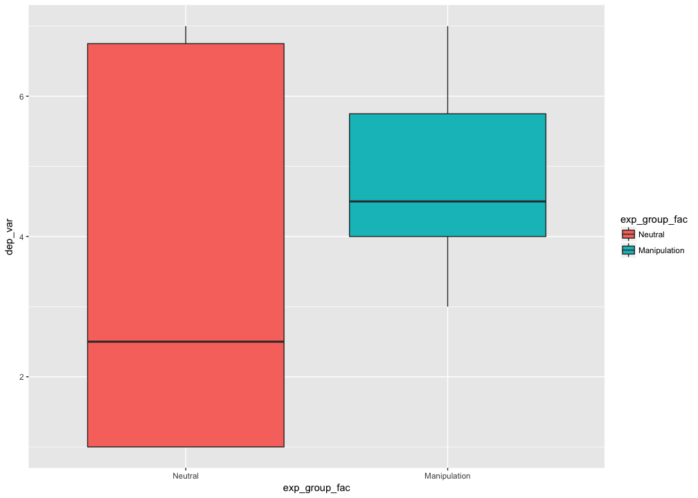
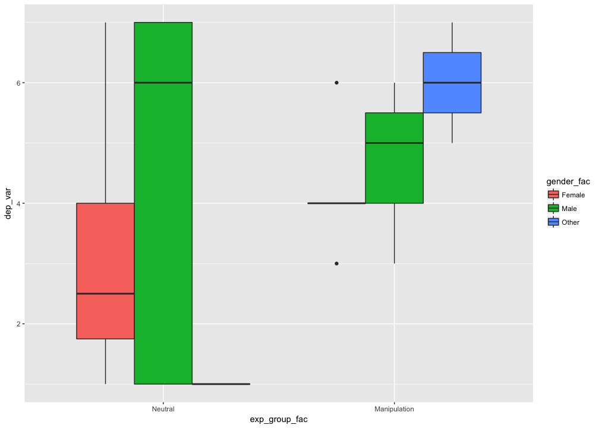
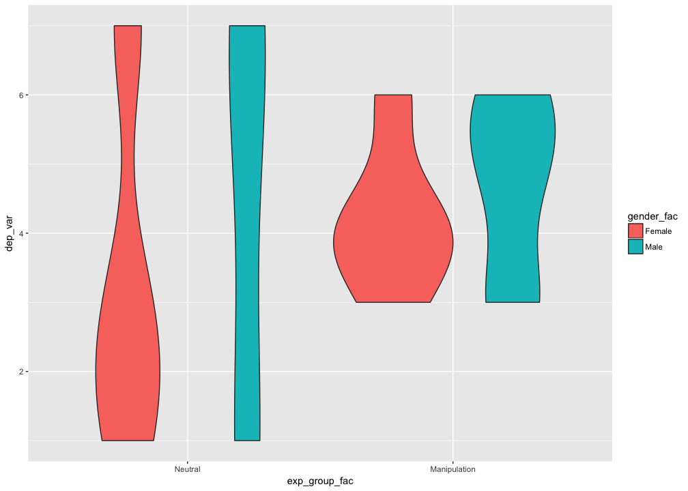
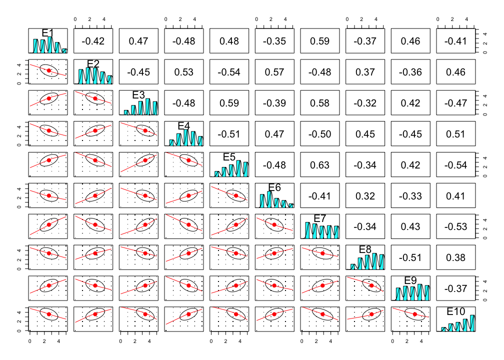

# Day 3. Vectors, strings, factors, and statistics
Nicholas Michalak  
6/24/2017  

# install prerequisite packages


```r
# character vector of packages you'll need for your whole analysis
needed_packages <- c("tidyverse", "forcats", "psych", "haven", "lavaan", "lme4", "lmerTest", "afex", "compute.es")

# source custom function
lapply(list.files(path = "custom_functions/", pattern = "*.R", full.names = TRUE), source)
```

```
## [[1]]
## [[1]]$value
## function (alpha, m, sd, n, c) 
## {
##     est <- t(c) %*% m
##     k <- length(m)
##     df1 <- sum(n) - k
##     v1 <- sum((n - 1) * sd^2)/df1
##     se1 <- sqrt(v1 * t(c) %*% solve(diag(n)) %*% c)
##     t1 <- est/se1
##     p1 <- 2 * (1 - pt(abs(t1), df1))
##     tcrit1 <- qt(1 - alpha/2, df1)
##     ll1 <- est - tcrit1 * se1
##     ul1 <- est + tcrit1 * se1
##     v2 <- diag(sd^2) %*% (solve(diag(n)))
##     se2 <- sqrt(t(c) %*% v2 %*% c)
##     t2 <- est/se2
##     df2 = (se2^4)/sum(((c^4) * (sd^4)/(n^2 * (n - 1))))
##     p2 <- 2 * (1 - pt(abs(t2), df2))
##     tcrit2 <- qt(1 - alpha/2, df2)
##     ll2 <- est - tcrit2 * se2
##     ul2 <- est + tcrit2 * se2
##     out1 <- t(c(est, se1, t1, df1, p1, ll1, ul1))
##     out2 <- t(c(est, se2, t2, df2, p2, ll2, ul2))
##     out <- rbind(out1, out2)
##     colnames(out) <- c("Estimate", "SE", "t", "df", "p-value", 
##         "LL", "UL")
##     rownames(out) <- c("Equal Variances Assumed:", "Equal Variances Not Assumed:")
##     return(out)
## }
## 
## [[1]]$visible
## [1] FALSE
## 
## 
## [[2]]
## [[2]]$value
## function (alpha, m, sd, n, c) 
## {
##     z <- qnorm(1 - alpha/2)
##     v <- sd^2
##     a <- length(m)
##     s <- sqrt(sum(v)/a)
##     df <- sum(n) - a
##     sp <- sqrt(sum((n - 1) * v)/df)
##     est1 <- (t(c) %*% m)/s
##     est2 <- (t(c) %*% m)/sp
##     a1 <- est1^2/(a^2 * s^4)
##     a2 <- a1 * sum((v^2/(2 * (n - 1))))
##     a3 <- sum((c^2 * v/(n - 1)))/s^2
##     se1 <- sqrt(a2 + a3)
##     ll1 <- est1 - z * se1
##     ul1 <- est1 + z * se1
##     a1 <- est2^2/a^2
##     a2 <- a1 * sum(1/(2 * (n - 1)))
##     a3 <- sum(c^2/n)
##     se2 <- sqrt(a2 + a3)
##     ll2 <- est2 - z * se2
##     ul2 <- est2 + z * se2
##     out1 <- t(c(est1, se1, ll1, ul1))
##     out2 <- t(c(est2, se2, ll2, ul2))
##     out <- rbind(out1, out2)
##     colnames(out) <- c("Estimate", "SE", "LL", "UL")
##     rownames(out) <- c("Equal Variances Not Assumed", "Equal Variances Assumed:")
##     return(out)
## }
## 
## [[2]]$visible
## [1] FALSE
## 
## 
## [[3]]
## [[3]]$value
## function (needed_packages) 
## {
##     have_packages <- needed_packages %in% rownames(installed.packages())
##     if (any(have_packages == FALSE) == TRUE) 
##         install.packages(needed_packages[have_packages == FALSE])
##     lapply(needed_packages, library, character.only = TRUE)
## }
## 
## [[3]]$visible
## [1] FALSE
## 
## 
## [[4]]
## [[4]]$value
## function (y, x, z, sd_values = seq(-3, 3, 0.5), mean_center = TRUE, 
##     alpha = 0.05) 
## {
##     if (mean_center == TRUE) {
##         x <- x - mean(x, na.rm = TRUE)
##         z <- z - mean(z, na.rm = TRUE)
##     }
##     descriptives <- sapply(list(y = y, x = x, z = z), function(v) {
##         round(c(N = sum(is.na(v) == FALSE), Mean = mean(v, na.rm = TRUE), 
##             SD = sd(v, na.rm = TRUE), Median = median(v, na.rm = TRUE), 
##             Min = min(v, na.rm = TRUE), Max = max(v, na.rm = TRUE)), 
##             digits = 3)
##     })
##     model <- lm(y ~ x * z)
##     z_mean <- mean(z, na.rm = TRUE)
##     z_sd <- sd(z, na.rm = TRUE)
##     model_vcov <- vcov(model)
##     est <- list()
##     se <- list()
##     for (i in 1:length(sd_values)) {
##         est[[i]] <- coefficients(model)["x"] + coefficients(model)["x:z"] * 
##             (z_mean + sd_values[i] * z_sd)
##         se[[i]] <- sqrt(model_vcov["x", "x"] + 2 * (z_mean + 
##             sd_values[i] * z_sd) * model_vcov["x", "x:z"] + (z_mean + 
##             sd_values[i] * z_sd) * (z_mean + sd_values[i] * z_sd) * 
##             model_vcov["x:z", "x:z"])
##     }
##     result <- data.frame(z_sd = sd_values * descriptives[3, 3], 
##         est = unlist(est), se = unlist(se))
##     result$t_val <- with(data = result, est/se)
##     result$p_val <- with(data = result, 2 * pt(q = -abs(t_val), 
##         df = model$df.residual))
##     t_crit <- qt(p = 1 - alpha/2, df = model$df.residual)
##     result$lwr_ci <- with(data = result, est - t_crit * se)
##     result$upr_ci <- with(data = result, est + t_crit * se)
##     result[, !colnames(result) %in% "p_val"] <- data.frame(apply(result[, 
##         !colnames(result) %in% "p_val"], 2, function(i) round(i, 
##         3)))
##     print(paste0("Descriptives"))
##     print(descriptives)
##     return(result)
## }
## 
## [[4]]$visible
## [1] FALSE
```

```r
# install needed packages
install_needed_pkgs(needed_packages = needed_packages)
```

```
## Loading tidyverse: ggplot2
## Loading tidyverse: tibble
## Loading tidyverse: tidyr
## Loading tidyverse: readr
## Loading tidyverse: purrr
## Loading tidyverse: dplyr
```

```
## Conflicts with tidy packages ----------------------------------------------
```

```
## filter(): dplyr, stats
## lag():    dplyr, stats
```

```
## 
## Attaching package: 'psych'
```

```
## The following objects are masked from 'package:ggplot2':
## 
##     %+%, alpha
```

```
## 
## Attaching package: 'haven'
```

```
## The following object is masked from 'package:forcats':
## 
##     as_factor
```

```
## This is lavaan 0.5-23.1097
```

```
## lavaan is BETA software! Please report any bugs.
```

```
## 
## Attaching package: 'lavaan'
```

```
## The following object is masked from 'package:psych':
## 
##     cor2cov
```

```
## Loading required package: Matrix
```

```
## 
## Attaching package: 'Matrix'
```

```
## The following object is masked from 'package:tidyr':
## 
##     expand
```

```
## 
## Attaching package: 'lmerTest'
```

```
## The following object is masked from 'package:lme4':
## 
##     lmer
```

```
## The following object is masked from 'package:stats':
## 
##     step
```

```
## Loading required package: lsmeans
```

```
## Loading required package: estimability
```

```
## 
## Attaching package: 'lsmeans'
```

```
## The following object is masked from 'package:lmerTest':
## 
##     lsmeans
```

```
## ************
## Welcome to afex. For support visit: http://afex.singmann.science/
```

```
## - Functions for ANOVAs: aov_car(), aov_ez(), and aov_4()
## - Methods for calculating p-values with mixed(): 'KR', 'S', 'LRT', and 'PB'
## - 'afex_aov' and 'mixed' objects can be passed to lsmeans() for follow-up tests
## - Get and set global package options with: afex_options()
## - Set orthogonal sum-to-zero contrasts globally: set_sum_contrasts()
## - For example analyses see: browseVignettes("afex")
## ************
```

```
## 
## Attaching package: 'afex'
```

```
## The following object is masked from 'package:lme4':
## 
##     lmer
```

```
## [[1]]
##  [1] "dplyr"     "purrr"     "readr"     "tidyr"     "tibble"   
##  [6] "ggplot2"   "tidyverse" "stats"     "graphics"  "grDevices"
## [11] "utils"     "datasets"  "methods"   "base"     
## 
## [[2]]
##  [1] "forcats"   "dplyr"     "purrr"     "readr"     "tidyr"    
##  [6] "tibble"    "ggplot2"   "tidyverse" "stats"     "graphics" 
## [11] "grDevices" "utils"     "datasets"  "methods"   "base"     
## 
## [[3]]
##  [1] "psych"     "forcats"   "dplyr"     "purrr"     "readr"    
##  [6] "tidyr"     "tibble"    "ggplot2"   "tidyverse" "stats"    
## [11] "graphics"  "grDevices" "utils"     "datasets"  "methods"  
## [16] "base"     
## 
## [[4]]
##  [1] "haven"     "psych"     "forcats"   "dplyr"     "purrr"    
##  [6] "readr"     "tidyr"     "tibble"    "ggplot2"   "tidyverse"
## [11] "stats"     "graphics"  "grDevices" "utils"     "datasets" 
## [16] "methods"   "base"     
## 
## [[5]]
##  [1] "lavaan"    "haven"     "psych"     "forcats"   "dplyr"    
##  [6] "purrr"     "readr"     "tidyr"     "tibble"    "ggplot2"  
## [11] "tidyverse" "stats"     "graphics"  "grDevices" "utils"    
## [16] "datasets"  "methods"   "base"     
## 
## [[6]]
##  [1] "lme4"      "Matrix"    "lavaan"    "haven"     "psych"    
##  [6] "forcats"   "dplyr"     "purrr"     "readr"     "tidyr"    
## [11] "tibble"    "ggplot2"   "tidyverse" "stats"     "graphics" 
## [16] "grDevices" "utils"     "datasets"  "methods"   "base"     
## 
## [[7]]
##  [1] "lmerTest"  "lme4"      "Matrix"    "lavaan"    "haven"    
##  [6] "psych"     "forcats"   "dplyr"     "purrr"     "readr"    
## [11] "tidyr"     "tibble"    "ggplot2"   "tidyverse" "stats"    
## [16] "graphics"  "grDevices" "utils"     "datasets"  "methods"  
## [21] "base"     
## 
## [[8]]
##  [1] "afex"         "lsmeans"      "estimability" "lmerTest"    
##  [5] "lme4"         "Matrix"       "lavaan"       "haven"       
##  [9] "psych"        "forcats"      "dplyr"        "purrr"       
## [13] "readr"        "tidyr"        "tibble"       "ggplot2"     
## [17] "tidyverse"    "stats"        "graphics"     "grDevices"   
## [21] "utils"        "datasets"     "methods"      "base"        
## 
## [[9]]
##  [1] "compute.es"   "afex"         "lsmeans"      "estimability"
##  [5] "lmerTest"     "lme4"         "Matrix"       "lavaan"      
##  [9] "haven"        "psych"        "forcats"      "dplyr"       
## [13] "purrr"        "readr"        "tidyr"        "tibble"      
## [17] "ggplot2"      "tidyverse"    "stats"        "graphics"    
## [21] "grDevices"    "utils"        "datasets"     "methods"     
## [25] "base"
```

# integer
> subject ID


```r
(subj_id <- 1:20)
```

```
##  [1]  1  2  3  4  5  6  7  8  9 10 11 12 13 14 15 16 17 18 19 20
```

# logical
> did this subject fail the pre-screen?


```r
(failed_prescreen <- c(TRUE, FALSE, FALSE, FALSE, TRUE, TRUE, FALSE, TRUE, TRUE, TRUE, FALSE, TRUE, FALSE, FALSE, FALSE, TRUE, FALSE, FALSE, FALSE, FALSE))
```

```
##  [1]  TRUE FALSE FALSE FALSE  TRUE  TRUE FALSE  TRUE  TRUE  TRUE FALSE
## [12]  TRUE FALSE FALSE FALSE  TRUE FALSE FALSE FALSE FALSE
```

# character / factor
> experimental group


```r
# character vector
(exp_group <- c("Treatment", "Control", "Control", "Treatment", "Treatment", "Control", "Treatment", "Control", "Treatment", "Treatment", "Treatment", "Control", "Control", "Treatment", "Control", "Control", "Treatment", "Control", "Treatment", "Control"))
```

```
##  [1] "Treatment" "Control"   "Control"   "Treatment" "Treatment"
##  [6] "Control"   "Treatment" "Control"   "Treatment" "Treatment"
## [11] "Treatment" "Control"   "Control"   "Treatment" "Control"  
## [16] "Control"   "Treatment" "Control"   "Treatment" "Control"
```

```r
# convert to factor vector
(exp_group_fac <- parse_factor(exp_group,
                               levels = c("Treatment", "Control")))
```

```
##  [1] Treatment Control   Control   Treatment Treatment Control   Treatment
##  [8] Control   Treatment Treatment Treatment Control   Control   Treatment
## [15] Control   Control   Treatment Control   Treatment Control  
## Levels: Treatment Control
```

## modify factor order


```r
(exp_group_fac <- parse_factor(exp_group,
                               levels = c("Control", "Treatment")))
```

```
##  [1] Treatment Control   Control   Treatment Treatment Control   Treatment
##  [8] Control   Treatment Treatment Treatment Control   Control   Treatment
## [15] Control   Control   Treatment Control   Treatment Control  
## Levels: Control Treatment
```

## modify factor levels


```r
(exp_group_fac <- recode_factor(exp_group_fac, Control = "Neutral", Treatment = "Manipulation"))
```

```
##  [1] Manipulation Neutral      Neutral      Manipulation Manipulation
##  [6] Neutral      Manipulation Neutral      Manipulation Manipulation
## [11] Manipulation Neutral      Neutral      Manipulation Neutral     
## [16] Neutral      Manipulation Neutral      Manipulation Neutral     
## Levels: Neutral Manipulation
```

# numeric
> dependent variable


```r
(dep_var <- c(4, 2, 7, 3, 5, 6, 6, 1, 7, 3, 4, 1, 3, 6, 1, 7, 4, 7, 5, 1))
```

```
##  [1] 4 2 7 3 5 6 6 1 7 3 4 1 3 6 1 7 4 7 5 1
```

# combine them into a "tibble"


```r
(my_data <- tibble(subj_id, exp_group, exp_group_fac, dep_var, failed_prescreen))
```

```
## # A tibble: 20 x 5
##    subj_id exp_group exp_group_fac dep_var failed_prescreen
##      <int>     <chr>        <fctr>   <dbl>            <lgl>
##  1       1 Treatment  Manipulation       4             TRUE
##  2       2   Control       Neutral       2            FALSE
##  3       3   Control       Neutral       7            FALSE
##  4       4 Treatment  Manipulation       3            FALSE
##  5       5 Treatment  Manipulation       5             TRUE
##  6       6   Control       Neutral       6             TRUE
##  7       7 Treatment  Manipulation       6            FALSE
##  8       8   Control       Neutral       1             TRUE
##  9       9 Treatment  Manipulation       7             TRUE
## 10      10 Treatment  Manipulation       3             TRUE
## 11      11 Treatment  Manipulation       4            FALSE
## 12      12   Control       Neutral       1             TRUE
## 13      13   Control       Neutral       3            FALSE
## 14      14 Treatment  Manipulation       6            FALSE
## 15      15   Control       Neutral       1            FALSE
## 16      16   Control       Neutral       7             TRUE
## 17      17 Treatment  Manipulation       4            FALSE
## 18      18   Control       Neutral       7            FALSE
## 19      19 Treatment  Manipulation       5            FALSE
## 20      20   Control       Neutral       1            FALSE
```

# review

## `summarise()`


```r
my_data %>%
  group_by(failed_prescreen) %>%
  summarise(n = n())
```

```
## # A tibble: 2 x 2
##   failed_prescreen     n
##              <lgl> <int>
## 1            FALSE    12
## 2             TRUE     8
```

## `count()`


```r
my_data %>%
  count(failed_prescreen)
```

```
## # A tibble: 2 x 2
##   failed_prescreen     n
##              <lgl> <int>
## 1            FALSE    12
## 2             TRUE     8
```

## `filter()`


```r
my_data %>%
  filter(failed_prescreen == FALSE)
```

```
## # A tibble: 12 x 5
##    subj_id exp_group exp_group_fac dep_var failed_prescreen
##      <int>     <chr>        <fctr>   <dbl>            <lgl>
##  1       2   Control       Neutral       2            FALSE
##  2       3   Control       Neutral       7            FALSE
##  3       4 Treatment  Manipulation       3            FALSE
##  4       7 Treatment  Manipulation       6            FALSE
##  5      11 Treatment  Manipulation       4            FALSE
##  6      13   Control       Neutral       3            FALSE
##  7      14 Treatment  Manipulation       6            FALSE
##  8      15   Control       Neutral       1            FALSE
##  9      17 Treatment  Manipulation       4            FALSE
## 10      18   Control       Neutral       7            FALSE
## 11      19 Treatment  Manipulation       5            FALSE
## 12      20   Control       Neutral       1            FALSE
```

## `geom_histogram()` and aesetics


```r
my_data %>%
  ggplot(mapping = aes(x = dep_var, fill = failed_prescreen)) +
  geom_histogram(binwidth = 1, color = "white")
```

<!-- -->

### `facet_wrap()`


```r
my_data %>%
  ggplot(mapping = aes(x = dep_var)) +
  geom_histogram(binwidth = 1, color = "white") +
  facet_wrap(~ failed_prescreen)
```

<!-- -->

## `geom_boxplot()`


```r
my_data %>%
  ggplot(mapping = aes(x = exp_group_fac, y = dep_var, fill = exp_group_fac)) +
  geom_boxplot()
```

<!-- -->

## `geom_violin()`


```r
my_data %>%
  ggplot(mapping = aes(x = exp_group_fac, y = dep_var, fill = exp_group_fac)) +
  geom_violin()
```

<!-- -->

## `stat_summary()`


```r
my_data %>%
  ggplot(mapping = aes(x = exp_group_fac, y = dep_var, fill = exp_group_fac)) +
  stat_summary(fun.data = "mean_cl_normal", geom = "bar", position = position_dodge(0.9)) +
  stat_summary(fun.data = "mean_cl_normal", geom = "errorbar", width = 0.1, position = position_dodge(0.9))
```

<!-- -->

## grouped descriptives


```r
with(data = my_data, describeBy(dep_var, group = exp_group_fac, mat = TRUE))
```

```
##     item       group1 vars  n mean       sd median trimmed    mad min max
## X11    1      Neutral    1 10  3.6 2.796824    2.5   3.500 2.2239   1   7
## X12    2 Manipulation    1 10  4.7 1.337494    4.5   4.625 1.4826   3   7
##     range      skew kurtosis        se
## X11     6 0.2610916 -1.98091 0.8844333
## X12     4 0.2407395 -1.40203 0.4229526
```

## `t.test()`
* I make all arguments explcit


```r
t.test(formula = dep_var ~ exp_group_fac,
       data = my_data,
       alternative = "two.sided",
       mu = 0,
       paired = FALSE,
       var.equal = FALSE,
       conf.level = .95)
```

```
## 
## 	Welch Two Sample t-test
## 
## data:  dep_var by exp_group_fac
## t = -1.122, df = 12.912, p-value = 0.2823
## alternative hypothesis: true difference in means is not equal to 0
## 95 percent confidence interval:
##  -3.219415  1.019415
## sample estimates:
##      mean in group Neutral mean in group Manipulation 
##                        3.6                        4.7
```

### less explicit
* if you don't name arguments explictly, make sure you give argument input in order


```r
t.test(dep_var ~ exp_group_fac, my_data)
```

```
## 
## 	Welch Two Sample t-test
## 
## data:  dep_var by exp_group_fac
## t = -1.122, df = 12.912, p-value = 0.2823
## alternative hypothesis: true difference in means is not equal to 0
## 95 percent confidence interval:
##  -3.219415  1.019415
## sample estimates:
##      mean in group Neutral mean in group Manipulation 
##                        3.6                        4.7
```

# Big Five data from [personality-testing.info](http://personality-testing.info/_rawdata/)


```r
(big_five <- "example_tidy_data/big_five_may_2014/big_five_may_2014.csv" %>%
  read_tsv() %>%
  mutate(race_fac = recode(race, `1`  =  "Mixed Race", `2`  =  "Arctic (Siberian, Eskimo)", `3`  =  "Caucasian (European)", `4` = "Caucasian (Indian)", `5` = "Caucasian (Middle East)", `6` = "Caucasian (North African, Other)", `7` = "Indigenous Australian", `8` = "Native American", `9` = "North East Asian (Mongol, Tibetan, Korean Japanese, etc)", `10` = "Pacific (Polynesian, Micronesian, etc)", `11` = "South East Asian (Chinese, Thai, Malay, Filipino, etc)", `12` = "West African, Bushmen, Ethiopian", `13` = "Other (0 = missed)"),
         eng_nat_fac = recode(engnat, `1` = "yes", `2` = "no", `0` = "missed"),
         gender_fac = recode(gender, `1` = "Male", `2` = "Female", `3` = "Other", `0` = "missed"),
         hand_fac = recode(hand, `1` = "Right", `2` = "Left", `3` = "Both", `0` = "missed"),
         source_fac = recode(source, `1` = "from another page on the test website", `2` = "from google", `3` = "from facebook", `4` = 'from any url with ".edu" in its domain name (e.g. xxx.edu, xxx.edu.au)', `5` = "other source, or HTTP Referer not provided")) %>%
  select(age, country, race, race_fac, engnat, eng_nat_fac, gender, gender_fac, hand, hand_fac, source, source_fac, everything(.)))
```

```
## Parsed with column specification:
## cols(
##   .default = col_integer(),
##   country = col_character()
## )
```

```
## See spec(...) for full column specifications.
```

```
## Warning: Unreplaced values treated as NA as .x is not compatible. Please
## specify replacements exhaustively or supply .default
```

```
## # A tibble: 19,719 x 62
##      age country  race
##    <int>   <chr> <int>
##  1    53      US     3
##  2    46      US    13
##  3    14      PK     1
##  4    19      RO     3
##  5    25      US    11
##  6    31      US    13
##  7    20      US     5
##  8    23      IN     4
##  9    39      US     5
## 10    18      US     3
## # ... with 19,709 more rows, and 59 more variables: race_fac <chr>,
## #   engnat <int>, eng_nat_fac <chr>, gender <int>, gender_fac <chr>,
## #   hand <int>, hand_fac <chr>, source <int>, source_fac <chr>, E1 <int>,
## #   E2 <int>, E3 <int>, E4 <int>, E5 <int>, E6 <int>, E7 <int>, E8 <int>,
## #   E9 <int>, E10 <int>, N1 <int>, N2 <int>, N3 <int>, N4 <int>, N5 <int>,
## #   N6 <int>, N7 <int>, N8 <int>, N9 <int>, N10 <int>, A1 <int>, A2 <int>,
## #   A3 <int>, A4 <int>, A5 <int>, A6 <int>, A7 <int>, A8 <int>, A9 <int>,
## #   A10 <int>, C1 <int>, C2 <int>, C3 <int>, C4 <int>, C5 <int>, C6 <int>,
## #   C7 <int>, C8 <int>, C9 <int>, C10 <int>, O1 <int>, O2 <int>, O3 <int>,
## #   O4 <int>, O5 <int>, O6 <int>, O7 <int>, O8 <int>, O9 <int>, O10 <int>
```

# more descriptives examples

* see psych package ([an overview of the psych package](http://personality-project.org/r/overview.pdf)) for many trusty tools

## extraversion


```r
big_five %>%
  select(num_range(prefix = "E", range = 1:10)) %>%
  psych::describe(.)
```

```
##     vars     n mean   sd median trimmed  mad min max range  skew kurtosis
## E1     1 19719 2.63 1.23      3    2.57 1.48   0   5     5  0.21    -0.96
## E2     2 19719 2.76 1.31      3    2.70 1.48   0   5     5  0.21    -1.08
## E3     3 19719 3.42 1.24      4    3.50 1.48   0   5     5 -0.36    -0.88
## E4     4 19719 3.15 1.22      3    3.19 1.48   0   5     5 -0.10    -0.94
## E5     5 19719 3.43 1.28      4    3.53 1.48   0   5     5 -0.40    -0.94
## E6     6 19719 2.45 1.24      2    2.34 1.48   0   5     5  0.54    -0.74
## E7     7 19719 2.87 1.43      3    2.83 1.48   0   5     5  0.12    -1.32
## E8     8 19719 3.38 1.27      3    3.45 1.48   0   5     5 -0.28    -1.00
## E9     9 19719 3.09 1.40      3    3.12 1.48   0   5     5 -0.09    -1.28
## E10   10 19719 3.59 1.30      4    3.71 1.48   0   5     5 -0.51    -0.93
##       se
## E1  0.01
## E2  0.01
## E3  0.01
## E4  0.01
## E5  0.01
## E6  0.01
## E7  0.01
## E8  0.01
## E9  0.01
## E10 0.01
```

# some correlation matrix examples

## `pairs.panels()`


```r
big_five %>%
  select(num_range(prefix = "E", range = 1:10)) %>%
  pairs.panels(pch = ".")
```

<!-- -->

## `cor.plot()`


```r
big_five %>%
  select(num_range(prefix = "E", range = 1:10)) %>%
  cor.plot(numbers = TRUE)
```

<!-- -->

## `cor.test()`
* explicit argument names again


```r
big_five %>%
  cor.test(formula = ~ E1 + E2, data = .,
           alternative = "two.sided",
           method = "pearson",
           exact = NULL,
           conf.level = .95)
```

```
## 
## 	Pearson's product-moment correlation
## 
## data:  E1 and E2
## t = -65.174, df = 19717, p-value < 2.2e-16
## alternative hypothesis: true correlation is not equal to 0
## 95 percent confidence interval:
##  -0.4324256 -0.4094576
## sample estimates:
##        cor 
## -0.4210091
```

## `corr.test()`
* from psych package
* takes matrix or dataframe input
* explicit argument names again


```r
big_five %>%
  select(num_range(prefix = "E", range = 1:10)) %>%
  corr.test(use = "complete",
            method = "pearson",
            adjust = "none",
            alpha = .05,
            ci = TRUE) %>%
  print(short = FALSE)
```

```
## Call:corr.test(x = ., use = "complete", method = "pearson", adjust = "none", 
##     alpha = 0.05, ci = TRUE)
## Correlation matrix 
##        E1    E2    E3    E4    E5    E6    E7    E8    E9   E10
## E1   1.00 -0.42  0.47 -0.48  0.48 -0.35  0.59 -0.37  0.46 -0.41
## E2  -0.42  1.00 -0.45  0.53 -0.54  0.57 -0.48  0.37 -0.36  0.46
## E3   0.47 -0.45  1.00 -0.48  0.59 -0.39  0.58 -0.32  0.42 -0.47
## E4  -0.48  0.53 -0.48  1.00 -0.51  0.47 -0.50  0.45 -0.45  0.51
## E5   0.48 -0.54  0.59 -0.51  1.00 -0.48  0.63 -0.34  0.42 -0.54
## E6  -0.35  0.57 -0.39  0.47 -0.48  1.00 -0.41  0.32 -0.33  0.41
## E7   0.59 -0.48  0.58 -0.50  0.63 -0.41  1.00 -0.34  0.43 -0.53
## E8  -0.37  0.37 -0.32  0.45 -0.34  0.32 -0.34  1.00 -0.51  0.38
## E9   0.46 -0.36  0.42 -0.45  0.42 -0.33  0.43 -0.51  1.00 -0.37
## E10 -0.41  0.46 -0.47  0.51 -0.54  0.41 -0.53  0.38 -0.37  1.00
## Sample Size 
## [1] 19719
## Probability values (Entries above the diagonal are adjusted for multiple tests.) 
##     E1 E2 E3 E4 E5 E6 E7 E8 E9 E10
## E1   0  0  0  0  0  0  0  0  0   0
## E2   0  0  0  0  0  0  0  0  0   0
## E3   0  0  0  0  0  0  0  0  0   0
## E4   0  0  0  0  0  0  0  0  0   0
## E5   0  0  0  0  0  0  0  0  0   0
## E6   0  0  0  0  0  0  0  0  0   0
## E7   0  0  0  0  0  0  0  0  0   0
## E8   0  0  0  0  0  0  0  0  0   0
## E9   0  0  0  0  0  0  0  0  0   0
## E10  0  0  0  0  0  0  0  0  0   0
## 
##  To see confidence intervals of the correlations, print with the short=FALSE option
## 
##  Confidence intervals based upon normal theory.  To get bootstrapped values, try cor.ci
##        lower     r upper p
## E1-E2  -0.43 -0.42 -0.41 0
## E1-E3   0.46  0.47  0.49 0
## E1-E4  -0.49 -0.48 -0.47 0
## E1-E5   0.47  0.48  0.49 0
## E1-E6  -0.36 -0.35 -0.33 0
## E1-E7   0.58  0.59  0.60 0
## E1-E8  -0.38 -0.37 -0.35 0
## E1-E9   0.44  0.46  0.47 0
## E1-E10 -0.43 -0.41 -0.40 0
## E2-E3  -0.46 -0.45 -0.43 0
## E2-E4   0.52  0.53  0.54 0
## E2-E5  -0.55 -0.54 -0.53 0
## E2-E6   0.56  0.57  0.58 0
## E2-E7  -0.49 -0.48 -0.47 0
## E2-E8   0.36  0.37  0.39 0
## E2-E9  -0.38 -0.36 -0.35 0
## E2-E10  0.45  0.46  0.47 0
## E3-E4  -0.49 -0.48 -0.47 0
## E3-E5   0.58  0.59  0.60 0
## E3-E6  -0.41 -0.39 -0.38 0
## E3-E7   0.57  0.58  0.59 0
## E3-E8  -0.33 -0.32 -0.31 0
## E3-E9   0.41  0.42  0.43 0
## E3-E10 -0.48 -0.47 -0.46 0
## E4-E5  -0.52 -0.51 -0.50 0
## E4-E6   0.46  0.47  0.49 0
## E4-E7  -0.51 -0.50 -0.49 0
## E4-E8   0.43  0.45  0.46 0
## E4-E9  -0.46 -0.45 -0.44 0
## E4-E10  0.50  0.51  0.52 0
## E5-E6  -0.49 -0.48 -0.47 0
## E5-E7   0.62  0.63  0.64 0
## E5-E8  -0.36 -0.34 -0.33 0
## E5-E9   0.40  0.42  0.43 0
## E5-E10 -0.55 -0.54 -0.53 0
## E6-E7  -0.42 -0.41 -0.39 0
## E6-E8   0.31  0.32  0.33 0
## E6-E9  -0.34 -0.33 -0.32 0
## E6-E10  0.40  0.41  0.42 0
## E7-E8  -0.36 -0.34 -0.33 0
## E7-E9   0.42  0.43  0.44 0
## E7-E10 -0.54 -0.53 -0.52 0
## E8-E9  -0.52 -0.51 -0.50 0
## E8-E10  0.37  0.38  0.39 0
## E9-E10 -0.38 -0.37 -0.36 0
```

# regression

## `lm()`
* to be honest, I don't understand *all* of the arguments in `lm()`


```r
big_five %>%
  lm(formula = E1 ~ E2 + E3, data = .)
```

```
## 
## Call:
## lm(formula = E1 ~ E2 + E3, data = .)
## 
## Coefficients:
## (Intercept)           E2           E3  
##      2.0883      -0.2455       0.3565
```

## `summary()`


```r
big_five %>%
  lm(formula = E1 ~ E2 + E3, data = .) %>%
  summary(.)
```

```
## 
## Call:
## lm(formula = E1 ~ E2 + E3, data = .)
## 
## Residuals:
##     Min      1Q  Median      3Q     Max 
## -2.6253 -0.6669 -0.0233  0.6896  3.7825 
## 
## Coefficients:
##              Estimate Std. Error t value Pr(>|t|)    
## (Intercept)  2.088341   0.035319   59.13   <2e-16 ***
## E2          -0.245457   0.006333  -38.76   <2e-16 ***
## E3           0.356475   0.006728   52.99   <2e-16 ***
## ---
## Signif. codes:  0 '***' 0.001 '**' 0.01 '*' 0.05 '.' 0.1 ' ' 1
## 
## Residual standard error: 1.046 on 19716 degrees of freedom
## Multiple R-squared:  0.2798,	Adjusted R-squared:  0.2797 
## F-statistic:  3830 on 2 and 19716 DF,  p-value: < 2.2e-16
```

### interactions
* ":" creates an interaction term between variables
* "*" creates all main effect and interaction terms


```r
big_five %>%
  lm(formula = E1 ~ E2 + E3 + E2:E3, data = .) %>%
  summary(.)
```

```
## 
## Call:
## lm(formula = E1 ~ E2 + E3 + E2:E3, data = .)
## 
## Residuals:
##     Min      1Q  Median      3Q     Max 
## -2.6767 -0.6767 -0.0196  0.7213  3.6887 
## 
## Coefficients:
##              Estimate Std. Error t value Pr(>|t|)    
## (Intercept)  1.858046   0.058752  31.625  < 2e-16 ***
## E2          -0.171392   0.016377 -10.465  < 2e-16 ***
## E3           0.419950   0.014587  28.789  < 2e-16 ***
## E2:E3       -0.021938   0.004474  -4.903 9.49e-07 ***
## ---
## Signif. codes:  0 '***' 0.001 '**' 0.01 '*' 0.05 '.' 0.1 ' ' 1
## 
## Residual standard error: 1.045 on 19715 degrees of freedom
## Multiple R-squared:  0.2807,	Adjusted R-squared:  0.2806 
## F-statistic:  2564 on 3 and 19715 DF,  p-value: < 2.2e-16
```

```r
# same model
big_five %>%
  lm(formula = E1 ~ E2 * E3, data = .) %>%
  summary(.)
```

```
## 
## Call:
## lm(formula = E1 ~ E2 * E3, data = .)
## 
## Residuals:
##     Min      1Q  Median      3Q     Max 
## -2.6767 -0.6767 -0.0196  0.7213  3.6887 
## 
## Coefficients:
##              Estimate Std. Error t value Pr(>|t|)    
## (Intercept)  1.858046   0.058752  31.625  < 2e-16 ***
## E2          -0.171392   0.016377 -10.465  < 2e-16 ***
## E3           0.419950   0.014587  28.789  < 2e-16 ***
## E2:E3       -0.021938   0.004474  -4.903 9.49e-07 ***
## ---
## Signif. codes:  0 '***' 0.001 '**' 0.01 '*' 0.05 '.' 0.1 ' ' 1
## 
## Residual standard error: 1.045 on 19715 degrees of freedom
## Multiple R-squared:  0.2807,	Adjusted R-squared:  0.2806 
## F-statistic:  2564 on 3 and 19715 DF,  p-value: < 2.2e-16
```

## `glm()`


```r
big_five %>%
  filter(hand != 3 & hand != 0) %>%
  mutate(right_handed = recode(hand, `1` = 1, `2` = 0)) %>%
  glm(formula = right_handed ~ E2 * E3, data = ., family = binomial) %>%
  summary(.)
```

```
## 
## Call:
## glm(formula = right_handed ~ E2 * E3, family = binomial, data = .)
## 
## Deviance Residuals: 
##     Min       1Q   Median       3Q      Max  
## -2.2903   0.4235   0.4338   0.4421   0.4585  
## 
## Coefficients:
##              Estimate Std. Error z value Pr(>|z|)    
## (Intercept)  2.243993   0.195483  11.479   <2e-16 ***
## E2          -0.026190   0.054530  -0.480    0.631    
## E3          -0.004887   0.048730  -0.100    0.920    
## E2:E3        0.018354   0.015117   1.214    0.225    
## ---
## Signif. codes:  0 '***' 0.001 '**' 0.01 '*' 0.05 '.' 0.1 ' ' 1
## 
## (Dispersion parameter for binomial family taken to be 1)
## 
##     Null deviance: 11589  on 19147  degrees of freedom
## Residual deviance: 11583  on 19144  degrees of freedom
## AIC: 11591
## 
## Number of Fisher Scoring iterations: 5
```

# Factorial ANOVA

## afex package

### between-subjects ANOVA


```r
my_data %>%
  aov_car(formula = dep_var ~ exp_group_fac + Error(subj_id), data = .) %>%
  summary(.)
```

```
## Contrasts set to contr.sum for the following variables: exp_group_fac
```

```
## Anova Table (Type 3 tests)
## 
## Response: dep_var
##               num Df den Df    MSE     F     ges Pr(>F)
## exp_group_fac      1     18 4.8056 1.259 0.06537 0.2766
```

### specific contrasts


```r
# t-value and p-value
my_data %>%
  aov_car(formula = dep_var ~ exp_group_fac + Error(subj_id), data = .) %>%
  lsmeans::lsmeans(specs = "exp_group_fac") %>%
  contrast(list(ntrl_mnpl = c(-1, 1)))
```

```
## Contrasts set to contr.sum for the following variables: exp_group_fac
```

```
##  contrast  estimate        SE df t.ratio p.value
##  ntrl_mnpl      1.1 0.9803627 18   1.122  0.2766
```

```r
# confidence intervals
my_data %>%
  aov_car(formula = dep_var ~ exp_group_fac + Error(subj_id), data = .) %>%
  lsmeans::lsmeans(specs = "exp_group_fac") %>%
  contrast(list(ntrl_mnpl = c(-1, 1))) %>%
  confint(.)
```

```
## Contrasts set to contr.sum for the following variables: exp_group_fac
```

```
##  contrast  estimate        SE df   lower.CL upper.CL
##  ntrl_mnpl      1.1 0.9803627 18 -0.9596657 3.159666
## 
## Confidence level used: 0.95
```

## straight to contrasts

### Function 23: Confidence interval for a linear contrast of means (between-subjects design) [[Download more functions from Douglas Bonnet's course webpage](https://www.google.com/url?sa=t&rct=j&q=&esrc=s&source=web&cd=1&ved=0ahUKEwjg7bG3u-bUAhVi2IMKHWfSAWwQFggqMAA&url=https%3A%2F%2Fpeople.ucsc.edu%2F~dgbonett%2Fdocs%2Fpsyc204%2F204RFunctions.docx&usg=AFQjCNGRCAg-lE7TwzMSps_A1pmDOEEb8w)]


```r
my_data %>%
  group_by(exp_group_fac) %>%
  summarise(n = n(),
            m = mean(dep_var),
            sd = sd(dep_var)) %>%
  with(data = ., CImeanBS(alpha = .05, m = m, sd = sd, n = n, c = c(-1, 1)))
```

```
##                              Estimate        SE        t       df
## Equal Variances Assumed:          1.1 0.9803627 1.122034 18.00000
## Equal Variances Not Assumed:      1.1 0.9803627 1.122034 12.91188
##                                p-value         LL       UL
## Equal Variances Assumed:     0.2765933 -0.9596657 3.159666
## Equal Variances Not Assumed: 0.2822809 -1.0194152 3.219415
```

## effect size

### Function 24: Confidence interval for a standardized linear contrast of means (between-subjects design) [[Download more functions from Douglas Bonnet's course webpage](https://www.google.com/url?sa=t&rct=j&q=&esrc=s&source=web&cd=1&ved=0ahUKEwjg7bG3u-bUAhVi2IMKHWfSAWwQFggqMAA&url=https%3A%2F%2Fpeople.ucsc.edu%2F~dgbonett%2Fdocs%2Fpsyc204%2F204RFunctions.docx&usg=AFQjCNGRCAg-lE7TwzMSps_A1pmDOEEb8w)]


```r
my_data %>%
  group_by(exp_group_fac) %>%
  summarise(n = n(),
            m = mean(dep_var),
            sd = sd(dep_var)) %>%
  with(data = ., CIstdmeanBS(alpha = .05, m = m, sd = sd, n = n, c = c(-1, 1)))
```

```
##                              Estimate        SE         LL       UL
## Equal Variances Not Assumed 0.5017887 0.4816354 -0.4421992 1.445777
## Equal Variances Assumed:    0.5017887 0.4549662 -0.3899286 1.393506
```

