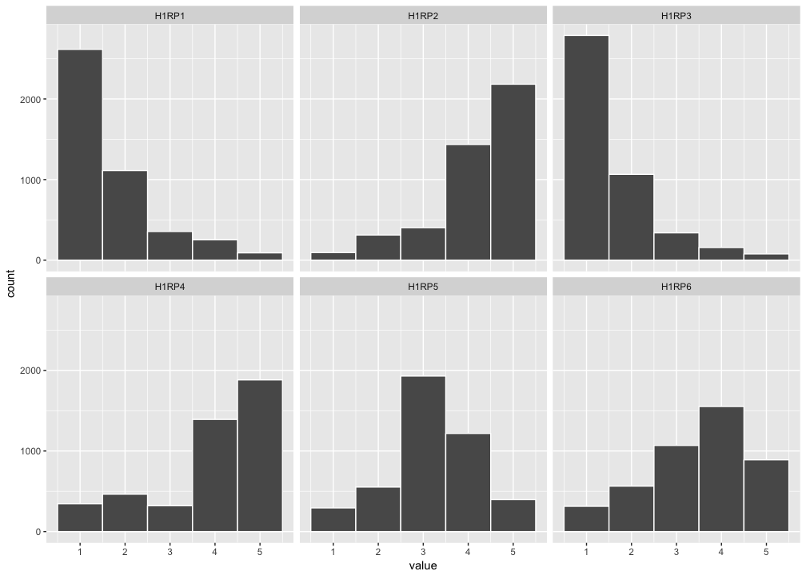
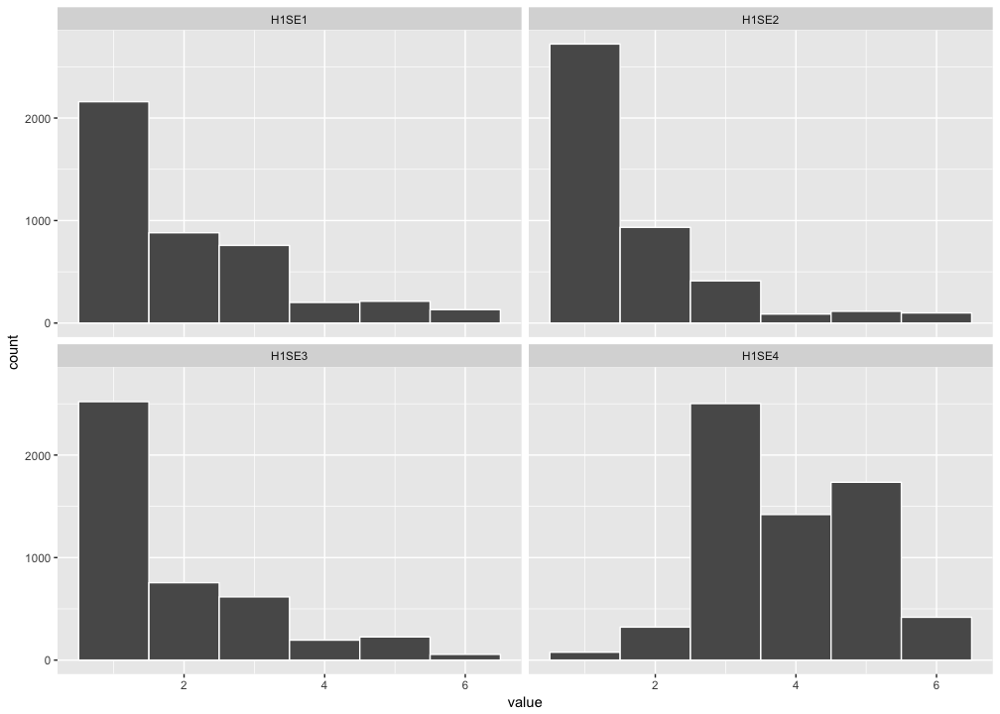

# Day 4. Miscellaneous
Nicholas Michalak  
7/14/2017  

# load packages


```r
# character vector of packages you'll need for your whole analysis
needed_packages <- c("tidyverse", "stringr", "haven", "readxl", "psych", "officer", "rvg")

# source custom function
source("custom_functions/install_needed_pkgs.R")

# install needed packages
install_needed_pkgs(needed_packages = needed_packages)
```

```
## Loading tidyverse: ggplot2
## Loading tidyverse: tibble
## Loading tidyverse: tidyr
## Loading tidyverse: readr
## Loading tidyverse: purrr
## Loading tidyverse: dplyr
```

```
## Conflicts with tidy packages ----------------------------------------------
```

```
## filter(): dplyr, stats
## lag():    dplyr, stats
```

```
## 
## Attaching package: 'psych'
```

```
## The following objects are masked from 'package:ggplot2':
## 
##     %+%, alpha
```

```
## [[1]]
##  [1] "dplyr"     "purrr"     "readr"     "tidyr"     "tibble"   
##  [6] "ggplot2"   "tidyverse" "stats"     "graphics"  "grDevices"
## [11] "utils"     "datasets"  "methods"   "base"     
## 
## [[2]]
##  [1] "stringr"   "dplyr"     "purrr"     "readr"     "tidyr"    
##  [6] "tibble"    "ggplot2"   "tidyverse" "stats"     "graphics" 
## [11] "grDevices" "utils"     "datasets"  "methods"   "base"     
## 
## [[3]]
##  [1] "haven"     "stringr"   "dplyr"     "purrr"     "readr"    
##  [6] "tidyr"     "tibble"    "ggplot2"   "tidyverse" "stats"    
## [11] "graphics"  "grDevices" "utils"     "datasets"  "methods"  
## [16] "base"     
## 
## [[4]]
##  [1] "readxl"    "haven"     "stringr"   "dplyr"     "purrr"    
##  [6] "readr"     "tidyr"     "tibble"    "ggplot2"   "tidyverse"
## [11] "stats"     "graphics"  "grDevices" "utils"     "datasets" 
## [16] "methods"   "base"     
## 
## [[5]]
##  [1] "psych"     "readxl"    "haven"     "stringr"   "dplyr"    
##  [6] "purrr"     "readr"     "tidyr"     "tibble"    "ggplot2"  
## [11] "tidyverse" "stats"     "graphics"  "grDevices" "utils"    
## [16] "datasets"  "methods"   "base"     
## 
## [[6]]
##  [1] "officer"   "psych"     "readxl"    "haven"     "stringr"  
##  [6] "dplyr"     "purrr"     "readr"     "tidyr"     "tibble"   
## [11] "ggplot2"   "tidyverse" "stats"     "graphics"  "grDevices"
## [16] "utils"     "datasets"  "methods"   "base"     
## 
## [[7]]
##  [1] "rvg"       "officer"   "psych"     "readxl"    "haven"    
##  [6] "stringr"   "dplyr"     "purrr"     "readr"     "tidyr"    
## [11] "tibble"    "ggplot2"   "tidyverse" "stats"     "graphics" 
## [16] "grDevices" "utils"     "datasets"  "methods"   "base"
```

# read data


```r
add_health <-
"~/Desktop/R_programming_for_research/day_01_data_import_and_visualization/example_tidy_data/ICPSR_21600/DS0001/21600-0001-Data.sav" %>%
  read_sav()
```

# some descriptives

## age
> HOW OLD ARE YOU?

### counts


```r
add_health %>%
  count(S1)
```

```
## # A tibble: 11 x 2
##           S1     n
##    <dbl+lbl> <int>
##  1        10     1
##  2        11    13
##  3        12   466
##  4        13   690
##  5        14   859
##  6        15   867
##  7        16   860
##  8        17   743
##  9        18   199
## 10        19    35
## 11       NaN  1771
```

### convert to number and then describe


```r
add_health %>%
  mutate(age = S1 %>% parse_number()) %>%
  select(age) %>%
  psych::describe()
```

```
## Warning: 1771 parsing failures.
## row # A tibble: 5 x 4 col     row   col expected actual expected   <int> <int>    <chr>  <chr> actual 1     4    NA a number    NaN row 2    14    NA a number    NaN col 3    23    NA a number    NaN expected 4    33    NA a number    NaN actual 5    43    NA a number    NaN
## ... ................. ... ............................. ........ ............................. ...... ............................. ... ............................. ... ............................. ........ ............................. ...... .............................
## See problems(...) for more details.
```

```
##     vars    n  mean   sd median trimmed  mad min max range skew kurtosis
## age    1 4733 14.87 1.73     15    14.9 1.48  10  19     9    0    -0.87
##       se
## age 0.03
```

### histogram


```r
add_health %>%
  ggplot(aes(x = S1)) +
  geom_histogram(binwidth = 1, bins = 10, color = "white") +
  scale_x_continuous(breaks = seq(9, 20, 1)) +
  coord_cartesian(xlim = c(10, 19))
```

```
## Warning: Removed 1771 rows containing non-finite values (stat_bin).
```

<!-- -->

## sex
> WHAT SEX ARE YOU?

### counts


```r
add_health %>%
  mutate(sex = S2 %>%
           parse_character() %>%
           recode(`1` = "Male", `2` = "Female")) %>%
  count(sex)
```

```
## # A tibble: 4 x 2
##      sex     n
##    <chr> <int>
## 1 Female  2483
## 2   Male  2235
## 3    NaN  1785
## 4   <NA>     1
```

# Section 8: Pregnancy, AIDS, and STD Risk Perceptions


```r
add_health %>%
  select(AID, num_range(prefix = "H1RP", range = 1:6)) %>%
  gather(variable, value, -AID) %>%
  ggplot(mapping = aes(x = value)) +
  geom_histogram(binwidth = 1, color = "white") +
  facet_wrap(~ variable)
```

```
## Warning: attributes are not identical across measure variables; they will
## be dropped
```

```
## Warning: Removed 12555 rows containing non-finite values (stat_bin).
```

<!-- -->

# Section 9: Self Efficacy


```r
add_health %>%
  select(AID, num_range(prefix = "H1SE", range = 1:4)) %>%
  gather(variable, value, -AID) %>%
  ggplot(mapping = aes(x = value)) +
  geom_histogram(binwidth = 1, color = "white") +
  facet_wrap(~ variable)
```

```
## Warning: attributes are not identical across measure variables; they will
## be dropped
```

```
## Warning: Removed 6459 rows containing non-finite values (stat_bin).
```

<!-- -->

# create slides with these plots

## create rpptx object


```r
my_pptx <- read_pptx()
```

## add slide


```r
my_pptx <-
my_pptx %>%
  add_slide(layout = "Title and Content", master = "Office Theme") %>% 
  ph_with_vg(code = last_plot() %>% print(), type = "body") %>% 
  print(target = "my_histogram.pptx")
```

```
## Warning: Removed 6459 rows containing non-finite values (stat_bin).
```

